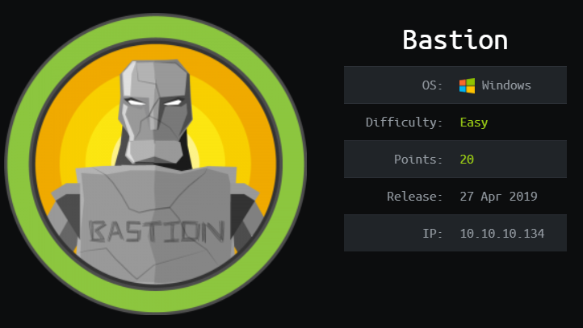

# HackTheBox Bastion

> Author: Hades

> [*Scripting here*](https://github.com/leecybersec/scripting)



## Information Gathering

### Openning Services

```
### Port Scanning ############################
nmap -sS -p- --min-rate 1000 10.10.10.134

[+] Openning ports: 22,135,139,445,5985,47001,49664,49665,49666,49667,49668,49669,49670

### Services Enumeration ############################
nmap -sC -sV -Pn 10.10.10.134 -p22,135,139,445,5985,47001,49664,49665,49666,49667,49668,49669,49670
Starting Nmap 7.91 ( https://nmap.org ) at 2021-04-06 14:30 +07
Nmap scan report for 10.10.10.134
Host is up (0.25s latency).

PORT      STATE SERVICE      VERSION
22/tcp    open  ssh          OpenSSH for_Windows_7.9 (protocol 2.0)
| ssh-hostkey: 
|   2048 3a:56:ae:75:3c:78:0e:c8:56:4d:cb:1c:22:bf:45:8a (RSA)
|   256 cc:2e:56:ab:19:97:d5:bb:03:fb:82:cd:63:da:68:01 (ECDSA)
|_  256 93:5f:5d:aa:ca:9f:53:e7:f2:82:e6:64:a8:a3:a0:18 (ED25519)
135/tcp   open  msrpc        Microsoft Windows RPC
139/tcp   open  netbios-ssn  Microsoft Windows netbios-ssn
445/tcp   open  microsoft-ds Windows Server 2016 Standard 14393 microsoft-ds
5985/tcp  open  http         Microsoft HTTPAPI httpd 2.0 (SSDP/UPnP)
|_http-server-header: Microsoft-HTTPAPI/2.0
|_http-title: Not Found
47001/tcp open  http         Microsoft HTTPAPI httpd 2.0 (SSDP/UPnP)
|_http-server-header: Microsoft-HTTPAPI/2.0
|_http-title: Not Found
49664/tcp open  msrpc        Microsoft Windows RPC
49665/tcp open  msrpc        Microsoft Windows RPC
49666/tcp open  msrpc        Microsoft Windows RPC
49667/tcp open  msrpc        Microsoft Windows RPC
49668/tcp open  msrpc        Microsoft Windows RPC
49669/tcp open  msrpc        Microsoft Windows RPC
49670/tcp open  msrpc        Microsoft Windows RPC
Service Info: OSs: Windows, Windows Server 2008 R2 - 2012; CPE: cpe:/o:microsoft:windows

Host script results:
|_clock-skew: mean: -38m12s, deviation: 1h09m16s, median: 1m46s
| smb-os-discovery: 
|   OS: Windows Server 2016 Standard 14393 (Windows Server 2016 Standard 6.3)
|   Computer name: Bastion
|   NetBIOS computer name: BASTION\x00
|   Workgroup: WORKGROUP\x00
|_  System time: 2021-04-06T09:33:24+02:00
| smb-security-mode: 
|   account_used: guest
|   authentication_level: user
|   challenge_response: supported
|_  message_signing: disabled (dangerous, but default)
| smb2-security-mode: 
|   2.02: 
|_    Message signing enabled but not required
| smb2-time: 
|   date: 2021-04-06T07:33:28
|_  start_date: 2021-04-06T07:31:02

Service detection performed. Please report any incorrect results at https://nmap.org/submit/ .
Nmap done: 1 IP address (1 host up) scanned in 74.21 seconds
```

### Server Message Block

```
### SMB Enumeration (445) ############################
smbmap -H 10.10.10.134 -u guest
[+] IP: 10.10.10.134:445        Name: 10.10.10.134
[\] Work[!] Unable to remove test directory at \\10.10.10.134\Backups\THPQBWRNVY, please remove manually
        Disk                                                    Permissions     Comment
        ----                                                    -----------     -------
        ADMIN$                                                  NO ACCESS       Remote Admin
        Backups                                                 READ, WRITE
        C$                                                      NO ACCESS       Default share
        IPC$                                                    READ ONLY       Remote IPC
```

## Foothold

### 

## Privilege Escalation

###